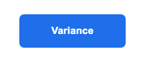
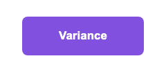

<p align="center">
  <a href="docs/visual-guidelines.md">
    
  </a>
</p>

# Variance Authority

**Visual regression that points to the cause.**

A screenshot diff tells you where pixels moved. Variance Authority connects the
changed region to the component responsible and the `file:line` where that
component lives, so the result starts with what to review rather than a list of
screenshots to inspect.

It works with UI states your Playwright tests, Storybook, application, or unit
tests already know how to reach. Rendering, baselines, and reports stay in
infrastructure you control; there is no vendor account or hosted dashboard.

## Start with what you already run

| Your UI is already ready in | Start here |
| --- | --- |
| A Playwright test | [`@variance-authority/playwright-test`: add an observation](packages/playwright-test/README.md#add-an-observation-to-a-test) |
| A Jest or Vitest jsdom test | [`@variance-authority/unit-test`: capture now, render later](packages/unit-test/README.md) |
| A built or served Storybook | [`@variance-authority/storybook-collector`: integrate a Storybook](packages/storybook-collector/README.md#integrate-a-storybook) |
| A running application or static build | [`@variance-authority/route-collector`: integrate a route list](packages/route-collector/README.md#integrate-an-explicit-route-list) |
| A custom renderer, store, or pipeline | [`@variance-authority/observe`: choose the entrypoint](packages/observe/README.md#choose-the-entrypoint) |

Choose the row that already owns the state you care about. Variance Authority
adds observation to that environment; it does not replace its test runner,
fixtures, routing, or mounting.

## What a result looks like

This example changes only the `background-color` of one `Button`:

| Before | After | Diff |
| --- | --- | --- |
|  |  |  |

The report names the cause and the source location:

```text
1 root(s): 0 authorized, 1 to review, 0 violation(s).
  [needs-review] Button — Button
      undeclared component change: `Button` (token/paint) reached 1 subject(s)
      examples/readme-case/src/Button.js:9
```

A root is the cause the run asks you to review. Several affected subjects can
share one root, so one edit does not have to become one decision per screenshot.
If a subject moves by itself or because another subject ran first, the run
reports that separately and refuses to promote the unstable result as a
baseline.

[`examples/readme-case`](examples/readme-case) generates the images and report
above. [Flake detection](docs/flakiness.md) explains the repeated readings used
to distinguish a change from instability and order dependence.

## Scope and non-goals

Variance Authority fits when you already control the UI environment and want
source attribution, deterministic evidence, and a CI verdict without sending
the workflow to a managed service.

You operate the compute, storage, browser capacity, and review integration.
Choose a hosted product instead when you need a managed dashboard, a managed
cross-browser or real-device grid, perceptual or ML comparison, or a setup path
owned by a vendor.

The [adoption gates](docs/gates.md) match those boundaries to Playwright,
Storybook, Jest, and Vitest. The [product comparison](docs/comparison.md) states
what Percy, Chromatic, Argos, and Applitools each provide that this project does
not.

## Go deeper when you have a question

The [documentation index](docs/README.md) routes by reader question: deciding
whether the tool fits, understanding a verdict, diagnosing a flake, selecting
less of a suite, or checking the evidence behind a claim.

For the system itself, see the [architecture](docs/architecture.md). For
executable evidence, start with the [small examples](examples/readme-case) and
then the [external cases](cases/README.md). Presentation sensing and runtime
scenarios are separate, baseline-free surfaces described in
[presentation](docs/presentation.md) and [scenarios](docs/scenarios.md).

## Licence

MIT — see [LICENSE](LICENSE). Copyright (c) 2026 Mechanic Garden.
