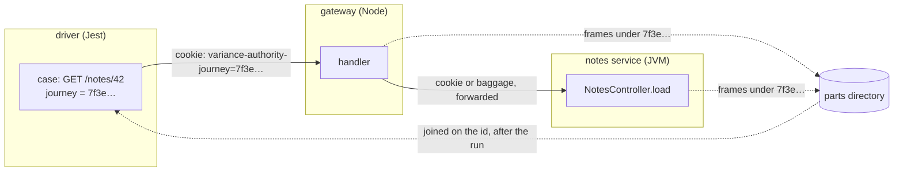

# Testing across dimensions

A test runs in one process, and the code it checks often runs in others: a
gateway it calls, the services behind that gateway, a JVM backend, a Worker
behind a service binding. Each process, runtime or language one test passes
through is a **dimension** of that test. This page is for a suite whose tests
cross them. It explains why no import graph can tell which of those tests a
change beyond the first process reaches, and how Variance Authority follows each
test's execution into the other processes and joins what they ran back to the
test after the run.

## Why the import graph cannot see it

Take one Jest case. It calls `GET /notes/42` on your gateway, and the gateway
calls a notes service to load the note. The case file imports a test client and
an assertion library. The gateway is a separate program, and the notes service
is a third, possibly in another language. Nothing in the case file names a file
in either of them.

Now change a branch in the notes service. Which test has to run?

The answer is the case above, and nothing that reads source can reach it. A
graph walks from the changed file to the files that import it, and the notes
service is imported by nothing the test suite contains. The request crossed a
socket, and a socket is not an edge. So a selector built on the graph has two
answers available, and both are wrong:

- **It selects nothing.** The walk finds no path from the notes service to any
  test, so no test runs, the change merges, and the one case that would have
  failed never ran. That is an escape.
- **It selects everything.** A suite that knows it cannot see the crossing
  treats every backend change as touching every test. That is safe and never
  narrows. Every change to a handler runs the whole end-to-end suite, for as
  long as the suite exists.

This is measured. The JVM agent's tests drive a small Java shop through
browser specs, seed six backend changes, and score two selectors against the
specs that fail. [`variance reach`](polyglot.md) reads Java as well as it
reads TypeScript and still selects no spec for any of the four breaking
changes, because no spec imports the service. The execution record
selects 9 of 18 spec runs and misses none of the failures. [The JVM agent's
README](../jvm/README.md#tests) has the setup.

What the graph lacks is not a better parser. It lacks the fact that *this*
case's request reached *that* branch, and only the running system knows that.

## What crosses the fence

A **fence** here is any boundary a test's execution crosses that the graph
does not: a network hop, a process, a runtime. To follow one execution past a
fence you need a key the far side can read and the near side can later match.
Variance Authority uses a **journey**: one opaque id per execution of one test.
It is a UUID and nothing else, minted by the process that runs the test, which
this page calls the **driver**.

The id crosses the fence, and the test's name does not. The processes on the far
side never learn which test they served. Each one writes down what it ran under
each id it saw. After the run, the driver, the only party that holds the
`journey → test` table, joins those accounts back to its tests. A report cannot
claim an execution by writing a test's name into its body, and a service that
serves several tests at once cannot mix them up by guessing whose request it is
serving. [A carried value joins; a derived one
drifts](observability.md#a-carried-value-joins-a-derived-one-drifts) states the
general rule.

**You put the id on the request.** Nothing patches `fetch`, `http` or your
client library. A patch would have to guess which clients your tests use and
would change the system under test in a way your production code never sees. A
Jest case asks for its own id:

```ts
import { journeyCookie } from '@variance-authority/sense/case-journey';

const response = await fetch(`${gateway}/notes/42`, {
  headers: { cookie: journeyCookie() },
});
```

`journeyCookie()` returns `variance-authority-journey=<id>`. The case mints its
id the first time it asks, and every later ask in the same case returns the same
id. `caseJourney()` from the same module returns the bare id if you carry it
some other way. Outside a case, both return nothing. A browser spec needs no
call of its own, because the driver sets the same cookie on the browser context
before the first navigation and the browser sends it on every same-origin
request.

**Past the first hop, the id travels the way your system already forwards
context.** The gateway has to pass it to the notes service. Copy the cookie onto
the onward request, or let W3C `baggage` carry a `variance-authority-journey`
member if your tracing already propagates baggage between services. The JVM
head reads either header. When both are present and name different ids, the
request is charged to no journey. A JavaScript head reads the cookie form, so a
Node service that receives the id in baggage hands
`variance-authority-journey=<id>` to `enter` itself.

A service that does not forward the id breaks the chain at that hop. Whatever
the notes service ran for an un-forwarded request is charged to no case's
journey. See [what silence means](#what-silence-means).



## What each process writes, and when the join happens

Each process beyond the fence is a **head**: a process other than the test's own
that records what it ran, under the name its build gave its probes. A head is
instrumented the way your test process is. A Node service is built with
`testSelectionProbes()`, and a JVM service runs with the agent. A head scopes
each request to the journey it carried. What the head ran inside that scope is
charged to that journey. What it ran outside any journey, such as startup, a
readiness probe or a request that carried no id, is charged to every test that
crossed into that process. A change to a shared service's startup therefore
selects every test that called it.

Heads hand their accounts over in one of two ways:

- **Parts.** The head appends frames to its own file, with one frame per
  journey and one for what ran outside any journey. The file lives in a
  directory you name, or behind a receiver on the host that writes into one.
  Nothing waits for the service. A Node head sends each journey's frame as that
  journey's scope settles. A JVM head writes its files when the JVM exits. A
  process killed mid-write leaves a torn last frame, and the fold reads past it.
- **Reports.** A Node head posts each journey's account to the address the
  driver left beside the id, and the driver collects the accounts while the run
  is live. Nothing in the head writes a file. This is the path a Playwright
  suite driving a Node service takes.

The join always happens after the run, never during it. Shards finish at
different times, a service answers several tests at once, and a request can
still be running after the test that made it has reported. For a Jest suite,
Jest seals its own journals when it ends, and a separate step, `variance
journeys finalize`, reads them together with every part and charges each
journey's frame to the case that minted the id. Run that step after the
services have stopped, and whether Jest passed or failed. Each CI shard
finalizes its own file, and `variance journeys stitch` assembles the shards in
any order. [Record Jest journeys without selecting
tests](../packages/sense/README.md#record-jest-journeys-without-selecting-tests)
has both commands.

## Where a test enters

### A browser spec calling a Node service

The Playwright driver mints the id and sets it as a cookie beside a return
address. You declare the service as a head in `playwright.config.ts`
(`varianceExecution: { heads: ['api'] }`), start it with
`VARIANCE_AUTHORITY_JOURNEYS` and `VARIANCE_AUTHORITY_HEAD` in its environment,
and wrap your request handling in `collectJourneys().enter(cookie, run)` from
`@variance-authority/sense/journey`. Told neither variable, `collectJourneys`
installs nothing and `enter` runs the handler directly, so the call can stay in
the build you ship. [Declaring a head](observability.md#declaring-a-head) has
the setup, and [follow one execution into a
service](../packages/sense/README.md#follow-one-execution-into-a-service) covers
a driver that is not Playwright.

### A Jest case calling any service

The case puts `journeyCookie()` on its request. Every service it reaches writes
parts to one directory, and Jest's `withJourneyCoverage` is told where that
directory is:

```js
withJourneyCoverage(config, {
  journeyFile: '.variance-authority/journeys.bin',
  parts: ['/tmp/va-parts'],
  heads: ['gateway'],
});
```

A Node service calls `collectJourneys({ head: 'gateway', parts: '/tmp/va-parts' })`,
or sets `VARIANCE_AUTHORITY_PARTS`. `heads` lists the `label`s the Node services'
builds gave `testSelectionProbes()`, so the fold can find the inventories their
frames name. [Follow a Jest case into a service it
calls](../packages/sense/README.md#follow-a-jest-case-into-a-service-it-calls)
has the details.

A JVM service wraps each request in `Journey.enter(cookie, baggage)` and runs
with the agent and `-Dva.parts=<dir>` (or `VARIANCE_AUTHORITY_PARTS`). At exit
it writes a frames file and the regions those frames name into the same
directory, so a JVM head needs no entry in `heads`. [Record a service a Jest
case calls](../jvm/README.md#record-a-service-a-jest-case-calls) has the build
and flags.

### A browser spec calling a JVM service

Without a JavaScript record for the spec to join, you keep a table of
`<journey>\t<spec file>`, one row for each id your driver set, and the agent's
`Coverage` converter reads the table beside the service's record. Each journey
row goes to its spec, and each row for work outside a journey goes to every
spec. [Record a service browser specs
drive](../jvm/README.md#record-a-service-browser-specs-drive) has the command.

### A Cloudflare Worker behind a service binding

A Worker has no host filesystem, so its parts leave over HTTP to a receiver on
the host. Its modules are all evaluated before any of its own code runs, so its
build installs the head. And a service binding does not carry async context, so
each Worker is a head of its own and the gateway forwards the cookie on every
binding call.

Build the Workers with Vite and the Cloudflare plugin, and ask the probes to
install the head:

```js
// vite.config.js
import { cloudflare } from '@cloudflare/vite-plugin';
import { testSelectionProbes } from '@variance-authority/sense/journal';

export default {
  plugins: [
    cloudflare({
      configPath: './gateway/wrangler.jsonc',
      auxiliaryWorkers: [{ configPath: './notes/wrangler.jsonc' }, { configPath: './books/wrangler.jsonc' }],
    }),
    testSelectionProbes({ root: import.meta.dirname, label: 'workers', journeys: true }),
  ],
};
```

With `journeys: true`, the collector every instrumented module imports first
installs the head under `label`. Each entry's own `collectJourneys()` returns
that head, and wraps its fetch:

```js
import { collectJourneys } from '@variance-authority/sense/journey';

const journeys = collectJourneys();

export default {
  fetch: (request, env, context) =>
    journeys.enter(request.headers.get('cookie') ?? undefined, () => handle(request, env, context)),
};
```

Each Worker is told where the receiver listens, in its `wrangler.jsonc`:

```jsonc
"compatibility_flags": ["nodejs_compat"],
"vars": { "VARIANCE_AUTHORITY_PARTS": "http://127.0.0.1:5198" }
```

On the host, start the receiver before the Workers, and close it after they
stop:

```js
import { receiveParts } from '@variance-authority/sense/journey';

const receiver = await receiveParts('/tmp/va-parts', { port: 5198 });
```

`wrangler dev` builds with esbuild, which has no hook for a transform, so it
cannot place probes. Run the Vite build and serve its output instead:

```bash
wrangler dev -c dist/gateway/wrangler.json -c dist/notes/wrangler.json -c dist/books/wrangler.json
```

Jest's `withJourneyCoverage` names the receiver's directory in `parts` and
`workers` in `heads`. Each journey's frame is sent before the promise its scope
returned settles, so a Worker that ends a request's work with its response still
delivers it, and nothing depends on `waitUntil`. A receiver that is gone loses
that part, never the request.

## What silence means

A head that recorded nothing can mean two things: it ran nothing for any test,
or nobody was watching it. The service may have failed to start, been built
without probes, or been left out of one CI job. From the outside, the two look
identical.

For reporting heads, silence never narrows. Every head a Playwright run
declares must report at least once. A declared head that reports nothing,
reports under a different probe recipe, or still has a request open when the
driver joins marks every test in the run incomplete, including the ones the
page recorded perfectly. The next `--since` then runs the whole suite and
prints which head was silent. [An absence is never reported as a
measurement](observability.md#an-absence-is-never-reported-as-a-measurement)
shows the message.

For a browser spec reaching a JVM service, `Coverage` fails when your table
names journeys and the service recorded none of them.

On the parts path, a part is evidence and its absence is not. A missing parts
directory reads as empty, and a case whose journey no part names is folded from
its own frames alone. So a Jest case whose service wrote no part is charged
nothing in that service, and a later change there does not select it. Check
that each service you expect wrote a part before you narrow on the record.

Within a process that did write, what a request with no id ran is charged to
every test whose id reached that process, never to one of them in particular.
A service that no id reached is charged to no test, and a change there selects
none. Its modules leave the journey file, and `variance journeys finalize` counts
fewer modules than the run before: behind a gateway that stopped forwarding the
cookie, three Workers' 10 modules become the gateway's 4.
A case that called a service without putting its id on the request is not
charged for what that request ran, because nothing names the case.

## Positions

- **Concurrent requests.** A Node head scopes by async context, so two tests
  whose requests interleave inside one module still come back apart. A JVM head
  records one flag per method and cannot tell threads apart. Every enter and
  exit of a journey ends a window, and the methods drained in a window go to
  every journey open during it. Two journeys in flight at once share their
  windows, so each test is charged for the other's methods too. Selection
  widens and never loses a method a journey ran. Run Jest in band against a
  JVM service when you need each case's row to be exact.
- **Work that outlives its request.** A Node head keeps a promise the handler
  started and did not return attached to its request. What that promise runs
  after the scope closed is still sent to the journey, as a scope of its own. A
  JVM head cannot follow such work. It lands in whichever window drains it, and
  that window's journeys are charged for it, whether or not the journey that
  started it is among them.
- **A change no probe sees.** A module the service loaded with no probe in it,
  a class the agent could not name, or a service built without probes gives the
  record nothing to charge. Tests recorded partially cannot be excluded by it.
  A changed file the record says nothing about is named in the output and keeps
  no test in the run on its own. On a JVM, constructors and static
  initializers charge the whole file, and so does a change outside every
  method, so each selects every test that entered the file.
- **Coarser than the page.** A JVM head records methods, not branches, and a
  recorded method carries every line in it. At line grain it only widens.

Most suites need none of this. A Storybook preview or a Vitest file runs in one
process, so the process that executes is the process that is watched and no
id crosses anything. Declare a head when a test's execution leaves its own
process, and only then.
