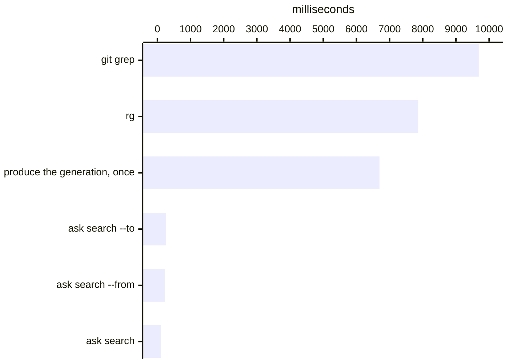

# Find code through the workspace index

This is the source how-to and contract for
[orientation](orientation.md). Start there when you need to choose between text
search, indexed source search and observed-subject search.

`rg` tells you where text is written. This server tells you which exported name
matches your words in the part of the import graph you are working in, then gives
you its import line, declaration, signature, documentation, and existing import
sites. It answers from a dated workspace generation — no build, run, generated
API site, or `variance.config.json` in between.

The difference matters when a checkout is too large to open again for every
question. A [source index](source-index.md) parses and resolves a file once,
stores its exported names and outgoing edges, and reuses that record while the
file and its resolution inputs stay the same. A question with `from` or `to`
then filters names through those stored edges instead of searching every file
for another string.

## Choose the cheapest entrance

| You need | Start with |
| --- | --- |
| An exact string in arbitrary file contents | `rg`; it needs no index and reads the working tree now. |
| An exact string in committed source | `git grep <tree>`; a named tree searches Git objects and deliberately leaves working-tree edits out. |
| A name you can only describe, its exact signature, or the code that imports it | This server; those answers depend on declarations, exports, resolved imports, and the area named by `from` or `to`. |

## Search finds the name; the graph finds the area

The workspace generation combines two different answers. Names and documentation
find a candidate such as `createStore`. Resolved import edges decide whether that
candidate belongs to the code in question.

Carry a path into the first search whenever you have one:

```bash
variance ask search --query createStore --from src/fulfilment/ --just-answer
```

`--from` walks along imports and keeps names used inside that closure. Use
`--to` when the known thing is a dependency or helper and the question is what
depends on it. Both walks have no depth limit. This turns a common word that
matches hundreds of files into a relation question over the area the path
actually connects to.

Once the search returns the name, ask `symbol` for its contract and `uses` for
its exact import sites. `uses --from` only orders those sites by path proximity;
it does not perform another graph traversal or remove any result.

This is a resolved module graph, not a function-call graph. It records file
imports, re-exports, literal dynamic imports, type imports, asset edges, and the
files a module names in `/// <depends path="…" />`. It
can answer what a file rests on, what rests on that file, and where an exported
name is imported. It does not claim that one function called another at runtime;
open the named file or use a language server for that question.

No graph database service sits on the answer path. The producer publishes a
compact graph beside the names and materializes both directions, so walking
dependencies and dependents are the same bounded operation over the recorded
generation. The graph is the relationship data; its storage is not another
service an adopter has to operate.

Text search remains the shorter route when text is the answer. It has to scan
content again for the next word, and it does not resolve the imports it finds.
The workspace producer pays for parsing and resolution, then publishes an
answerable generation outside the checkout. The question path reads that value
without scanning the repository again. Producing and answering are separate operations:
a CI step can publish once, then every agent in that step can ask the same dated
facts without making freshness checks part of query latency.

This path is measured on seven copies of [Material
UI](https://github.com/mui/material-ui) side by side in one checkout: 288,197
tracked paths. Every figure is the median of seven runs, each run a separate
process looking for `button`, on an Apple M4 Max with 64 GB, macOS 27.0, Node
v26.7.0, ripgrep 15.2.0 and a warm filesystem cache.



| One process | Milliseconds |
| --- | --- |
| `git grep -niF button` | 9,688 |
| `rg -niF button .` | 7,862 |
| produce the generation into an empty index, once | 6,695 |
| `variance ask search --query button --to …/ButtonBase.js` | 263 |
| `variance ask search --query button --from …/Autocomplete.js` | 228 |
| `variance ask search --query button` | 101 |

The text searches pay their whole cost again for the next word, and they return
every file that contains the string. The producer pays once, in less than the
time of one text search, and every question after it reads the published
generation. A question without a path costs about 100 ms at 2,500 paths, at
41,000 and at 288,000: it opens a search file the producer publishes beside the
generation and decodes only the rows it prints, so nearly all of that 100 ms is
Node starting. `--from` and `--to` also load the import graph and walk it.
`--from` is reachability at any depth, not a
maximum hop count; the answer prints import distances where it has them.

`git grep` and `rg` read the text in different ways: `git grep` can read packed
objects, and `rg` opens each file in parallel.
[Then stop opening the file](performance.md#then-stop-opening-the-file) measures
that difference, and [after the first read](performance.md#after-the-first-read-you-do-not-read-it-again)
measures what a scan costs on a public checkout with no index, unchanged, and
with a few files edited. The index adds the facts
that neither read supplies — declarations and resolved relations — and keeps
them for the next question.

Ordinary source questions reuse a generation for one hour, then refresh it.
Pass `--just-answer` when the caller owns freshness: no Git status, generation,
or regeneration is performed, and the answer prints the generation time. If no
generation has been published, the command refuses instead of silently turning
the question into production work.

`search` always answers as if `--just-answer` were given. It opens the
published search at any age and never scans, because in CI the step before it
already brought the index up to date and is the one that owns freshness. The
flag is accepted and changes nothing. With no published generation, `search`
refuses and names the command to run.

When an editor, watcher, or orchestrator produces a generation and already
knows the changed paths, write their scan-root-relative paths to a newline-delimited
file and pass that file through `--changed-file`. An empty file means the caller
knows nothing changed. This is producer input: it replaces Git's changed-file
discovery and cannot be combined with `--just-answer`. [Naming what
changed](source-index.md#naming-what-changed) gives the file contract.

## Point the server at the workspace

Use Node 22 or newer. Install the package in the TypeScript workspace:

```bash
npm install --save-dev @variance-authority/help
```

The package installs a `variance-authority-help` binary, which answers the same
questions on the command line, with no client and no server:

```bash
npx @variance-authority/help search viewport --root .
```

Pass the package name to `npx`, not the binary name: `variance-authority-help`
is not a package name and the registry will report it missing. `--root` is the
workspace to read; omit it when you are standing in that workspace.

A workspace that already has `@variance-authority/cli` installed needs neither
this package nor its binary, over either transport. The six questions are on
`variance ask`, beside the questions about a run, and read the checkout under
the working directory:

```bash
npx variance ask search --query viewport
npx variance ask symbol --name Viewport
npx variance ask search --query viewport --from packages/app/ --just-answer
```

The flags are the tool arguments, spelled `--name`, `--package`, `--subpath`,
`--query`, `--from` and `--to`; `--just-answer` selects the last published
generation. [Ask a run from the command
line](agent-cli.md#ask-the-code-when-the-name-is-not-in-the-run) shows each one.

The six are also tools on `variance serve`, under the same names as below, so
a workspace with the CLI declares one server for the run and the source
together. The rest of this page is that contract, whichever of the two serves
it.

Without the CLI, configure the MCP client to launch this package's server with
the workspace root:

```json
{
  "mcpServers": {
    "workspace-api": {
      "command": "variance-authority-help",
      "args": ["."]
    }
  }
}
```

Here `.` is the server process's working directory. Pass the workspace's
absolute path when the MCP client launches outside it. The configured command
must resolve the installed package binary.

## Read from entrypoint to symbol

Call `docs_packages` first. It returns the package import specifiers the
workspace publishes, derived from its manifests, and gives the remaining calls
an exact entrypoint.

Choose one specifier and call `docs_entrypoint` to see the names it opens,
ranked by how many workspace packages import them. Then call `docs_symbol` for
the import line, declaration, signature, source documentation, and importing
packages of the name you are investigating.

Call `docs_uses` when the question is how the name is written here rather than
what it claims to be. It returns the file and line of every import, with the
stories and the tests — the files written to show the name in use — listed apart
from the source that depends on it. Pass `from` with the file you are editing and
the sites arrive ordered by how many leading path segments they share with it.

Open those files yourself. The server names the place and the line; it does not
serve the text, so what you read is the file as it is now.

Use `docs_search` only when the name is unknown: it performs a
case-insensitive substring match over names and documentation, not semantic
ranking. Where your words land on a name that does not contain them — a word
typed wrong, or two words written about a name but not beside each other — those
names follow under a heading of their own, after the substring answer and never
inside it.

## Bound a search to where you are working

A substring matches everywhere a large repository writes a common word. Pass a
start point and `docs_search` answers only from one part of the checkout:

```text
docs_search  query: order  from: src/fulfilment/
```

`from` answers from the files that path reaches along the imports, at any
depth. `to` answers from the files that reach it — use it when you start from a
helper and want the screens or other dependents behind it. Pass both and you get both
areas together; they are combined, not intersected, because two entry points of
one application usually share no file.

A start point is a path in the source tree, said at one of three widths —
`src/a/File.ts`, `src/a/*`, `src/a/` — and a path the checkout does not contain
is refused by name; you never receive an unscoped answer under a scoped
heading. [Say where to look](locate.md#say-where-to-look) is the rule in full,
and it is the same rule here: one path vocabulary, read by one resolver,
whichever question names a path.

Scoping removes names rather than ranking them down. An empty answer with a
start point is a fact about that area, and the answer reports how many files it
searched. Ask again without `from` and `to` to search the whole workspace.

The same start points are available from the shell, under whichever binary you
have:

```bash
variance ask search --query order --from src/fulfilment/
variance-authority-help search order --from src/fulfilment/
```

## What the answer claims, and what it does not

The server reads manifests and TypeScript source, not `dist`. It parses with
`oxc-parser` and resolves with `oxc-resolver`; no TypeScript language service
runs behind it. A types target under an output directory is mapped back to that
package's source. A consumer is a workspace package whose source imports the
symbol; it is not a claim about runtime execution or external adoption. A site
is an import of the name, not a call to it — where the name is used inside that
file is a question for your editor's language server.

Missing documentation remains missing, and a search with no exact substring
match says so before it offers anything near it. Those absences are source
facts, not prompts for the server to infer an answer: a looser reading of your
own words can add names below the answer, and nothing can promote one into it.

Where nothing is written above a declaration, the server may quote the nearest
`README.md` that names the symbol, labelled with the file and line it came from.
Read it as prose written about a package, not as a description of the signature
above it: the name still counts as undocumented by `docs_gaps`, the
call that lists names other packages import with nothing written above the
declaration.

`from` means two different things across the two tools, so read each one for
what it does:

- **On `docs_uses`, it orders and never removes.** Every site of the name still
  comes back, and proximity there is shared path segments, a fact about the
  filesystem.
- **On `docs_search`, it is a start point.** The import graph is walked and
  names outside the closure are removed.

Neither is a distance. How many hops separate two modules, and what selecting on
that distance costs, is [`@variance-authority/sense`](distance.md).

## Point an agent at it

Your agent reads `AGENTS.md` at the start of every session, and a skill only
when its description matches the task. Put these lines in `AGENTS.md`, with
`npx` changed to however your package manager runs a local binary:

```markdown
## Finding your way in the code

Ask before you grep: `npx variance ask uses --name <name>` lists who imports a
name, `ask symbol --name <name>` says what it is and where it is declared, and
`ask search --query <words>` finds a name by what it does. The
`variance-authority` skill has the rest.
```

The skill is `variance-authority`. It ships in `@variance-authority/cli` at
`node_modules/@variance-authority/cli/skills/variance-authority` and covers the
rest of the CLI too. Claude Code reads skills from `.claude/skills`; most other
agents read `.agents/skills`. Link the skill into both rather than copying it,
so it follows every update:

```bash
mkdir -p .agents/skills && ln -s ../../node_modules/@variance-authority/cli/skills/variance-authority .agents/skills/variance-authority
mkdir -p .claude/skills && ln -s ../../.agents/skills/variance-authority .claude/skills/variance-authority
```

`variance doctor` reports whether your agent can find it.

The full tool and source-reading contract is in the
[`@variance-authority/help` package
reference](https://variance-authority.dev/reference/packages/help). When the
answer raises an ownership or entrypoint question, continue with [package
boundaries and public contracts](architecture.md#packages).
