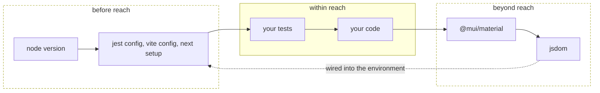
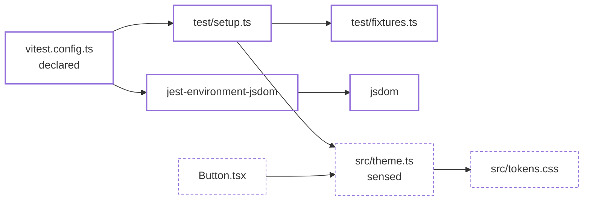

# Changes before and beyond

Two changes widen a run that no import graph can narrow: a config file nothing
imports, and a package you never wrote. Selection answers from names files say
to each other, so a change with no name in that conversation is either the whole
suite or nothing at all — and which of the two is a choice you make rather than
one the walk makes for you. This page is about those two changes, and
[selection](selecting.md) is about everything between them.

Read a run from left to right. The harness starts it, the tests it started run
your code, and your code goes out into what the install provides and never comes
back. Selection lives in the middle stretch, where a file has a name the record
can store. What comes before it and what lies beyond it are both outside
selection, for opposite reasons.



**Beyond reach** is the far right: a dependency bump. Nothing in the diff names
a file you wrote, and yet the code that imports the bumped package renders
differently. That change is reachable, because the thing that changed has a
name and your files say the name.

**Before reach** is the far left: the node version, the harness config, the
bundler setup. Nothing imports them and they change everything downstream of
themselves. That change is not reachable, and a diff that touches only it runs
the whole suite.

## What a bumped package reaches

A package is a node in the graph like a file is, and an import of one is an edge
to it. So the question a dependency bump asks is the question every change asks
— *which subjects covered something that depends on this* — and it is answered
by the same walk, from a seed at the other end of the line.

| The diff says | Selection does |
| --- | --- |
| `@mui/material` bumped | Every file whose imports reach it is treated as changed, transitively, and selection proceeds from there |
| `jsdom` bumped, and only `jest-environment-jsdom` depends on it | The bump is traced up through the install to the packages that rest on it, and then into your files. A transitive dependency is not a shorter question, only a longer trail |
| `@mui/material` bumped and no file imports it | Nothing. An installed package with no importer reaches nothing |
| Only a `type` import names the bumped package | Nothing. Types are erased before anything runs, so nothing a run can observe rests on them |
| A file that imports the bumped package was never measured | That file selects nothing, and every measured file the walk reaches beside it or above it selects the tests that ran it. The record has no crossing to charge an unmeasured file with, and declaring the file does not change that: a precondition selects on a change to the declared file's own text, never on a bump beneath it |

Which **copy** of a package an importer got is not asked. A specifier names
`@mui/material`; which of the installed instances a resolver hands it is
unanswerable without reproducing that resolver, and a selector that guessed
would skip on the guess. Names over-include, and over-including is the safe
direction.

## Why the lockfile is read and not diffed

`package.json` is a request, the lockfile is the answer, and neither is a
changed file here. They are read at two revisions — the base and the working
tree — and compared as installs, which is a different question from *did this
file's bytes change*:

- A workspace edit rewrites `yarn.lock` and changes no package. Compared as an
  install it contributes nothing.
- A resolution or an override changes what `^4.17.21` means without changing the
  line that asked for it. Compared as an install it is a bump like any other.
- Both paths are then dropped from the changed-file list. They have no row in
  any record, so left in they would be reported a second time for the very
  thing they just explained.

`yarn.lock` (classic and Berry), `pnpm-lock.yaml` and `package-lock.json` are
read. **A lockfile that cannot be read widens the run**: a comparison that could
not be made is not a comparison that found nothing.

## How a change before reach is declared

A change to `vite.config.ts`, to the jest environment, to the node version in
CI: none of them is imported by anything, so there is no edge to walk back
along and no answer smaller than the whole suite. That much is decided for you.
What is not decided is whether the run notices.

A diff that is *only* a config file already runs everything when no execution
record is kept, because a diff no part of which is in the graph says nothing
about which component changed. That stops being true the moment anything else
is in the diff, or a record is kept: the record has no row for the config file,
so it keeps no subject in the run. A CI workflow edited
beside one component gives the walk a seed, and the run narrows to that
component, though it never examined the change that seeded it.

Name the files the run rests on and it stops being an accident:

```json
{
  "source": {
    "dirs": ["src"],
    "relations": true,
    "before": ["vitest.config.ts", ".github/workflows", ".nvmrc"]
  }
}
```

Each entry is matched against the diff by path, so naming a directory of
workflows is one line rather than one per file. When one of them changes, the
run is whole and the report says which file put it there.

Which paths govern a run is a fact about your repository, and no rule derives
it. *Every changed path the graph does not include* would be the README, the
changelog and the editor settings — a whole run each, forever — and switching
that off would switch the config files off with it. Declared, it is exact.

`source.before` needs `source.relations: true`, because what an entry point
buys is everything below it.

Test selection makes the same declaration on the runner. `variance select` reads
no `variance.config.json`, so `source.before` does not reach it. The Vitest
integration declares the config file Vite loaded and the local modules it
imports; the Vitest, Jest and Rstest integrations take a `preconditions` option
for the rest, and every test they record declares each file it lists. A change
to one of those files selects the whole suite. A changed file nothing imports
and nothing lists selects nothing, and `select` names it.

## What comes with a declared entry point

The config file is one name. The setup module it loads, the fixture only that
setup imports, the polyfill, the environment package it names: each is an
ordinary file that nothing imports, whose change reaches no component, and
which on its own narrows a run to nothing. Declared once at the top, they
arrive together — the entry point is the one thing walked **along** the arrows
instead of against them.



The descent stops at the first file `source.dirs` already covers. A setup file
that imports `src/theme.ts` does not drag it in: that file has dependents, a
change to it is answered exactly by walking them, and pulling it in would trade
an exact answer for a whole run. Everything below it is reached *through* it,
so `src/tokens.css` stays out too.

An entry the scan does not cover — a `.nvmrc`, a workflow, a `tsconfig` —
has nothing under it to read. It contributes its own name, which is all it has,
and the run says so in a note.

The cost is real and it is yours to spend. A config that imports your bundler
rests on everything that bundler rests on, so a bump inside that set widens the
run. That is the correct answer, because the harness did change; a repository
that finds it too wide narrows what it declares.

## Where before and beyond meet

A `jsdom` bump is beyond reach, and the environment it is wired into is before
reach — the only arrow in the first figure that points back to the left. The
install comparison names `jsdom`; the harness depends on it through
`jest-environment-jsdom`, three edges out from a config file; and no file you
wrote ever spells the word. Undeclared, that diff narrows to whatever else it
touched. Declared, the run is whole, and it says `jsdom`.

