# Coverage-based test selection

Coverage-based test selection runs, after a change, only the tests that
executed the code you changed, according to a recording of an earlier run.
[Variance Authority](README.md) records that relation on the suite you already
run, for no more than 8% of its run time, and parses each changed file as it was
recorded and as your diff leaves it before it selects a test. On an unmodified
Zod checkout, a one-line edit selects 6 test files, 8 runs in all, where the
import graph selects 131.

This page compares that approach with other selectors: what each one records,
where each one widens, and what each one costs to run on every change.
[Running less of the suite](selecting.md) is the exact contract.

## The idea is old

Running only the tests that executed the changed code is regression test
selection. It was envisioned by research long before products shipped it:

| Paper | What it records or analyzes per test |
|---|---|
| [TestTube](https://dl.acm.org/doi/10.5555/257734.257769), Chen, Rosenblum and Vo, ICSE 1994 | The functions, types, variables and macros of a C program each test covered |
| [A safe, efficient regression test selection technique](https://doi.org/10.1145/248233.248262), Rothermel and Harrold, TOSEM 1997 | The control-flow edges each test ran |
| [Scaling regression testing to large software systems](https://dl.acm.org/doi/10.1145/1029894.1029928), Orso, Shi and Harrold, FSE 2004 | A first pass over classes, then control-flow edges only where that pass found a change, on Java programs up to 500 KLOC |
| [Ekstazi](https://users.ece.utexas.edu/~gligoric/papers/GligoricETAL15Ekstazi.pdf), Gligoric, Eloussi and Marinov, ISSTA 2015 | The class and resource files each test loaded |
| [Hybrid regression test selection](https://doi.org/10.1145/3180155.3180198), Zhang, ICSE 2018 | Files and methods together, choosing the grain per change |
| [Towards refactoring-aware regression test selection](https://dl.acm.org/doi/10.1145/3180155.3180254), Wang and others, ICSE 2018 | Loaded files, with refactorings recognized as edits no test can observe |
| [More precise regression test selection via reasoning about semantics-modifying changes](https://dl.acm.org/doi/10.1145/3597926.3598086), Liu and others, ISSTA 2023 | Loaded files, with kinds of change that cannot alter a test's result skipped |
| [Names are all you need](https://arxiv.org/abs/2605.25356), Wang, Pradel and Liu, ISSTA 2026 | Names each Python test depends on, found statically |

[Yoo and Harman's survey](https://onlinelibrary.wiley.com/doi/abs/10.1002/stvr.430) covers the field up
to 2012, and
[On testing](on-testing.md#coverage-opens-the-question-it-does-not-close-it)
covers what it means for a suite. Ekstazi argued that loaded files cost less to
collect than executed code and lose little precision, and most research since
then wins precision back by reasoning about the change rather than the run.

Products that select tests fall into two groups. The first records a file list
per test, either the files a test depends on or the files its coverage touched,
and discards everything below the file:

| Product | What it keeps per test |
|---|---|
| [Microsoft Test Impact Analysis](https://learn.microsoft.com/en-us/azure/devops/pipelines/test/test-impact-analysis), .NET | The files the test depends on |
| [Datadog Test Impact Analysis](https://docs.datadoghq.com/tests/test_impact_analysis/how_it_works/), JavaScript and others | The files its coverage touched |
| [CircleCI Smarter Testing](https://circleci.com/docs/guides/test/set-up-test-impact-analysis/) | The files its coverage touched |

A change anywhere in a listed file selects the test, so for selection these
behave like an import graph cut to the files a test loaded.

The second group keeps coverage below the file, and a change is charged to the
tests that ran the changed part:

| Product | What it keeps per test |
|---|---|
| [pytest-testmon](https://testmon.org/), Python | Function bodies and one module body, each checksummed from its syntax tree |
| [Wallaby.js](https://wallabyjs.com/docs/), JavaScript in the editor | The code each test ran, while the editor session lasts |
| [Teamscale](https://docs.teamscale.com/tutorial/tia-java/) and [Sealights](https://docs.sealights.io/knowledgebase/test-optimization/how-it-works) | The methods the test ran |

Some of them already ignore edits a test cannot observe. pytest-testmon
compares syntax trees, so a comment or whitespace change selects nothing.
Teamscale documents the same for comments, whitespace and renames.

The selectors built into your tools work from the import graph instead:
`jest --changedSince` and `vitest --changed` decide by file, and `nx affected`
and `turbo --affected` decide by project. Google's TAP and Meta's predictive
test selection both considered per-test coverage for their monorepos and
decided against it. The [TAP
paper](https://huang.isis.vanderbilt.edu/cs8395/paper/google-testing-icse-seip-17.pdf)
names the overhead of instrumentation and how quickly churn makes a coverage
report obsolete. The [Meta paper](https://arxiv.org/abs/1810.05286) calls
accurate per-test coverage impractical in a large monolithic repository and
learns from past failures instead.

The tools that record per test share two limits:

- **Recording costs real time.** [Ekstazi's first collection
  run](https://users.ece.utexas.edu/~gligoric/papers/GligoricETAL15Ekstazi.pdf)
  costs about 8× on one subject. Datadog [reports a 25%
  median](https://www.datadoghq.com/blog/engineering/ruby-test-impact-analysis/)
  for its own Ruby extension, against 200% to 400% for the stock tracers.
- **A change to a module's top level is charged to every test that loaded the
  module.** Wallaby does this by default, and has a [project-wide
  option](https://wallabyjs.com/docs/config/overview/) that stops charging a
  module's loading at all. No tool here documents a third option: charging a
  changed top-level value to the tests that ran code that reads it.

## What recording buys over the import graph

If you have used coverage, you probably share the view above: it is slow to
collect, out of date by the next commit, and too large to keep for a big
repository. Those are costs, and the
[four questions below](#four-questions-that-decide-whether-it-works-on-every-change)
take each of them. A cost is only worth paying for an answer you cannot get for
free, and the import graph is free: it is read from source on every change. So
start with the answer. What can a recording tell you that the graph cannot?

Take a toolbar with two buttons:

```jsx
import { saveDraft } from "./drafts";
import { shareLink } from "./sharing";

export function Toolbar({ draft }) {
  return (
    <>
      <button onClick={() => saveDraft(draft)}>Save</button>
      <button onClick={() => shareLink(draft)}>Share</button>
    </>
  );
}
```

Three tests render it. One clicks Save, one clicks Share, and one clicks
nothing. All three import `Toolbar`, and through it `drafts` and `sharing`, so
to the import graph they are the same test three times:

| You change | The import graph selects | The record selects |
|---|---|---|
| `shareLink` in `sharing.ts` | all three | the test that clicked Share |
| the Share button's `onClick` | all three | the test that clicked Share |
| `saveDraft` in `drafts.ts` | all three | the test that clicked Save |
| the markup `Toolbar` returns | all three | all three |

The graph cannot tell a click from no click. The record can, because a click
runs code and no click runs none.

The same holds when the code sits behind an import:

```js
import { renderPdf } from "./pdf";

export function exportReport(report, format) {
  if (format === "pdf") return renderPdf(report);
  return JSON.stringify(report);
}
```

A test that calls `exportReport(report, "json")` loads `./pdf` and runs none
of it. An import declares a dependency; it does not use one. ES modules made
that declaration static, which is what lets a graph-based selector read it
without running anything, but static means known before the run, not used by
it. CommonJS never tied the two together. A `require` can sit inside the branch
that needs it:

```js
export function exportReport(report, format) {
  if (format === "pdf") return require("./pdf").renderPdf(report);
  return JSON.stringify(report);
}
```

React Native's
[inline requires](https://archive.reactnative.dev/docs/next/ram-bundles-inline-requires),
introduced with RAM bundles and
[still part of its loading guide](https://reactnative.dev/docs/optimizing-javascript-loading),
make this rewrite for you, so a module loads only when the branch that needs it
runs. The graph draws the same edge from `exportReport` to `./pdf` in both
versions. The JSON test runs no code in `./pdf` in either version, and a record
of what it ran says so in both.

A dynamic `import()` loads on demand, and the graph still counts it as loaded.
Take a comment field that turns into a rich text editor when you double-click
it:

```jsx
export function CommentField({ value, onChange }) {
  const [Editor, setEditor] = useState(null);
  const open = () =>
    import("./editor").then((module) => setEditor(() => module.Editor));
  if (Editor) return <Editor value={value} onChange={onChange} />;
  return <textarea value={value} onChange={onChange} onDoubleClick={open} />;
}
```

Every form in the product renders a comment field, and one team owns the
editor. A graph read from source draws an edge from `CommentField` to
`./editor`, because it cannot know whether anybody double-clicks. So when that
team changes one toolbar button, every test that renders a form is selected.
Almost none of them double-click. The record lists the tests that opened the
editor, and a change to its toolbar selects those tests only.

In one file the gap between loading and running is one button, one branch or
one double click. Across a suite it grows, for two reasons.

### Good tests divide the work

Each test in a well-composed suite checks one
behaviour, so the tests of a module cover different, overlapping branches of
it, and none of them runs all of it. A change to one branch is charged only to
the tests that took that branch. Seen from one test file, the same rule applies:
the file is charged with changes to the branches it ran, not with every change
to every module it loads. In Zod, 131 test files load `locales/ru.ts`, 2 of
them call `getRussianPlural`, and 1 runs the branch the example edit
changes.

### Distance puts conditions between a test and a module

Most imports
between a test and a module add code that decides whether the module is called
at all. The further
a test is from a module, the more often it loads the module and never calls it,
because execution took another branch before it got there. In TanStack Query,
149 of 188 test files load `query.ts`, and the median region in it is run by
29 of them. The import graph counts all 149. The [execution record](execution-record.md) counts the tests
that ran the changed region: the function, branch arm or loop body the edit is
in.

### What the record keeps

So in a well-tested codebase the graph and the run give answers that are far
apart. [Wallaby.js](https://wallabyjs.com/docs/features/test-stories/) calls
the code one test executed, shown in one view, its **test story**. A
[journey](journeys.md) is the same list of code one test ran, stored after the
run. Selection reads journeys. A change to code in some test's journey selects
that test. A change to code in no journey selects nothing, because no test ran
it. In the record, a shared module is charged to the tests that ran the changed
code. In the graph, it is charged to every test that imports it, and most of a
graph-based selector's extra runs come from those modules.

That is the answer a recording buys. Whether it is worth what it costs is the
first of four questions, and the rest decide whether you can run it on every
change.

## Four questions that decide whether it works on every change

Every tool above records some version of the same relation:
this test used that code. What decides whether you can run one on every
change is how it answers four questions.

**What does the recording cost?** The coverage your runner already offers
reads the engine's counters, and those counters cover every script the worker
loaded, whether a test used it or not. On three public suites, `--coverage`
adds 26% to 30% to every run and produces a union with no record of which test
covered what. Reading those counters once per test costs 2.1× to 2.7× on a
jsdom suite. At that cost the per-test relation is not
recorded on every run, so it describes an older commit.

**What grain does a change charge?** A selector that decides by package or by
file inherits the way modules load. Zod has 202 test files, and 196 of them
import the code they test through one barrel. Change one line in
`locales/ru.ts` and the package graph selects 201 files. The import graph
selects 131, the files that load `ru.ts`. A record of which functions or regions
ran shows that 2 of those 131 ran the function you changed.

**What does an edit to a module's top level mean?** A line outside any function
runs as the module loads, so by its lines alone it is charged to every test
that loaded the file. Most edits there change nothing a test can observe: a
comment, a type, a new function nobody calls yet. A changed constant matters
only to the code that reads it. A selector that charges by line either runs
every test that loaded the module for these edits, or skips tests it should
run.

**What happens to a dependency the record does not list?** A test can depend on a
file it never imports: a schema read from disk, a fixture, an image. It can
also depend on a module loaded by a path the import graph does not list. A
selector that treats "not recorded" as "not affected" skips those tests
without telling you.

## What Variance Authority does about each

**It records with a probe, not the profiler.** The recorder writes a counter at
each region as your code is transformed, so the cost depends on what your tests
ran. On Zod, TanStack Query and Material UI, recording costs at most 1.02×,
1.08× and 1.03× the plain run, against 1.26× to 1.30× for `--coverage` on the
same suites. At that
cost you can record on every run, which keeps the record current.
[Test-level coverage](test-level-coverage.md#what-you-already-believe-this-costs)
has the measurements and how they were made.

**It records blocks, and names them by position in the tree.** A region is a
function, a branch arm, a loop body or a handler, and its identity is its
address in the module's syntax tree rather than its line numbers. Inserting a
function above a region does not change the region's identity. The
[execution record](execution-record.md#identity-under-an-edit) shows how an
identity survives an edit.

**It reads each changed file from both of its texts.** The recorded text and
the text your diff produces are parsed and compared, so the edit is charged by
what it does rather than by where its lines are.
[From a diff to a list of tests](#from-a-diff-to-a-list-of-tests) shows the
steps. As in pytest-testmon and Teamscale, a comment or a formatting change
selects nothing. A TypeScript type selects nothing either, because no test runs
it. A changed value is charged to the tests that ran a function that reads it,
in the same file or in a file that imports it, not to every test that loaded
the file.

**What the record cannot answer runs, and what it cannot resolve is printed.** A test file the
record did not observe whole always runs. A changed file the record has no data for is
parsed the same way; if parsing cannot decide, the tests of the recorded files
that import it are selected. A file
your code reads from disk is an edge when you declare it with
`/// <depends path="…" />`, and a changed image or stylesheet selects the tests of the
modules that import it. A test that loaded a changed file through an edge the
graph does not list is printed by name and is not selected: the missing edge is
the thing to fix. Every run prints one line per changed file saying how it was
read, or why it could not be.
[Where selection widens](selecting.md#where-selection-widens) lists each case.

The record is columnar and stores each repeated set of tests once. In a
checkout of around 400,000 files, close to the size of Chromium's, the
record of one test runner's roughly 25,000 unit test files is about 30 MB, and
one edit reads a small part of it.
[How the test-to-code map stays small](how-selection-scales.md) explains the
format.

## From a diff to a list of tests

You give selection a diff. By default it is `git diff` against the commit the
record was made at, so an edit you have not committed counts too. Take the
one-line Zod edit from the top of this page, inside `getRussianPlural` in
`locales/ru.ts`:

```diff
-  if (lastDigit >= 2 && lastDigit <= 4) {
+  if (lastDigit >= 2 && lastDigit < 5) {
```

**1. The diff gives line numbers in the recorded text.** The record names
regions by position in the text that ran, so each hunk is read on its old side.
Here that is line 14. A removed line charges itself. An inserted line charges
the lines on either side of it, because it has no line of its own in the
recorded text.

**2. Git gives both texts.** The recorded text is read from git at the record's
commit. The new text is that text with your hunks applied, so the diff is the
whole description of the change, and a patch file works as well as `git diff`.
When a hunk does not apply, the file is charged by its lines, and the run says
so.

**3. Parsing both texts gives one verdict.** The native addon in
[Sense](../packages/sense/README.md) parses each text with
[oxc](https://oxc.rs), once as written and once with every function body
emptied. It compares the two results side by side:

| When the two texts compare equal | The verdict | What is charged |
|---|---|---|
| Whole, with comments, types and formatting removed | `none` | Nothing |
| With bodies emptied, and every top-level value is the same | `bodies` | The regions around the changed lines |
| With bodies emptied, but some top-level values differ | `values` | Those regions, and every function that reads a changed value, in this file and in the files that import it directly |
| In neither form | `load` | Every test that loaded the file |

This edit is inside a function body, so the emptied texts are equal and nothing
at the top level changed. The run prints one line for the file:

```
read packages/zod/src/v4/locales/ru.ts: bodies — the changed regions are charged, not the whole module
```

**4. Lines become regions.** Line 14 is the first line of the `if` arm (lines
14–16), inside `getRussianPlural` (lines 5–23). The arm is charged. The function
is charged too, because the condition on line 14 runs in the function before
the arm starts. The module's own region, lines 1–188, is not charged, because
the verdict says that loading the module does the same thing as before. That
region is the one all 131 files ran, just by loading `ru.ts`.

**5. Regions become test files.** The record lists, for each region, the test
files that ran it. Two ran `getRussianPlural`, and one of them ran the arm, so
two files are selected. Four files the record did not observe whole also run,
as they do on every change. That makes the 6 files in the lead.

### When a constant changes

A `values` verdict names the bindings whose value changed. Nothing ran when the
constant changed. What changes is the code that reads it, and the record already
has a region for each function that reads it. So the change is charged to those
functions, not to the module that declares the constant:

```ts
// limits.ts
export const MAX_ITEMS = 20; // changed to 50
export const DEFAULTS = { pageSize: MAX_ITEMS };

export function clamp(n) {
  return Math.min(n, MAX_ITEMS);
}

export function label() {
  return "items";
}
```

```ts
// list.ts
import { DEFAULTS as defaults } from "./limits";
import * as limits from "./limits";

export function List({ items }) {
  return items.slice(0, defaults.pageSize);
}

export function Footer() {
  return "up to " + limits.MAX_ITEMS;
}

export function Header() {
  return "Items";
}
```

```
read limits.ts: values — MAX_ITEMS changed; their readers and the changed regions are charged
```

The addon looks for reads of the changed name in the oxc syntax tree, first in
`limits.ts` and then in each file that imports it:

- `clamp` reads `MAX_ITEMS` inside a function, so the tests that ran `clamp` are
  selected. `label` reads nothing that changed and is not charged.
- `DEFAULTS` is built from `MAX_ITEMS` without running anything, so its value
  changed too, and its readers are looked for in turn.
- `list.ts` imports `DEFAULTS` as `defaults`, so a read of `defaults` is a read
  of `DEFAULTS`, and `List` is charged. `limits.MAX_ITEMS` is a read of
  `MAX_ITEMS` through the namespace, so `Footer` is charged. `Header` is not,
  and neither is a test that only rendered `Header`.

Some reads cannot be placed in one function, and those charge the whole module:

- A read at the top level, such as `const cache = new Array(MAX_ITEMS)`, runs
  when the module loads. Every test that loaded that file is selected.
- A namespace passed on whole, such as `configure(limits)`, or a module loaded
  by `require` or `import()`, gives the parser no name to match.

The search goes one import deep: it looks in the files that import the declaring
file, and further only through a file that re-exports the name, such as a
barrel with `export { MAX_ITEMS } from "./limits"`. Names are matched by
spelling, without resolving scopes. A parameter named `MAX_ITEMS` counts as a
read, which selects more tests and never fewer. A test that loaded `limits.ts`
through an import the file graph does not list is printed by name as `unseen`
and not selected, because the missing import is what to fix.

A file the parser cannot read is charged by its lines, and a file the record has
no data for is read against the file graph. Either way, the run prints the reason.
[Tracing a diff to tests](execution-record.md#tracing-a-diff-to-tests) gives
every step with its cost.

## What it saves on real suites

Both case studies replay the sixty commits before the setup commit, on an
unmodified fork with one commit of setup:

| | Zod | TanStack Query |
|---|---|---|
| Test files | 202 | 188 |
| One-line edit, package graph | 201 files | 168 files, from `nx affected` |
| One-line edit, test files that load the changed module | 131 files | 149 files |
| One-line edit, the record | 6 files in 8 runs, 1.6 s instead of 8.1 s | 10 files, 4.4 s instead of 12.7 s |
| Test file runs skipped over sixty commits | at least 51% | at least 79% |
| Recording cost, at most | 1.02× | 1.08× |

```mermaid
---
config:
  xyChart:
    height: 250
---
xychart-beta horizontal
  accTitle: Test files one one-line edit selects, by what reads the change
  x-axis ["Zod, package graph", "Zod, import graph", "Zod, record", "Query, nx affected", "Query, import graph", "Query, record"]
  y-axis "test files selected" 0 --> 210
  bar [0, 0, 6, 0, 0, 10]
  bar [201, 131, 0, 168, 149, 0]
  bar [0, 0, 0, 0, 0, 0]
  bar [0, 0, 0, 0, 0, 0]
```



[Zod](selection-zod.md) and [TanStack Query](selection-tanstack-query.md) have
the scripts every figure came from.

## What it does not do

It selects whole test files, as Datadog and CircleCI do. What differs is what
a file is charged with: the regions it ran, not every file it covered. The same
run records which test case covered which region, and [test-level coverage](test-level-coverage.md) reads that to
explain a line.

It does not rank, predict or learn from history. A test runs because the
record saw it execute changed code, or because the record cannot rule it out.
A selector that learns from past failures can skip more, and it can also skip
a test that would have failed; this one does not make that trade.

A record describes the commit it was recorded at. A change is measured from
that commit rather than from your branch point, so a record several commits old
selects for every change made since. Record on every run and the record is
never more than one commit old.

It does not see through a cache. A memoized function is credited to the case
that ran it first. A later case that got the cached result is not recorded as
reading the function, or anything the function calls, so a change to either does
not select it. [What the record does not show](selecting.md#what-the-record-does-not-show)
says when that happens and when it does not.

## Start

- [Record your Vitest, Jest or Rstest suite](../packages/sense/README.md) with
  `@variance-authority/sense`, or [any other runner](../packages/sense/README.md#record-a-runner-this-package-has-no-seam-for) with
  `@variance-authority/sense/runner`. Then pass
  `$(variance select --format vitest)` to your runner.
- [Measure test distance](distance.md) to run the tests nearest to a change
  first.
- [Run relevant work](run-relevant-work.md) when the tests are visual subjects
  rather than unit tests.
