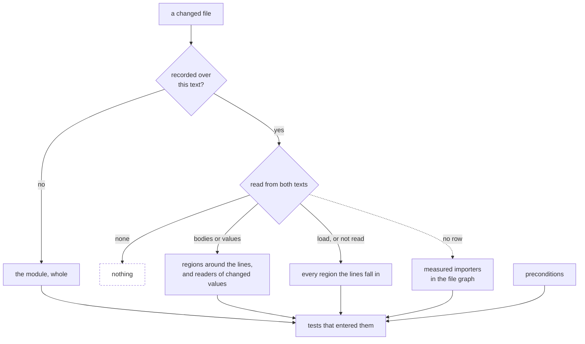

# The execution record

This page is the reference for the file your suite writes when it runs. The
record holds **which parts each test actually covered**, so a changed line can
select from witnessed execution instead of every test a static import graph can
reach. Blocks, the coverage file, and journals make that distinction queryable.

Read on for where the file lands, what to import to read it, what each
structure's primary key is, how a fact traces back to the line or test that
produced it, and what a lookup, merge and append cost.
[`selecting.md`](selecting.md) says what a run does with the answer;
[`source-structures.md`](source-structures.md) covers the static side this page
joins with.

Throughout, `T` is the number of tests the record lists, `M` the number of
modules, `B` the number of blocks in one module, `P` the total number of
preconditions, and `C` the number of crossings, one per test that executed a
block. A precondition on this page is a file a test's answer depends on. The
state a test ran under, such as a feature flag or what a mock returns, is
recorded as a [case precondition](case-preconditions.md), which never selects a
test.

## Where the file is, and what to do with it

Find it with `testCoverageFile(root)`, or with `readableTestCoverage(root)` when
you want the nearest snapshot a worktree can actually read:

```
<cache>/test-selection/<repository-digest>/coverage.bin
```

`<cache>` is [your cache](cache.md).
`<repository-digest>` is a digest of the checkout's absolute path, so two
checkouts never write one another's bytes. A worktree writes its own layer under
`.work/<workspace-digest>/` beneath that directory and reads the primary
checkout's as a fallback, so a worktree cut this morning inherits what the
repository already recorded instead of re-transforming it.

**Do not commit it.** The default path is outside your work tree: `git status`
never sees it, `git clean` never takes it, and it never lands in a pull request.
Two cases need an ignore entry, and you create both. Set `cacheRoot` to a path
inside the checkout, and ignore that directory as [the cache](cache.md) page
shows. Or pass `coverageFile` to a runner integration to put the snapshot at a
path you name, typically inside the repository so CI can upload it as an
artifact, and ignore that path. The record carries the run's cases too, so
there is no second file to upload.

One more thing lives under that directory: a run in progress keeps a
`.run-<pid>-<uuid>` directory there until its reporter folds the journals and
removes it. An instrumenting build writes nothing there; what an ordinal means
is cut again from the source file whenever a run is read.

Delete any of it and you pay one full run. A missing, foreign or corrupt file is
read as an absent record rather than an empty one, so a selector widens to the
whole suite instead of narrowing on damage.

### One record for each suite

If your repository runs more than one test suite, declare each one, with its
kind, under `suites` in the `variance.config.json` at the repository root:

```json
{
  "suites": {
    "unit": { "kind": "unit" },
    "stories": { "kind": "visual" },
    "checkout": { "kind": "e2e" }
  }
}
```

The kind is one of `unit`, `integration`, `e2e` and `visual`. Nothing infers it
from the runner, because a Playwright suite can be `e2e` or `visual` and only
you know which one you meant.

Each declared suite has its own record, at
`<repository-digest>/suites/<name>/coverage.bin`, with its runs log beside it. Name the suite in the runner integration with the `suite`
option, and `testCoverageFile(root, { suite })` returns its path. A Playwright
run then never replaces what the unit suite recorded, and each record keeps the
commit its own suite last ran at. The [source index](source-index.md)
stays at the top of the directory, because it describes the checkout and not a
run. A worktree seeds each suite's record from the same suite in the primary
checkout, never from another suite's.

Once `suites` is declared, a run stops before it starts when its integration
names no suite, names one the file does not declare, or names a suite and a
`coverageFile` together. A repository that declares no suites keeps the one
`coverage.bin` described above.

`variance select`, `variance run --since` and `variance journeys` each answer
for one runner, so each reads one suite's record: the one `--suite <name>`
names, or the only one declared. With more than one declared and no `--suite`,
they stop and list the suites.

`variance covering` asks the other question, which suites ran this code, so it
reads every declared suite's record and answers under each suite's name and
kind. Suites that never loaded the file are named together after the answers,
and a suite with no recording yet says so. A payment module your unit suite
walked and your visual suite never loaded reads as exactly that. `--suite
<name>` asks one record alone.

## What each host records

Six hosts write this file, and they write the same structures into it. What
differs is the owner of an observation — the key a crossing joins, which is
whatever that host schedules — and where the bracket goes that separates one
case from the next.

| Host | An observation is owned by | The case bracket wraps |
|---|---|---|
| Vitest | the test file | the asynchronous scope of each case, so cases in flight together stay apart |
| Jest | the test file | the body of every case the runner announces, so a file that imports `it` from `@jest/globals` is bracketed like one that does not |
| Rstest | the test file | `it` and `test` wherever the suite reads them — off the realm, or off the object an import of `@rstest/core` compiles to |
| Playwright | the spec file | the test, which is already the window the driver closes |
| Storybook | the story | the story, which is already the unit the preview shows |
| [A JVM on the JUnit Platform](jvm.md) | the test class's source file | the top-level test class, which the listener closes as the next one starts |
| [Any other runner](../packages/sense/README.md#record-a-runner-this-package-has-no-seam-for) | the test file it observes | the body it hands to `observer.case` |

None of the Node seams asks you to change a runner option to record cases, and the
snapshot's bytes do not depend on them — the case axis is a second file beside
it. A test file that runs in a page, under Vitest or Rstest browser mode, is
recorded per file only: that run writes no case index and prints a warning.
[Own fewer tests](own-fewer-tests.md#ask-which-tests-cover-a-line) is the
question that reads it.

Two answers are properties of this file rather than of a host, so they read the
same under every host:

- **A run that transformed nothing still records what its tests covered.** When
  every module came from a warm cache, each probe still reports its file and a
  digest of the text it was placed on, and the run cuts that file again from
  the checkout to learn what each region means.
- **An observation that did not finish is dropped from the pool.** It is not
  counted as a miss, so nothing a host retries or interrupts can justify a skip.

The snapshot is not a run history. It stores no pass-or-fail verdict for each
attempt and no sequence connecting a failing local edit to the corrected change
later submitted to continuous integration. A failed file is incomplete evidence
for selection, not a retained failure event.

## Reading the snapshot yourself

No `variance` subcommand dumps the snapshot. The CLI reads it to answer
questions — which tests a change reaches, where two subjects parted — and prints
those answers, never the rows. To see the rows, decode the file in process:

```ts
import {
  readTestCoverage,
  testCoverageFile,
} from '@variance-authority/sense/test-selection';

const coverage = await readTestCoverage(testCoverageFile(process.cwd()));

for (const module of coverage.modules) {
  for (const block of module.blocks) {
    console.log(module.file, block.kind, block.name, block.path, block.testFiles);
  }
}
```

`readTestCoverage` decodes the whole file into `TestCoverage`, the model the
rest of this page describes: tests with their preconditions, modules with their
blocks, and on each block the test files that crossed it. Budget a second and
three hundred megabytes of heap for a repository-scale snapshot — thirty times
the file it came from — because the model is made of objects where the file is
made of columns.

When you want one module's regions rather than the repository's, open the file
instead of decoding it. `openCoverageFile(file)` parses the section index and
hands back a view whose columns decompress only when something in them is asked
for, plus the `close()` that releases the descriptor; `askCoverageFile(file,
ask)` is the same open with that close already written for you. Opening costs a
millisecond and half a megabyte resident, and answering a diff through the view
is single-digit milliseconds.

A region's `blockKind` in that view is a position in `BLOCK_KINDS`. The cases
are a section of their own: `caseSectionsAt(file, ['index']).index` reads it,
and `openSetColumns` opens it as columns — each case's file and how it settled,
and for each region the set of cases that crossed it after its module loaded —
with no string decoded until you ask for it.

## What you can import

These names are the package's published surface. Import them, and the shapes
they return are the ones this page describes.

| Import from | Names |
|---|---|
| `@variance-authority/sense/instrument` | `instrument`, `instrumentationId`, `instrumentModeOf`, `INSTRUMENTATION_ID`, `EVALUATING`; types `Block`, `BlockKind`, `Instrumented`, `InstrumentOptions`, `ModuleId` |
| `@variance-authority/sense/test-selection` | `testCoverageFile`, `readableTestCoverage`, `seedTestCoverage`, `readTestCoverage`, `writeTestCoverage`, `writeCoverageBytes`, `openCoverageFile`, `askCoverageFile`, `BLOCK_KINDS`, `caseSectionsAt`, `openSetColumns`, `selectTestFiles`, `narrowByExecution`, `mergeCoverage`, `foldTestCoverage`, `changedLines`, `coveringTests`, `coveringTestsInFile`, `recordedCommit`, `cacheLayers`, `cacheRootFor`, `CACHE_CONFIG`, `repositoryLayers`, `layeredFiles`; types `CacheLayers`, `TestCoverage`, `CoverageModule`, `CoverageBlock`, `CoverageTest`, `CoveragePrecondition`, `CoverageFile`, `CoverageShard`, `ExecutionIndex`, `SetColumns`, `TestColumns`, `StringTable` |
| `@variance-authority/sense/journal` | `testSelectionProbes`, `drainExecution`, `recordExecution`, `joinObservations`, `moduleId`, `EXECUTION_GLOBAL`; types `ExecutedModule`, `ExecutionJournal`, `EvaluatingPage`, `ObservedSubject` |
| `@variance-authority/sense/journey` | `collectJourneys`, `stitchJourneys`, `mintJourney`, `journeyOf`, `JOURNEY_COOKIE`, `JOURNEY_VARIABLE`, `JOURNEY_HEAD_VARIABLE`; types `JourneyAccount`, `JourneyReport`, `StitchedJourneys` |

Nothing else on this page is importable. Where the sections below describe the
encode, the merge or the lookup, they describe behaviour you can rely on through
those entry points, not functions you can call.

## The structures at a glance

| Structure | Primary key | Identity across runs | Lives |
|---|---|---|---|
| block | `(module path, ordinal)` | `kind`, `name`, `path` | coverage, and the source file it is cut from |
| module | file path | the same | coverage, and the source file it is cut from |
| test | test file path, or a story id | the same | coverage |
| case | test file path and the case's declaration path under it | the runner's id where it hands one over, otherwise the same pair | the case index, with the duration its runner reported |
| precondition | `name` and `digest` together | the same pair | coverage, per test |
| crossing | `(block, test)` | the same pair | coverage |
| worker journal | one test file in one worker | none, folded on read | the run directory |
| page journal | one drain of one page | none, folded on read | the driver's memory |
| journey account | one delivery from one head | none, stitched by journey id | the wire, then the driver's memory |
| journey | one minted id | the id | a cookie, and the driver's map to its subject |

## Blocks

Call `instrument` to parse one module with `oxc`. You get back `Instrumented`:
the transformed `code`, the `sourceDigest` of the exact input, the
`instrumentation` id, and a `blocks` array in ordinal order. Each `Block`
has the ordinal, the kind, the owner ordinal, the digest, the name, the
path, and the start and end offsets in the original source. For a module the
parser cannot read you get `undefined` rather than an empty list, because *not
instrumented* and *no regions* are different facts — check for it.

**Kinds.** `module`, `function`, `branch`, `continuation`, `resume`, `loop`,
`case` and `handler`. In the coverage file the kind byte is that list's index,
so read it against this order. One rule generates the set: a block is a region that control
runs under exactly one condition, one the region around it does not imply.
Running a `try` body follows from running the region around it, so it is no
block; running its `catch` does not, so it is.
Ternaries and the short-circuit operators stay inside the region that encloses
them.

**Ordinal.** The block's position in a pre-order walk of the module, and the
index of its counter in the runtime array. Ordinal `0` is the module root, the
only block without an owner. The ordinal is the key inside one instrumented
version of the module and means nothing across versions: inserting a function
above another renumbers everything after it.

**Owner.** The ordinal of the nearest enclosing block, so `owner`
chains lead every block to the root in at most depth steps. A continuation
owns what follows it, so the owner of the `if` inside a function that first
ran a loop is the loop's continuation, not the function's entry. The chain is
what gives a block its identity when ordinals shift.

**Name.** The declaration name path: the names of the functions and classes
enclosing the region, joined with `/`. A function takes its own identifier; a
method or a property takes its key; a function assigned to a variable takes
the variable; a closure passed as an argument takes `<callee>.arg<i>`; a
function with no name available takes `anon#<i>`, numbered within the
enclosing scope. `Cart/render/anon#0` and `applyTier/reduce.arg0` are names.
The module root's name is the empty string.

**Path.** The structural position inside that declaration. The module root
is `module`; a function's own region, from its parameter list to its end, is
`entry`. Decisions are numbered within the path that contains them:
`if#0/then`, `if#0/else`, `if#0/after`, `switch#1/case#2`,
`switch#1/default`, `try#0/catch`, `try#0/finally`, `for#0/body`,
`while#0/body`, `await#0`. A nested decision extends the path of the region it
sits in, and numbering is local to the containing path, so the first `if`
inside another's `then` arm is `if#0/then/if#0`. Two functions with one name
in one module are told apart by `name`, never by `path`: every function body
is `entry`.

**Digest.** `digestString` of the kind, a `NUL`, and the block's own text with
each child region replaced by a `NUL`-framed `kind:name:path` placeholder. So
the digest changes when the block's own statements change and does not
change when a nested region's body does: the condition of an `if` belongs to
the region around it, and editing the condition changes that region's digest
while editing one arm changes only the arm's. A synthesized region, an `else`
nobody wrote or a `default` nobody wrote, has zero width and digests to its
kind alone.

**Offsets.** `start` and `end` are offsets into the original source. The
record and the coverage file use lines instead, computed through the
bundler's source map when there was a transform before this one, so a diff
hunk lands on the file the author edited.

**Cost.** Cutting a module is one parse and one pass — 0.14 ms a module over
this repository's own source on one Mac, so a build that changed ten files
spends under two milliseconds carving them. The parse, the walk and the digests
run in `sense`'s native addon, and no tree crosses into JavaScript: what comes
back is the instrumented text and one column per block field.

### A worked example

The module below has eight regions. Instrumenting it adds text on existing
lines only; no line is added, so the lines a block covers are the
lines the author wrote.

```js
import { tax } from './tax.js';

export function total(items, premium) {
  let sum = 0;
  for (const item of items) sum += item.price;
  if (premium) return sum * 0.9;
  return sum + tax(sum);
}

export const label = (n) => n > 0 ? `${n} items` : 'empty';
```

The eight blocks, with the owner chain that gives each its identity:

| ordinal | kind | owner | name | path | offsets |
|---:|---|---:|---|---|---|
| 0 | `module` | | `` | `module` | 0–256 |
| 1 | `function` | 0 | `total` | `entry` | 54–194 |
| 2 | `loop` | 1 | `total` | `for#0/body` | 116–134 |
| 3 | `continuation` | 1 | `total` | `for#0/after` | 137–192 |
| 4 | `branch` | 3 | `total` | `if#0/then` | 150–167 |
| 5 | `branch` | 3 | `total` | `if#0/else` | 167–167 |
| 6 | `continuation` | 3 | `total` | `if#0/after` | 170–192 |
| 7 | `function` | 0 | `label` | `entry` | 217–254 |

Block 1 starts at `total`'s parameter list, not at its `{`: a parameter is
evaluated on every call, so an edit to one is charged to the tests that called
the function, not to every test that loaded the module declaring it.

Block 5 is the `else` nobody wrote: zero width, and still a place control
reached. Block 3's text spans from the statement after the loop to the end of
the function, and its digest is computed with blocks 4, 5 and 6 replaced by
their placeholders, so an edit to `return sum * 0.9` changes block 4's digest
and leaves block 3's alone. The loop header `for (const item of items)` is
block 1's text, so editing it changes the function's entry digest.

Ordinals run on through the module: `label` is block 7 because seven blocks
were opened before its body, and a third function would take 8. Both
functions count into one array, the module's, so the file has one counter
array of eight slots, not one per function.

Across test files the ordinals are the join key. Every worker that ran this
module reports hits against the same eight slots, and the fold unions them per
ordinal into the block's `testFiles`. `foldTestCoverage` unions the records of a
sharded run the same way, and refuses two shards that record the module under
two source digests, because their slot 4 would be two places.

### Identity under an edit

An ordinal is a slot in one instrumented version of a module, and it is not
what keeps evidence across an edit. What keeps it is the region's address: the
declaration name path and the structural path inside it, which record where the
region sits in the module's tree rather than where it sits in the module's
text. `mergeCoverage` moves a crossing from the previous record onto the
region with the same address, and the digests take no part in that.

So renumbering is not invalidation. Inserting
`const price = (item) => item.price;` after `let sum = 0;` opens
`total/price` at ordinal 2 and moves everything after it up by one — the loop
body to 3, `label` to 8. Inserting a top-level
`export function count(items) { return items.length; }` moves `label` to 8 the
other way. In both the record keeps every crossing it had, because
`total/if#0/then` is still `total/if#0/then`.

A crossing is dropped only when the new text has no region with its address:
a function renamed, a decision deleted, an arm that is now a loop. Even that
rarely retires a test. Arrival nests — a test reached a region by running
every region around it, up to the module — so a test whose function was
deleted still has crossings above it, and a diff at the place that function
was reaches it through them. Only a test that loses every crossing in a module
is demoted to incomplete and selected whole next time.

**A digest that changed keeps the crossing and demotes a test the run did not
observe.** It shows that the region's own text changed, and the tests to run are
the ones recorded against that region — which is the crossing. Reading a digest
as a reason to discard the crossing would throw away the evidence the change is
about to be answered with, and reading the owners' digests too made any edit at
a module's top level retire every crossing in the file. But the re-recorded rows
hold the text the run read, and selection reads a later change from that text,
so the edit between the text a carried test ran over and this one is in no diff
it will read. Each test on such a region that the run did not observe is
demoted to incomplete; a test the run observed was recorded again over the new
text.

| edit, under a run that did not observe the test | crossings kept | the kept test's row |
|---|---|---|
| function added inside `total` | every one | incomplete, if it entered `total` |
| function added at module level | every one | incomplete, if it loaded the module |
| body of one `if` arm edited | every one | incomplete, if it entered that arm |
| `total` renamed | those of the root and `label` | incomplete, if it entered `total` |

**A module the run did not load** stays in the record, and its rows are lines
of the text it had when it was recorded. When that text has since changed, the
regions are read out of the text standing there now and each crossing is
moved onto the region with its address, so the rows are in coordinates the
next diff will be in. A module whose text cannot be read as source has no
table to place them in: it stays as it was, and every test that covered
it is demoted.

### From a crossing back to a line

The record joins a block to the file two ways. `sourceDigest` on the module
row names the exact text the ordinals were cut from, and `startLine` and
`endLine` on each block are lines of that text. A diff is charged to lines, a
line lands on the blocks whose range covers it, and a block yields the tests
that crossed it; the procedure is in *Tracing a diff to tests* below.

So whether a change to a handler runs any test depends on where the
edited line sits. Take a component whose render function defines a two-line
`toggle` closure and a one-line `onClick` arrow, recorded with one test that
clicked and one that only rendered:

| edited line | charged blocks | selected |
|---|---|---|
| a line inside `toggle`'s body | `Button/toggle` only | the test that clicked |
| the line `const toggle = () => {` | `Button/toggle`, then `Button` | both |
| the JSX line with `onClick={() => …}` | `Button/anon#0`, then `Button` | both |

A line that is a region's first or last line is also the enclosing region's
text on that line, so the charge extends outward and the tests that merely
rendered are selected. An edit that lands on a line belonging to the handler
alone charges the handler and nothing wider, and a handler no test crossed then
selects no test at all. A one-line handler has no such line, so every edit to
it runs the tests that reached the component.

**Added text is charged for what it does.** A change read from both of its
texts ([step 3](#tracing-a-diff-to-tests)) charges an insertion into a gap no
region spans nothing at all, and what follows applies when it cannot be read that
way. An insertion has no line of its
own in the text the rows are coordinates in, so it is charged to the lines on
either side of the gap it opens — and at a module's top level both of those are
the module, whose crossings are every test that ever imported the file. The
diff includes the added text, so the question is asked of the text instead: a
type, an interface, a signature with no body, a type-only import, each of
them erased before the module runs, which leaves the text that was
already there the whole of what ran, so the hunk charges nobody. A function
declaration is not on that list, because it hoists: it binds its name at the top
of the block the text landed in, over whatever value that name had there, and
the lines above it are the ones the hunk did not touch. Neither is a class
declaration, whose decorators, computed keys, static initializers and base
expression all run, nor an enum the compiler emits, whose function merges into
whatever object its name already refers to, nor a `const`, whose initializer
is work every importer of the module consumed.

## The coverage file

The file you located above declares two numbers. One is the
model version: what `TestCoverage` means, stated by a producer and passed
through a merge. The other is the byte layout, which changes when the model
does not; a file written under another layout is refused rather than
reinterpreted. The container is a `u32` little-endian
header length, a JSON header `{ version, sections }` padded with `NUL` so the
payload starts on an 8-byte boundary, and then the sections. Each entry in
`sections` gives `name`, `offset` from the start of the payload, `length` in
bytes, `width` — one byte for `strings.blob` and the flag and kind columns,
four for everything else — and `rows`, present only on a section stored as
runs. Every section starts on an 8-byte boundary.

Every section is a column, and the columns of one group are indexed by the same
row number. Read a column whose name ends in `.off`, or one described below as a
range, as a compressed sparse row offset column with one more entry than the
parent has rows: child rows for parent `i` are `[off[i], off[i + 1])`.

| Group | Column | Contains |
|---|---|---|
| strings | `strings.blob`, `strings.off` | one UTF-8 dictionary, code-unit sorted, referenced by id everywhere else |
| snapshot | `snapshot.instrumentation` | one string id, the instrumentation the whole file was produced under |
| snapshot | `snapshot.commit` | zero or one string id, the commit the record describes |
| tests | `tests.path` | the test file path, sorted by code unit |
| tests | `tests.complete` | one byte, `1` when every case in the file ran and passed |
| tests | `tests.duration` | the whole milliseconds the test runner reported for the file, `0xffffffff` when it reported none |
| tests | `tests.preconditions` | range into the precondition rows |
| preconditions | `preconditions.name`, `preconditions.digest` | a path the test's answer depends on, and the digest it had |
| modules | `modules.path`, `modules.source` | the module path, sorted by code unit, and the digest of its source |
| modules | `modules.instrumented` | one byte, `1` when the module has blocks |
| modules | `modules.blocks` | range into the block rows |
| blocks | `blocks.ordinal`, `blocks.kind`, `blocks.owner` | position, kind byte, and owning block's ordinal, `0xffffffff` at the root |
| blocks | `blocks.digest`, `blocks.name`, `blocks.path` | identity, as string ids |
| blocks | `blocks.start`, `blocks.end` | first and last line in the source |
| blocks | `blocks.source` | one byte, `1` when the block is a region of the file's text |
| blocks | `blocks.set` | the pooled set of tests that executed the block |
| blocks | `blocks.loadedSet` | the pooled set of tests that had executed the block before their own file began, empty for most regions |
| sets | `sets.blob`, `sets.off` | the pool both of those name: one copy of each distinct set of tests, however many regions name it |

**Durations.** `tests.duration` is the runner's own figure for the file, never a
second clock: Vitest's file result, Jest's `perfStats.runtime`, Rstest's file
duration, Playwright's `testInfo.duration` summed over the file's tests, or the
`duration` you pass to `startRecording().finish()`. A file the runner reported
nothing for stores the sentinel, and a reader answers it as
absent, not as zero. When two projects record the same file, its duration is
their sum, and it is absent if either is.

The case index beside the snapshot carries the same figure for each case, in a
`tests.duration` column of its own: Vitest's task result, Jest's assertion
result, Rstest's test result, Playwright's `testInfo.duration`, or the
`duration` a case carries in what you pass to `startRecording().finish()`.
Playwright's figure covers the test body, its `beforeEach` hooks and the
fixtures set up for it, and not its `afterEach` hooks or fixture teardown, which
run after Playwright has set it. A retried case is timed as the sum of its
attempts, the same way a file recorded by two projects is. A case is joined to
the runner's report by the id the runner gave it, or by its declaration path
under the file where the runner gives none. A path the file declares twice
cannot be matched to one of the two cases, so neither is timed. A case index
written before cases carried durations opens with every case untimed.

A Storybook run is its own runner, so its figure is the time the run spent on
each story, from its first collection to its decision: the same time
`variance ask costs` answers from and the next run balances its shards on. It is
recorded on the story's row and on its case, once however many times the story
was read, and a story the run did not time is recorded without one.

`variance ask slowest-tests` lists the slowest recorded files and the slowest
recorded cases, anywhere or under the paths you name.

**Runs.** A section over sixty-four kilobytes is cut into runs — four thousand
and ninety-six rows of a column, five hundred and twelve strings of the blob —
and each run is compressed on its own. Nothing smaller than a run is
addressable and nothing larger than one is decompressed to read a row, so a
reader that wants the crossings of one region pays for one run and a reader
that wants none pays for nothing. A numeric column is delta coded, zigzagged
and written as varints before it is compressed: these columns ascend almost
everywhere — offsets into the blob, line numbers down a file, the test ordinals
inside one region — and a delta of an ascending column is a small number where
the value was a large one. Deltas are zigzagged because a delta is signed. One
byte per row is already a delta of nothing, so a flag column is compressed as it
stands.

Bytes are what a read costs, so the size rule and the speed rule pick the same
runs. A decoder's work is the compressed bytes it walks, so the run that
compresses to a fifteenth of itself is also the cheapest run to read — eleven
microseconds against the six a bare varint run costs — and the run that resists
compression is the expensive one, at nineteen, for a fifth off its size. That is
why the threshold is stated as a size: a section is stored as runs only when the
runs come out smaller than the column was, and a run compression would have
expanded is kept as the bytes it already is. Compressing what does not compress
buys nothing in either currency. Zstd at two levels, because the runs are two
kinds of data: six for the varints, one for the string blob, which is file paths
and hex digests and gains nothing above it. Against brotli at quality 4 over the
same twenty thousand columns, that is 319 milliseconds of compression down to
120 and a file 86 kilobytes smaller — the blob alone was 187 milliseconds and
7.169 megabytes, against 30 and 7.083. It costs a floor of Node 22.15, which is
where `zlib.zstdCompressSync` arrived. A repository of twenty thousand modules,
six hundred thousand regions and eight million crossings is ten megabytes this
way, a twenty-fifth of what the same snapshot costs as objects, and two thirds
of what is left is the string dictionary.

`TestCoverage` is the model you get from `readTestCoverage`: tests with their
preconditions, modules with their blocks, and on each block the test files that
crossed it. Rebuilding it from the columns is O(bytes). Opening the file with
`openCoverageFile` does not rebuild anything — it parses the section index,
checks that the row counts agree, and gives you a column per section that
decompresses when something in it is asked for. A column answers by the row or
answers whole, and choosing between the two is the difference between reading
one module's regions and reading a repository's. A run reads through the view,
because a selection touches a few modules and never needs the whole model.

The gap is not the decompression. On the snapshot above, opening the file is a
millisecond and half a megabyte of resident memory, answering a diff is single
digit milliseconds, and materializing every column of it — thirteen million
values, each one checked on the way out — is a seventh of a second. Turning
those same values into the objects `TestCoverage` describes is a second and
three hundred megabytes of heap, thirty times the file they came from. Columns
are cheap in both currencies and objects are expensive in both, which is why a
query reads columns and the model is something a caller asks for by name.

What makes the model expensive is repetition rather than size. A path is named
again by every region of its module and again by every crossing that covered
one, so a decode keeps one string per id and hands that one to every use of it.
Decoding each use on its own costs twice the time and close to three times the
heap, for a model that holds exactly the same values.

**Location.** [Where the file is](#where-the-file-is-and-what-to-do-with-it),
above. Nothing beside the snapshot gives its ordinals their meaning: each
module row names its file and the digest of the text its regions were cut from,
and a reader cuts that text again.

## Keys

**Test.** The owner of an observation: the test file's repository-relative
path under a Vitest, Jest, Rstest or Playwright run, because the runner's unit
of scheduling is the file, and a story id under Storybook, because a story is
selected on its own. Two observations of one owner in one write are refused as
a duplicate.

**Module.** The module's repository-relative path, with `modules.source` as
the digest it must still have for its blocks to mean anything.

**Module id.** A probe reports its module as `path@digest`: the
repository-relative path of the file the transform was handed, and the first 32
hexadecimal characters of the SHA-256 of the text the probes were placed on.
`moduleId(path, code)` from `@variance-authority/sense/journal` builds it, for a
driver that writes its own journal. The build writes nothing else down.
Placing probes is deterministic, so one text, one path and one recipe give one
set of ordinals, and every reader cuts the module again from the checkout:

- **The file has the text the digest names.** The reader cuts it exactly as the
  transform did, and every ordinal means the region it meant in the build.
- **The file has other text.** The module is recorded as not instrumented: its
  file is still named, with no regions. Every subject that ran it depends on
  that file's text whole, so a change to it selects those subjects.
- **The file is gone, or the id names no file under the root.** The module is
  left out. The test that ran it is recorded incomplete, so a later run never
  skips it.

So a transform reads nothing from the rest of the build: ten changed files out
of two hundred thousand are rebuilt in parallel, in any order, by processes that
never meet, and two builds over one repository, such as a Storybook preview and
the application a Playwright suite drives, need no name to keep their ordinals
apart.

**Block, within a file.** `(module row, ordinal)`. Ordinals are unique within
a module and the first block is the module root.

**Block, across files.** `name`, `path` and `kind`: the address, and what kind
of region sits at it. `mergeCoverage` matches `name` and `path`, and then checks
the one remaining condition, whether the kinds agree. Nothing above the block
is part of the match and neither is its digest, so a block keeps its crossings through every edit that leaves it where
it is. A block with no match in the new table is gone, and what was recorded
against it is dropped.

**Precondition.** The pair of path and digest, kept unique per test by the
concatenation `name`, `NUL`, `digest`. A test's preconditions are the files
its answer depended on that the instrument could not see inside: the test
file itself, configuration, fixtures, and modules that were loaded but not
instrumented.

**Crossing.** `(block, test)`. The record stores presence, not counts: a test
crossed a block or did not. Counts exist only in the runtime array and are
gone once the journal is written.

## Finding a row

Ask for a module or a test by path and you pay a binary search: it is found by binary-searching the sorted path column, decoding
one string per probe: O(log M) or O(log T) decodes. A block by ordinal within a
module is a linear scan of the module's block range, O(B).

The tests that crossed a block are the rows `crossings.test[blocks.tests[b]
.. blocks.tests[b + 1])`, O(crossings of that block).

The tests a changed uninstrumented file governs come from a walk of every
precondition row once, O(P), returning the tests by row with the names that
matched. A file no precondition names comes back as unread, which is the signal
that the record has no row for it.

The preconditions of a test are the rows `tests.preconditions[t] ..
tests.preconditions[t + 1]`, O(preconditions of that test).

## Tracing a diff to tests



A file with no row is read first, with every export counted as changed; the
dashed branch is what that reading cannot answer. A precondition selects on any
change to its file's text, whatever the reading found.

`selectTestFiles` performs the trace one changed file at a time. Each step
below is one stage of that call.

1. **Diff to lines.** `changedLines`, which you can also call on its own, reads
   the old side of each hunk: context lines are not charged, a pure insertion charges the line
   before and the line after, deletions charge the removed lines, a renamed
   file is read under its old name, and a file with no hunks is charged
   whole. The added text of an insertion is kept with the range it charges.
   O(diff length).
2. **Added text the module never runs.** The added text of each such range is
   parsed. A range whose text is nothing but types, interfaces,
   signatures with no body, erased enums, type-only imports and a re-export of
   a name the file already has is dropped before anything is charged: none of
   it is evaluated where the code that already ran could use it. Text that
   parses to no construct at all — a comment, a blank line — is *not* dropped,
   because the same bytes at the same line number are equally a line of the CSS
   or the copy a module renders out of a template literal, and a diff offers no
   coordinate finer than the line. One parse per inserted run.
3. **Reading the change.** When you pass `sourceAt` and the recorded text
   answers it, the file is read from both of its texts: the recorded one, and
   that one with the diff's hunks applied. Each side is parsed twice, whole and
   with every function body emptied, and the file gets one verdict. `none` —
   the two programs are equal without comments, types and formatting — charges
   nothing. `bodies` — what the module does as it loads and every binding's
   value are equal — charges the regions around the lines and never the
   module's own region. `values` charges the same regions, and every region
   that reads a binding whose value moved: in the file, and in each direct
   importer on a runtime edge, further only through a re-export. A read at
   load charges that module, and an importer that hands a namespace on whole
   charges its module. An import that binds a name is a use by the functions
   that read it, so an import added to a file charges those functions and not
   the file's loaders. When you pass `root`, the `package.json` each changed
   file sits under, and of every file an added or removed import loads at any
   depth that the file did not already load, is read for its `sideEffects`: a
   declared file, or an importer that starts or stops loading one, is `load`,
   and its reading lists the declared files in `effects`. A test that crossed the
   changed module through no importer the graph holds is listed in `unseen` and
   charged nothing. `load` charges the lines as step 4 does. Under `bodies`
   or `values`, text inserted in a gap no region spans charges nothing. A file
   without `sourceAt`, whose hunks do not apply to the recorded text, whose
   text does not parse, or on a machine without the scanner's native addon is
   charged by its lines, and `readings` records which. Two parses per side per
   changed file, and one parse per importer of a moved value.
4. **Lines to blocks.** Each charged line costs one scan of the module's
   blocks, O(B). Every synthesized region containing the line is charged. Source
   regions containing it are grouped by span, and the narrowest group is
   charged whole. Each wider group is charged in turn as long as a region of
   the group just charged extends outward, which means its text on that line
   sits beside the wider region's text. A region extends outward when the line
   is its first line, except that the module root and a continuation never do,
   a function also does when the line is its last, and a resume does on any of
   its lines, but only when no region of another kind has its span: every line
   of an awaited expression is evaluated before the await settles. A line no source region contains
   charges every block of the module.
5. **Blocks to tests.** Each charged block's crossings, O(C of those blocks), of
   every row recorded under the path — two builds that read one module are two
   rows, and the answer is all of them. Every changed path is also looked up in
   the precondition table, O(P), whatever its rows hold: a row records which
   tests covered which regions, a precondition marks the observation void if the
   file's text changes at all, and the two are not the same fact. A row does buy
   the path out of *unread*, which is why a module nothing declares is still
   measured.
6. **Files with no row.** Hand the relations graph in through
   `options.relations` and a changed module with no instrumented row under any
   of its names is read as step 3 reads one with a row, with every export
   counted as changed. What that reading cannot answer — no `sourceAt`, a text
   that does not parse, a `load` verdict — and every file with no row that is
   not a module is looked up in the graph, which walks to the files that import
   it. A file something imports as an asset — a stylesheet, an image, a JSON
   file, where no probe can sit — is walked along `asset` and `depends` edges
   only, through the stylesheets that import it to the modules that import or
   declare those. A module is walked along every runtime edge and never `type`,
   and each chain stops at the first test file or module with probes; a module
   without probes measured nothing, so the chain goes on past it. Each file a
   walk stops at answers for itself: a test selects itself, a module with probes
   selects the tests that crossed it, and a module without probes selects the
   tests that declare it. A file with no row selects nobody and takes nothing
   from the chains beside it. A test that mocked the changed module, or a file
   between the two, is cut there. A bumped package is walked from its node along
   every runtime edge to every file that imports it at any distance, and each
   answers the same way. A file with no row selects nobody even when a test
   declares it: a declaration selects on a change to the declared file's own
   text, and a walk selects on no such change. O(n + m) on the graph per changed
   file.
7. **Unread.** A changed path is read when *some* name the caller passes for
   it has a module row, a precondition or a node in
   the graph. One file is often two names — a package's own suite loads `src`,
   every other package loads the built twin — and each name selects the tests
   its own rows and declarations name; a name the snapshot has nothing under
   selects nobody and takes nothing from the name beside it. A path none of
   whose names is read, and a path the caller gives no name at all, is reported
   as unread. It is a report, not a widening: the skip list is still `whole`
   less `entered`, and a suite that rests on such a file declares it as a
   precondition, which removes it from `unread`. A name with a row is read even
   when no test names it: the row is the measurement.

The whole trace is O(diff length + inserted text + B per changed module + C of charged blocks
+ P), plus one graph walk per changed file when a graph is supplied, and the
parses of step 3 when a reading is made.

## Tracing a test to what it depends on

Going the other way costs you one row read. A test's preconditions name the files
whose change must re-run it without any block being involved, and its
crossings are the inverse of `crossings.test`: the blocks whose crossing range
contains the test's row. The file has no index in that direction, so listing
every block a test crossed is O(C) over the whole record. `ExecutionIndex` is
the same data in the shape a collector or an editor integration supplies: each
block lists the tests that crossed it with the call-stack depth from the test to
the block. Pass one to `coveringTests` to ask by line or by function name, at
O(M) to find the module and O(B) to place the line in its regions. A line answers
with the regions a change to it would select: the innermost region holding it,
and the enclosing one when the line opens a branch and holds its condition.

## Tracing a block to its place

Take a block row and you have its module row, its ordinal, and its owner
ordinal. The
owner chain is followed by finding the owner's row inside the module's block
range, O(B) per step, at most depth steps. `name` and `path` together read
as a location without the chain: the declaration and the structural position
inside it. `start` and `end` place the block on the lines of the source at
`modules.source`. When the file on disk no longer hashes to that digest the
lines are the record's, not the disk's. A merge notices that and re-cuts the
rows over the text that is there. A file it cannot read at all is treated
differently from one that is not there: a path that has gone leaves the
module to be answered for by name, and a path that refuses to be read retires
the observation instead of keeping it over text nobody has seen.

## Journals

Every runner seam records what one process observed and leaves the fold to the
writer. Read this section when you are wiring a runner yourself; a suite using
the shipped Vitest, Jest, Rstest, Playwright or Storybook seams never sees one.
Three journal shapes exist, and each includes a list of `ExecutedModule`; the
[module id](#keys) after them gives their ordinals meaning:

```json
{ "id": "src/cart/total.ts@9b2f6e0c4a7d1e58b3c09f2a6d4e7b10", "hits": [0, 1, 2, 3, 5, 6], "shared": [0], "loaded": [0, 1] }
```

`id` is the module id the module was instrumented under, `hits` the ordinals whose counter was above zero, ascending,
and `shared` the subset of `hits` whose counter had the `EVALUATING` bit set.
`loaded`, in the worker journal only, is the subset of `hits` whose counter was
already above zero in the snapshot the setup file took before the file's first
test: regions covered as a consequence of loading. Presence only: the counts
never leave the process. The ordinals index the recipe the build instrumented
under — `sense:instrument/presence-v5`, or `sense:instrument/entries-v2` when
the seam was asked for `mode: 'entries'`, which numbers the module and each
function and nothing between — and every reader refuses a journal or
snapshot cut under the other.

**Worker journal.** Written by the setup file of a Vitest, Jest or Rstest
worker in its `afterAll`, one per test file, as `<pid>-<uuid>.va` under the
run directory `.run-<pid>-<uuid>` beside the coverage file. It is the one of the three that is
never built as those objects: the encoder walks the counter arrays the probes
increment and writes the ordinals out as the gaps between them, so a worker pays
one pass over each array and the reporter reads bytes.

```
journal  "VAJRN" | version | test file | modules | module | module | …
module   1 | id | hits | shared | loaded
hits     count | gap | gap | …
```

A module is written as `1 | id`, and a reader refuses any other tag as a
damaged frame. Counts, ids and gaps are varints and text is a length and its UTF-8; ordinals
rise within a module, so a region costs one byte. A run of eight thousand test
files over two hundred thousand modules reports sixteen million module rows. As
frames each row is its module's id and its ordinals as gaps, which is under
half the bytes of the same rows as JSON, and nothing is rendered or parsed as
text on the way. No checksum: one process writes a journal and
closes it, one reader opens it once that process is gone, and the only damage
available to it is a tail that never arrived — which a decode obliged to land
exactly on the end of the frame refuses for nothing.

The reporter cuts each module an id names again from the checkout, folds every journal's `hits` into
crossings and its `loaded` ordinals the same way over the other column, merges
into the coverage file, and removes the run directory. A
shared ordinal is credited to every test file that consumed the module; under
isolation each file consumed its own evaluation and the credit goes to nobody
else.

**Page journal.** The collector that `testSelectionProbes` hoists in front of
every instrumented module installs the page factory and exposes itself on
`globalThis.__variance_authority_execution__` — the name `EXECUTION_GLOBAL`
spells — as `{ version: 1, instrumentation, drain(), reset() }`. `drain`
returns `{ instrumentation, modules }` and zeroes every counter; `reset` zeroes
without reporting. Call `drainExecution(page)` after each subject. You get
`undefined` back from a page with no collector, which means an application built
without probes and is not an error; handle it as its own case. Modules are keyed by the id the page reports,
which is the id the build instrumented them under.

**Journey account.** A **journey** is one execution of one subject, identified
by an opaque id the driver mints and sets on the browser context before the
first navigation. A **head** is a service process, instrumented by its own
build, that reads the id off the requests the browser sends and reports what it
covered under that id. [`journeys.md`](journeys.md) is their page. The type
`JourneyAccount` is what one head reports for one execution:

```json
{
  "version": 1,
  "instrumentation": "sense:instrument/presence-v5",
  "head": "api",
  "scope": "journey",
  "lost": 0,
  "modules": [ { "id": "src/routes/cart.js@4e0a91c37b2d58f6a1c9e3b07d5f2a84", "hits": [0, 1, 4], "shared": [0] } ]
}
```

`head` is the name the service reports under, the name a driver declares in
`heads`. Each module's `id` is a [module id](#keys), so the driver cuts the
service's modules again from the checkout the way it cuts the page's. `scope` is `journey` for crossings
made inside a request that carried a journey cookie and `process` for everything
the process did outside any journey, its own initialization for instance, which
the driver folds into every subject. `lost` counts the earlier accounts this
head could not deliver, and a positive count marks the run incomplete. The
account names neither the journey nor the subject: the id travels on the wire,
and only the driver owns the map from journey to subject.

**The wire.** One execution is one opaque UUID minted by the driver, carried
in the cookie `variance-authority-journey`, and the address a head delivers
to is the cookie `variance-authority-return`, loopback `http` only. A head
reads
both off the request's `Cookie` header, runs the handler inside an
`AsyncLocalStorage` scope keyed by the journey, and when the scope settles
delivers the account as a JSON `POST` to `<return>/journeys`, three attempts,
or through the `__VAW__` sink function when the driver is in the same realm.
The head installs nothing unless `VARIANCE_AUTHORITY_JOURNEYS` is set, and
names itself from `VARIANCE_AUTHORITY_HEAD` when no name is passed.
`stitchJourneys` joins every account bearing one id to the subject the driver
minted it for, counts an account under an id the driver never minted as
unclaimed, and marks the whole run incomplete when a declared head stayed
silent, reported another instrumentation id, or lost an account.

## Writing the record

Four ways bytes land in the file. Each is reachable from the imports above.

**Append from a worker run.** The Vitest, Jest and Rstest reporters read every
worker journal in the run directory, fold the `hits` and `loaded` columns into
crossings, merge into the coverage file and remove the run directory. O(sum of
journal sizes).

**Append from a driven run.** Call `recordExecution` with the drained subjects
in memory, one per owner, with the journey accounts already joined through
`joinObservations`. It cuts each module the subjects reported again from the
checkout, refuses when none of them is a file under the root or when one names
another instrumentation id, and folds under `<coverage>.lock`. The lock is
exclusive-create, waited on for ten seconds at a 25 ms poll, and considered
stale after sixty. A module whose file no longer has the text its id names is
recorded as not instrumented. A module whose file is gone is dropped,
and the subject that covered it is recorded incomplete, because a subject whose
crossings cannot all be placed is one a later run may not skip. The fold is
O(hits) over every subject's journal plus O(modules reported) to build the
rows.

**Merge with the previous record.** `mergeCoverage` brings forward what the run
did not observe. When the instrumentation id differs the previous record is
dropped whole. A test the run observed replaces its previous row. A test the
run did not observe keeps its row, unless no region it crossed survives in the
new table or a region it crossed has a new digest, in which case it is demoted
to incomplete and re-runs on its next selection. An unobserved module whose text on disk changed has its rows
re-cut over that text, one parse per such module, and only a module whose text
cannot be parsed demotes every test that crossed it. Both sides are indexed
before the walk — modules by path, blocks by their address, name path and
structural path together — so the cost is O(M_prev + M_cur) plus
O(B_prev + B_cur) for each matched module, and the file is sorted on the way
out.

**Fold shards.** `foldTestCoverage` unions the records of a
sharded run, in any order, O(sum of shard sizes). It refuses shards with
differing instrumentation or commit, a test in two shards, and a module with
two source digests. Where shards disagree about whether a module could be
read, the instrumented rows answer: a shard that could not instrument a module
has no rows for the tests another shard recorded running it, and the tests that
loaded the uninstrumented copy already declare it as a precondition. An
uninstrumented row stands only where no shard measured the module, and the
answer is the same whichever shard is read first.

**Encode.** `writeTestCoverage` sorts tests and modules by path, blocks by
ordinal, deduplicates preconditions and crossings, and builds one dictionary:
O(r log r) for `r` rows and strings. It writes under a scratch name and renames
into place, so a reader opening the path sees the previous snapshot or this one
and never the bytes between.

**A run that instruments nothing.** A run that keeps its cases and instruments
no module still writes the file, with the case sections and none of the
coverage sections: no strings, snapshot, tests, modules, blocks or sets. A
record already at the path keeps its coverage as it was, under the new run's
cases. A run that keeps no cases and instruments nothing writes nothing. A
file whose probes fired where nothing could place them is the exception: it is
recorded incomplete, which selects it on the next run, and that row lands as
coverage does. Such a record moves the way any record does: a new
worktree seeds from it, and landing it as a shard with `variance journeys` lays
its cases over the target's without folding any coverage, so it narrows nothing wherever it lands.

## What a reader refuses

Read a column and its values are checked on the way out; a column you never read
is never proven. Validation is paid for where it is used: a column nobody reads is never checked,
because nothing in it was believed. Shape is the exception — the section
index states it, and parsing the index is all an open does, so an open refuses
an index whose row counts disagree: a range column that is not one longer than the rows
it cuts, a column of block properties that does not agree with the block count,
a snapshot without exactly one instrumentation id.

Values are settled by the column that owns them, when something reads it, and
a run at a time where a run is enough to tell. Every string id is below the
dictionary size; every flag byte is zero or one; every kind byte names a kind;
every crossing names a test row; every block's start is at or before its end; a
module is instrumented exactly when it has blocks. A column nobody reads is
never proven, because nothing in it was believed.

Some properties are true of a whole column and of no run of it, and those are
settled when the column materializes: string offsets and the two range columns
start at zero and end at the length of what they cut; ordinals are unique within
a module; the first block of a module is the root, of kind `module`, with no
owner, and every other owner names an earlier block of the same module. Reading
such a column by the row goes straight through, on the bargain the crossings
already make — what a bad bound could do to a reader walking rows is refused by
the column the bound indexes, and a pair that runs backwards is a loop that does
not execute. `blocks.tests` has no check of its own for that reason: selection
reads two of its rows per region it looks up and never the column, and a
bound either lands in the crossings or is refused by them.

Any of those becomes an absent record rather than an empty one, so a corrupt
file costs you one full run and never a narrowed one.

A file that holds case sections and no coverage section opens as a record
without coverage, `RecordWithoutCoverage`, and not as a record of tests that
reach nothing. Selection narrows nothing over it: `variance select` skips
nothing and prints that the record holds no coverage, and `variance run --since`
runs every test file. A run writes one when it keeps its cases and instruments
no module. It travels like any record: `variance share` publishes it under the
commit its cases were recorded at, and a worktree fetches it from the mainline
and lays it under its first run, still narrowing nothing. A file that holds some
of the coverage sections and not the others is refused as broken.
`withoutCoverage` answers from the header alone.

One older layout is read rather than refused: the one written before
`tests.duration` existed, which the JVM agent still writes. It opens with every
duration absent, and a merge over it writes the current layout. A duration
column that is missing from a current file, or that does not have one row per
test, is refused at open.

## Complexity summary

| Operation | Cost | What pays it |
|---|---|---|
| instrument one module | O(length) | `instrument` |
| resolve the counter array | once per process that evaluates the module | the probe |
| record a hit | O(1) | the runtime counter |
| open the file | O(sections), no decode | `openCoverageFile` |
| one row of a column | O(run), decompressed once | a column read through the view |
| decode to the model | O(bytes) | `readTestCoverage` |
| module or test by path | O(log M), O(log T) decodes | a binary search of the path column |
| block by ordinal | O(B) | the module's block range |
| tests that crossed a block | O(crossings of the block) | the `blocks.set` range |
| tests governed by a file | O(P) | a walk of the precondition rows |
| diff to tests | O(diff + B per module + C charged + P) | `selectTestFiles` |
| graph walk, when a graph is supplied | O(n + m) per changed file | `selectTestFiles` with `options.relations` |
| blocks a test crossed | O(C) | the crossings column |
| tests covering a line | O(M + B²) | `coveringTests` |
| fold worker journals | O(journal bytes) | the reporter of a runner seam |
| record drained subjects | O(hits + modules reported) | `recordExecution` |
| merge with the previous record | O(M_prev + M_cur + Σ B) | `mergeCoverage` |
| re-cut an unobserved module's rows | O(module length) | `mergeCoverage`, per changed module |
| fold shards | O(Σ shard rows) | `foldTestCoverage` |
| encode | O(r log r) | `writeTestCoverage` |

**Further:** [`selecting.md`](selecting.md) for what a run does with the
answer · [`source-structures.md`](source-structures.md) for the static side ·
[`journeys.md`](journeys.md) for executions that cross processes.
