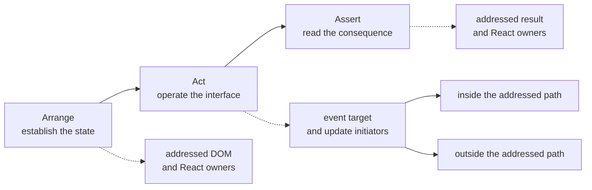

# Eyes: what a test actually witnesses

A passing test proves that its assertion succeeded. It does not reveal which UI
the test deliberately operated, which React work arrived alongside that
interaction, or which executed source was merely present. Eyes records that
missing surface as one authored Arrange–Act–Assert chronology.



The test author marks the three phases. Eyes does not decide that a render is
Arrange, that a click is Act, or that a query is Assert. It places later
observations under the most recent authored marker and leaves observations made
before one explicitly unphased.

## One chronology, four different facts

| Evidence | What it answers |
| --- | --- |
| Addressed target | Which live DOM element a query or locator resolved to, and which React path rendered it? |
| Consumed operation | Was that target acted on, read, asserted, or did a DOM event fire on it? |
| Update initiator | Which live component instance scheduled a React commit in this phase? |
| Performed work | Which component render bodies React visited because of that commit? |

Those rows do not substitute for one another. A component can initiate an
update without being addressed by the test. Another component can render
because of that update without initiating it. Source can execute without
producing any DOM target the test consumes.

That last combination is the useful smell: the test operates one surface while
another branch touches it.

## Read the test at the level it was written

For a checkout test, the retained reading can be reduced to this shape:

```text
arrange
  addressed  CheckoutForm → CartSummary

act
  click      button "Submit order" → CheckoutForm
  updates    inside: CheckoutForm
             outside: SessionClock

assert
  read       status "Order confirmed" → CheckoutResult
```

The outside initiator is an entanglement to investigate, not a verdict. Eyes
identifies the structural component instance; it does not claim which setter,
callback, or source statement scheduled the work.

Every target is copied while its DOM node and Fiber [attribution](attribution.md) are still live.
The journal retains portable names, structural owner paths, props digests, and
source candidates rather than DOM nodes or Fibers, so an element removed by
its own click remains attributable after it has disappeared.

## Distil attention against execution

Eyes answers what the test addressed. [Sense](../packages/sense) can independently answer which
source the same stable test id entered. `variance distill` joins the two without
turning either into coverage:

```text
Addressed source:  src/checkout/form.tsx
Entered source:    src/checkout/form.tsx
                   src/analytics.ts
                   src/top-nav.tsx

Opportunities:     src/analytics.ts
                   src/top-nav.tsx
```

An opportunity means that the test entered the file without addressing a target
attributed to it. It does not mean the file is unrelated, mockable, removable,
or safe to skip. The agent workflow changes one dependency boundary, reruns the
exact test, and keeps the substitution only when the witnessed behavior and
addressed targets survive. [Distil a test](distill.md) defines that loop.

## React improves the attribution; it is not required

With React attribution, Eyes records structural owner paths, components that
performed work, and update initiators inside or outside the addressed surface.
When React or Fiber attribution is unavailable, the DOM attention remains and
the missing attribution is explicit.

A plain test, fake component, or non-React harness can still participate in
distillation through execution evidence. It receives no invented Fiber count or
percentage. A complete empty Eyes journal is a measured empty surface; no Eyes
journal is an unavailable surface.

## What Eyes refuses to conclude

- It does not infer AAA phases from testing-library calls.
- It does not call every rendered component relevant to the assertion.
- It does not call an unaddressed or unentered branch safe to mock.
- It does not turn a partial journal into a complete empty one.
- It does not divide by the Fiber tree: hidden, lazy, unmounted, and
  never-observed branches do not form one honest denominator.

## Put it beside the test surface you already own

Eyes has additive adapters for React Testing Library and Playwright. The RTL
adapter watches a supplied `screen`; the Playwright adapter composes unbound
fixtures into the suite's existing extension. Neither replaces the runner's
`test`, `expect`, configuration, or lifecycle.

The [`@variance-authority/eyes` integration reference](../packages/eyes)
contains the installation, phase markers, journal publication, and React-hook
timing for both adapters. Once an archive exists, use
[`variance distill`](distill.md) for the deterministic reading or
[`variance_distill`](agent-questions.md#distill-one-test) when the archive is
supplied through MCP.
