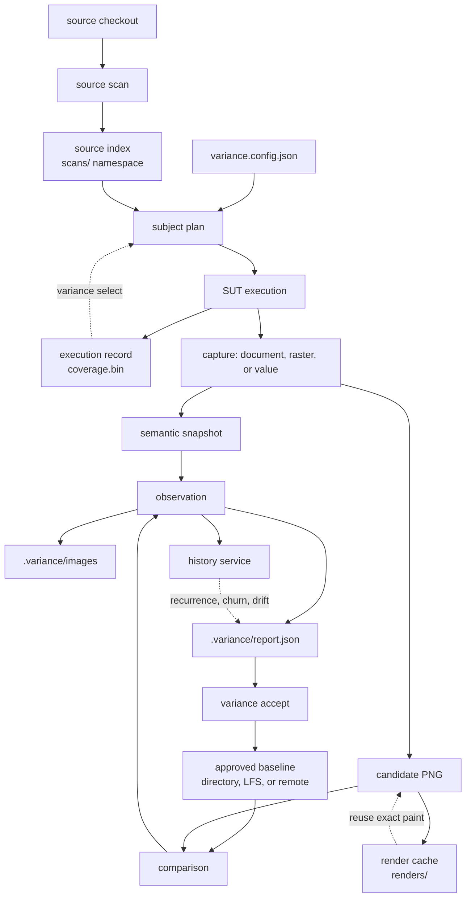

# What every record means, and where it is kept

Run `variance run` once and look at what it leaves on disk: a report at
`.variance/report.json`, PNGs beside it, an approved baseline directory it only
updates when you accept a change, and cache entries under
`$XDG_CACHE_HOME/variance-authority`.

A **subject** is one named UI state you asked for and can ask for again — a
story, a route, a fixture, or a value — under an id that survives a rename. A
**run** is one execution of `variance run`: it plans the subjects, captures each
one, compares each against its baseline, and writes a **report**.

Each of those outputs is tracked separately, by its own producer: the report,
review images, approved baselines, runtime coverage, scenario paths, history
facts, and disposable caches all keep their own identity, completeness,
disclosure, retention, and merge rules.

Read this page for the vocabulary the artifacts are written in, the verdict
values, the keys you will meet in `report.json`, what each store holds, how two
records from different producers join, and what survives to the next run. If
you came here because a section of your report is missing, go straight to
[reading a missing section](#reading-a-missing-section-in-your-own-report).

## The words

Every term below appears in a file you can open or a command you can run.
They are defined here rather than at first use because most of them appear in
several sections.

### Things a run addresses

| Term | What it is |
| --- | --- |
| **subject** | One named UI state you asked for and can ask for again — a story, route, fixture, or value — under an id that survives a rename. `story:components-button--primary` is one. |
| **observation profile** | What the capture surface was *able* to see, independent of what it found. Two ship: `jsdom` resolves roles, accessible names and author-declared style but has no layout engine and paints nothing; `chromium` adds the resolved cascade, real box geometry and pixels. Set it with `--profile` or in configuration. A profile that cannot see a band says so rather than reporting the band `unchanged`. |
| **painter** | The machine-and-software identity that produced an image: renderer (`playwright-chromium@1.49.0`, `remote:render.internal`), engine build, OS and architecture, device scale factor, the fonts the renderer actually had, and digests of what it did to the page before reading it and of its pixel-affecting launch settings. Every field is hashed into one **identity digest**. A *painter partition* is the set of images stored under one such digest — two painters never diff against each other. `variance doctor` prints your identity and every identity your baseline root and render cache already hold. |
| **band** | The kind of difference a change lands in. There are five, ordered loudest first: `a11y`, `geometry`, `token`, `content`, `texture`. The order is rarity — an accessible name almost never changes and is a defect when it does; anti-aliasing changes constantly and never matters. A set of bands collapses to the loudest one present, never to a default. |

### Things a run records

| Term | What it is |
| --- | --- |
| **semantic snapshot** | The normalized tree a verdict is decided from, and the thing a render hash addresses. It holds the subject reference, the profile and environment key it was taken under, a `renderHash` identifying the state plus separate `structureHash` and `styleHash`, the tree itself, where each winning style declaration came from, any subtrees your ignore rules excluded, and whatever the collector could not do. Ids have become structural aliases, class attributes are gone, inapplicable CSS is pruned, and the cascade is resolved to winning values — it is meant to be read. |
| **observation** | One subject's result: its id, the verdict, one sentence saying why, the comparison, the attributed regions with their components and `file:line`, whether the image was painted or came from the cache, fonts the document declared and the renderer lacked, the independently measured signals, and what your ignores absorbed. This is what `report.observations` is a list of. |
| **block** | One region of a module's text that control enters under exactly one condition — a condition the region around it does not imply. A function body, a branch arm, a loop body, a `catch`, the module's top level. Entering a `try` body follows from entering the code around it, so it is no block; entering its `catch` does not, so it is. Ternaries and short-circuit operators stay inside the region that holds them. This is not statement coverage under another name. The **block universe** is the whole set the instrument cut for one checkout under one instrumentation recipe. |
| **crossing** | One test entering one block. The [execution record](execution-record.md) is the whole set of crossings your suite produced, in one binary file. It is a relation, not a chronology. |
| **verdict** | The one word an observation carries for its subject: `unchanged`, `changed`, `new`, `incomparable`, or `ignored`. [Verdicts](#verdicts) below defines each one. |
| **content digest** | A hash of bytes or of a structured value: a document digest, `<checkout-digest>`, `<repository-digest>`, an identity digest, a snapshot's `renderHash`. Equal content digests mean the same input. |
| **component digest** | One hashed dimension of a component instance: `structure`, `semantics`, `text`, `style`, and — only under a profile with a layout engine — `geometry`. Equal component digests are a match, never a resemblance. A baseline carries these so a later run can settle a subject on hashes instead of pixels. |

The digests are not the bands, and the two lists do not line up one for one.
Each digest that changed contributes a band: `semantics` gives `a11y`, `text`
gives `content`, `style` gives `token`, and `structure` and `geometry` both give
`geometry`. Five digests, four bands — `texture` has no digest at all, because
sub-pixel rendering variance is only visible in pixels. Because two digests
share the `geometry` band, a component that edited its own tree and one that was
merely pushed by a neighbour read the same after the mapping; that is why each
changed component also records whether its **own** content changed, as against
only its box.

### Keys you will meet in `report.json`

Beside `observations`, a report carries these. Each one needs an input, and each
one is absent — not empty — when that input was not there.

| Key | What it holds |
| --- | --- |
| `notObserved` | Subjects the run planned and has no observation for, each under one of three kinds: `excluded` by configuration, `failed` where the run meant to look and could not, or `unreached` by this change. |
| `composition` | The suite compared to *itself* at one commit: many subjects, one revision, joined on the components they share. The one section with no baseline anywhere in it. See [composition](composition.md). |
| `lexicon` | Every name the run held for each subject — component names, roles, accessible names, visible text, tokens, files — written down per field so you can ask for a subject you can only describe. See [the lexicon](lexicon.md). |
| `variations` | Subjects that declared themselves a variant of another subject. Each is compared against that parent *in the same run*, so what the variant exists for becomes a value with an identity. See [variations](variations.md). |
| `reach` | What the commit reaches: which components the changed files can possibly have altered, and by which chain. Crossed against the verdicts, it is what lets a report say an edit reached a subject and changed nothing, or that a subject changed with nothing in the commit leading to it. |
| `journeys` | Where this run's subjects parted in the source, read off the execution journal the build's probes wrote. See [journeys](journeys.md). |
| `flakiness` | How often each subject this run found unstable has read differently before, and whether it has happened in the last few sweeps. See [flakiness](flakiness.md). |
| `churn` | How often each component this run named as a cause has changed before. A comparison answers *what changed*; this answers *how often this changes*. |
| `drift` | Design tokens whose value changed in this run, and what they have drifted to across every approved change in the window. Eleven correct approvals of 2px each are a 22px no single review ever saw. |
| `narrowing` | What this run narrowed by — the ref `--since` named — and what it could have narrowed by: where the recorded execution index stands and how many files the working tree differs from it by. |
| `ignores`, `sensitivities` | What each declaration did, rule by rule: which regions an [ignore](ignores.md) removed and which assertions a [sensitivity](sensitivity.md) relaxed, so *has this mask grown over a regression?* is answerable months later. |

`composition`, `lexicon`, `variations`, `reach` and `journeys` are the five
semantic sections — the parts of the report that are not a subject against its
own past.

### The named evidence producers

- **[Sense](../packages/sense)** builds a versioned binary index of your checkout and the execution
  record beside it. It answers which components and tests a source change
  reaches. See [source structures](source-structures.md) and the
  [execution record](execution-record.md).
- **[Eyes](eyes.md)** records what one test actually witnessed as an authored
  Arrange–Act–Assert chronology — the UI it operated, the React work that
  arrived alongside, the source that merely executed. It is this project's
  own recorder and has nothing to do with any similarly named commercial
  service.
- **[Vantage](vantage.md)** holds a running suite's in-flight signals in a process that
  outlives the test, so a suite that has not finished is something to look at.

## Verdicts

Every observation in `report.json` carries exactly one `verdict`, from this
set and no other:

| `verdict` | What it means |
| --- | --- |
| `unchanged` | The stored baseline and the new capture were comparable, and nothing differs. |
| `changed` | Pixels moved. The report names the region, the component and the `file:line`. |
| `new` | The subject was captured and no approved baseline exists. |
| `ignored` | Pixels moved, and every one of them fell inside a subtree your `ignore` rules excluded. Green, and a separate word from `unchanged`, so a report can be asked how much of its green was earned and how much was declared. |
| `incomparable` | The comparison was refused because the two images came from different painters. The report names which field differs. It is not zero difference. |

A subject the run could not observe at all gets no verdict. It goes in
`notObserved` under one of three kinds — `excluded` by configuration, `failed`
where the run meant to look and could not, or `unreached` by this change — and
a report whose `notObserved` is absent entirely cannot be read as a clean run.

Beside the verdict, `signals` carries what each boundary independently
measured: `document` is `unchanged` or `changed`; `pixels` adds `unobservable`
for a subject that occupies no pixels; `accessibility` adds `incomparable`.
These are measurements, not decisions, and they do not override the verdict.

`variance adjudicate --claims <path>` answers a second question — whether the
change you said you were making is the change that happened — and it uses its
own words. Each claim comes back `delivered`, `overreached` (it landed and
reached further than you declared), `undelivered` (the run watched for it and
it did not take), or `unobservable` (the run could not have seen it either
way). The run-level answer is `clean`, `review`, or `unmet`. Adjudication
changes no verdict and no exit code beyond its own.

Exit code `0` means nothing needs review, `1` means changes need review, and
`2` means operator error. A verdict and a crash never share a code.

## Where work starts

A run begins from four inputs:

1. **Project definition:** subject discovery, profiles, viewport, renderer,
   retention, source roots, [variation](variations.md) grammar, scenario definitions, policies,
   and output addresses.
2. **Source checkout:** file contents, paths, dependency resolution context,
   component declarations, and the revision or diff being asked about.
3. **SUT host:** the Storybook preview, route, browser test, unit DOM, custom
   host, or existing raster owner that can produce the named subject state.
4. **Retained evidence:** approved visual references, source-index generations,
   runtime coverage, render-cache entries, history facts, and any admitted
   scenario archive.

The project definition is one file, and it is what decides where everything on
this page is kept:

```jsonc
// variance.config.json
{
  "project": "checkout-ui",
  "profile": "chromium",
  "viewport": { "width": 1280, "height": 800 },
  "retention": "durable",
  "subjects": {
    "kind": "storybook",
    "index": "storybook-static/index.json",
    "collector": "variance/storybook.mjs"
  },
  "baselines": { "kind": "directory", "root": ".variance/baselines" },
  "report": ".variance/report.json",
  "images": ".variance/images"
}
```

`retention` is `durable` or `ephemeral`, and it decides whether anything is kept
at all. `durable` requires `baselines` and the run refuses to start without it —
there is nowhere to store the image it would compare against. `ephemeral` stores
nothing, and a config that sets `baselines` anyway is refused too, so the file
cannot say one thing while the run does another. `baselines` addresses the
approved references: a directory, Git LFS, or `{ "kind": "remote", "endpoint":
"…", "token": "…" }` for a store behind an HTTP hop. `report` is the path the
run report is written to. `images` is the directory the candidate, baseline and
diff PNGs land in, resolved beside the report when you leave it out — which is
why a CI job uploads the two together. [Surface](surface.md) carries the rest of
the file.

Configuration and the subject plan define the work. Caches may reduce its cost;
they cannot change which answer is correct. Baselines and history are evidence,
not caches: losing them changes what later runs can know.

## From execution to what lands on disk

Each box below is either a file you can open or a store you configure the
address of.



Solid arrows are production. Dotted arrows are reuse or
[attribution](attribution.md). Runtime execution is broader than visual
regression: a test can produce crossings without any capture, and those
crossings still select tests for a later source change.

The dotted edge from a capture to the execution record does not copy that record
into every snapshot. Sharing one SUT execution is not enough to attribute
particular crossings to a particular capture; that needs the capture and the
recorder to agree on an instrumentation generation and on interval markers the
recorder issued.

## What exists while the SUT executes

### Runtime execution

Instrumentation cuts the block universe from source and increments a probe per
block as the SUT executes. The runner owns temporary per-worker journals and
consolidates them into one run-wide coverage record. The stream includes setup,
application work, tests, and paths that never arrive at a visual assertion.
Captures and scenario frames are optional points inside that same execution;
their narrower scope comes from explicit interval markers.

### Capture points

A capture is addressed by subject, observation profile, and attempt. The host
can produce:

- a **render document**, containing the observed HTML and the CSS, inherited
  values, assets, resources, fonts, viewport, and environment needed to paint
  it;
- an **in-place raster**, when the state-owning browser paints directly; or
- a **captured value**, when the subject is not renderable.

Semantic and source evidence accompany the material when the host can
observe them.

### Scenario points

A scenario begins at the named Arrange subject and adds one frame after each
authored Act. Each observed frame references a semantic snapshot; an unobserved
outcome carries diagnostics and ends the witnessed prefix there. Several
executions fold together, and the fold never invents an edge nobody walked.

The scenario path is per SUT. Runtime coverage is run-wide. A shared host
explains why the two arose in one execution; only a shared interval identity
attributes particular source crossings to one frame.

### Presentation readings

A presentation reading is taken from one live page at one locator. It is not
addressed by subject and establishes nothing a later run is measured against,
and what it measured lasts only as long as the caller holds it.

Two readings of the same locator produce relationship effects and a
presentation-independent content identity. Those, and only those, are written
into `report.json`, as the presentation signal on the observation you aligned
the reading with. A pair the tool cannot compare carries its reason and no
effects: one reading is not a transition.

## What crosses process and service boundaries

### HTML and semantic state

HTML crosses the acquisition boundary as part of a `RenderDocument`, not as a
baseline. Browser and route collection normally hold that document in memory or
send it directly to a local or remote renderer. The unit-test composition writes
one resource-closed `.va-capture.json` file per subject so a later process can
render it.

There is no general HTML cache. A render cache is keyed by the document digest
but stores the resulting raster, not the document. A baseline sidecar retains
the document digest needed for settlement and attribution, not the HTML that
produced it. The run report retains only the semantic and source projections
needed for its sentences.

A full semantic snapshot remains in process unless a capture artifact contains
it or an explicit scenario policy admits it. The scenario archive stores
canonical semantic snapshots by content digest because several frames and
executions can refer to the same state.

### Pixels

Pixel bytes have three distinct homes:

- **Render cache:** a disposable raster keyed by document digest and painter
  identity. The CLI places its local cache under
  `$XDG_CACHE_HOME/variance-authority/renders`, falling back to
  `~/.cache/variance-authority/renders`. A miss or cache failure costs a paint.
- **Run images:** candidate, baseline, and diff PNGs retained for review. They
  default beside `.variance/report.json`, under `.variance/images`, and the
  report references them by relative path. A CI job must upload the report and
  the image directory together.
- **Approved visual reference:** the authoritative PNG plus readable sidecar at
  a baseline key and painter partition. It lives in a configured directory, in
  Git LFS, or in a baseline service you deploy.

An approved reference and a cache entry may contain the same bytes but have
opposite loss rules. A missing cache entry is reconstructed. A store that answers "no baseline here" gives you `new`; a store that cannot
answer at all stops the run. History and scenario archives store no pixels.

### A baseline or renderer behind an HTTP hop

Set `"baselines": { "kind": "remote", "endpoint": "…", "token": "…" }` to keep
approved images in a service instead of the repository, and
`"renderer": { "endpoint": "…" }` to paint on one machine that both your
laptop and CI use. [`@variance-authority/remote`](../packages/remote) is the
server: you give it a renderer or a store and it exposes that one over HTTP.
See [baseline placement](placement.md) for which layout to choose.

What crosses that hop is not an operator API. A store — local directory, LFS,
or remote — answers three questions the run asks: look up a baseline for this
key, describe the same lookup without moving the image, and store an accepted
one. The describe path is why a remote store is affordable: most subjects
settle on thirty-two hex characters read out of a few hundred bytes of
sidecar, so no PNG moves. You configure the endpoint and the token; you do not
call these yourself. A history service likewise returns bounded text answers
while its ledger stays remote, and the report retains those answers and
addresses rather than local replicas of either store.

### Sense source information

[Sense](../packages/sense) source information is one versioned binary index, not a pair of serialized
object documents. It stores source identities and names once and keeps requests,
bindings, exports, declarations, resolved edges and relations beside them, so a
reader opens only the sections its query needs. Reach trails and query results
are computed per run and are not stored.

The index lives in the configured source-index root. The CLI's local namespace
is `$XDG_CACHE_HOME/variance-authority/scans/<checkout-digest>`, falling back to
`~/.cache/variance-authority/scans/<checkout-digest>`. A generation names its
format, source contents, directory membership, and resolution and toolchain basis.
Readers reject an incompatible, foreign, incomplete, or corrupt generation and
rebuild from the checkout rather than accepting part of it as an empty graph.

The same binary generation can cross a CI cache or artifact boundary. No Sense
service owns it and no process exchanges decoded object trees. Local and remote
consumers transfer the binary artifact, validate its generation, and open only
the sections needed for their query. Sharing remains an optimization: losing the
index costs a source scan and cannot change the selected answer.

### Sense runtime information

The Vitest integration consolidates temporary worker journals into a versioned
`TestCoverage` binary. Its default location is
`$XDG_CACHE_HOME/variance-authority/test-selection/<repository-digest>/coverage.bin`,
falling back to `~/.cache`. `coverageFile` gives it an explicit path when CI must
publish, restore, or share the artifact. Temporary journals are removed after
consolidation.

This record stores the instrumentation recipe, the test files with their
preconditions and completeness, source modules and blocks, and block-to-test
crossings. Compatible partial runs add crossings; an incomplete or focused run
cannot erase earlier evidence by silence. A changed instrumentation generation
replaces the incompatible block universe.

`ExecutionIndex` is the runner-independent query shape used for source-to-test
questions. An MCP integration supplies it to the tool; the MCP server is not its
store. The persisted Vitest coverage file and a supplied [execution index](execution-record.md) are two
carriers for the runtime domain, not copies of the visual run report.

### The three kinds of journey

"Execution [journey](journeys.md)" names three different values and they live differently:

1. A **source reach trail** explains how a changed file reaches a component. It
   is derived from query views over the binary [source index](source-index.md) and is not
   independently stored.
2. A **runtime crossing record** says which tests entered which instrumented
   blocks. The coverage binary persists that relation. It is not a chronological
   event log, and the current query shape carries distance rather than a complete
   call path.
3. A **scenario path** records named SUT states and Acts. It remains in the
   session by default or enters the opt-in scenario archive as one manifest plus
   content-addressed semantic snapshots.

They stay separate because their edges mean different things: a source
dependency trail says *could reach*, a crossing record says *did enter*, and a
scenario path says *a person can walk this*. Merged into one graph, none of the
three questions has an answer any more.

## Joining two producers' records

Nothing here has a global run object. Each producer writes its own file, and a
view that shows two of them side by side joins on a value both producers
actually wrote down. There are two joins you will meet, and each fails in a way
you can check.

**Images join on painter identity.** The producer is the renderer; the
identity is the digest of renderer, engine, platform, device scale factor,
fonts, and the two stabilization digests. When a run reports `incomparable`,
that is this join failing: the baseline was written under one identity and this
run painted under another. Run `variance doctor`. It prints your current
identity, then every identity your baseline root holds and every identity in
your render cache, with an arrow on yours. If the arrow points at an identity
nobody else has, that is the whole diagnosis — pin one painter for laptop and
CI, either the same container image or one `"renderer": { "endpoint": … }` both
use, and re-approve under it. See [placement](placement.md).

**Test evidence joins on test id.** Eyes writes a per-test archive; Sense
writes the execution record. They relate only where both producers emitted the
same test id — the runner's own identifier for the test. Titles and file paths
are presentation and are never used as a fallback identity, so two records that
disagree on the id do not join at all rather than joining wrongly.
`variance distill --test <id> --eyes <path> --execution <path>` is where you
check it: give it both files and one test id, and what comes back tells you
which of the two answered. Supply only one of the two flags and it distills
from that one; supply neither and it exits `2` saying so. If the id you have
from one file returns nothing from the other, the runner that wrote the second
file named the test differently, and the id in each file is what to compare.

Within a joined test, three things stay distinct and are not read as each
other: which DOM the test attended to, which React components re-rendered
alongside, and which source executed. A re-rendering component counts as part
of the element the test addressed only when its position in the React tree
sits under that element's — sharing a component name is not enough, because
one component name can appear in a dozen unrelated places. Source files the
test entered that Eyes attributed to no addressed element are exactly that and
nothing more: entered, unattributed. Neither record says they are safe to
change.

### MCP view

An MCP connection can receive the run report, full presentation readings,
execution index, live [Vantage](vantage.md) state, [Eyes](eyes.md) archive, and scenario manifests as
optional fields of one subject. This is a view over separately supplied records,
not a global run object. Tool discovery is shared; evidence identity,
completeness, retention, and storage remain native to each domain. The
inventory distinguishes a field nothing supplied from a field holding a record
that is present and empty, and a tool asked for a field nothing supplied
refuses rather than answering from an empty value.

## What can produce a useful report

The report is assembled once, while the run still holds the plan, the snapshots,
the comparison, the [attribution](attribution.md) and the answers history
returned — and it is read back later by tools that hold none of those. What it
keeps is what a sentence needs.

The canonical `RunReport` persists the resulting observations, subject-coverage
ledger, warnings, run and painter identity, image references, variation and
composition readings, presentation signals, and bounded history answers.
`variance report`, its HTML form, and MCP tools over the report read that
artifact; they do not reopen a browser or query the history service again.

Full HTML, semantic trees, masks, baseline bytes, the source graph, runtime
coverage, scenario executions, and whole presentation readings do not enter
`RunReport`. They stay behind their own artifact or store boundary. A
presentation signal is the exception that is not a reference: its effects,
content identity, and information deltas are copied into the observation, while
the graph and paint geometry they were measured from stay with the caller. A
view that shows source-to-test evidence or scenario paths beside the visual
report must be given the separate coverage or scenario artifact and joins it on
a shared identity. Relative image paths are the one address the report carries
directly, because the page must know where its review pixels live.

Test results contribute at two levels. Runner completion, preconditions, and
probe hits form runtime coverage even when no visual subject is captured.
Collector results form planned-subject outcomes and capture artifacts. A report
must not infer one from the other: a passing test does not prove its visual
subject was observed, and an observed visual subject does not make the whole
test execution complete.

## Reading a missing section in your own report

Beside `observations` and `notObserved`, a report carries up to five optional
semantic sections — `composition`, `lexicon`, `variations`, `reach` and
`journeys` — plus `flakiness`, `churn` and `drift` ([what each one holds](#keys-you-will-meet-in-reportjson)).
Each needs an input, and when that input was not there the section is not an
empty object: **the key is absent from `report.json` entirely.** Open the file
and look for the key before concluding a section found nothing.

Within a section, missing takes two further shapes, and they are different
answers:

- **Nothing read it.** `lexicon.fields` is the run's own list of what it
  looked at. A field missing from `fields` means no producer supplied it, so a
  search that misses on that field has not missed — nothing searched.
- **It was read, and had nothing to say about this subject.** A field listed in
  `fields` can still be absent on an individual subject's `terms`. Read an
  execution journal, and `regions` joins `fields`; a subject that entered no
  instrumented region still has no `terms.regions`. The run looked, the subject
  was outside the answer.

One missing input can produce both shapes in one report, so do not read them
as the same word. On a production React build there is no owner information at
all: `composition.components[].createdBy` comes back as `[]`, while the
corresponding `structure` row has no `createdBy` key. The empty array
there does not mean nothing mounted the component — it means the build could
not say.

Two more distinctions worth holding while you read the file. `regions` names
two unrelated things: the [lexicon](lexicon.md) field above, and the required per-observation
array of attributed boxes. The per-observation one is always written; it is
empty on a subject settled without a comparison, and its boxes carry no
component or `file:line` when the run had no snapshot or could not resolve call
sites — a box with coordinates and no name is a degraded answer, not a nameless
component. And `composition.structure` keeps a record for every composed
subject whether or not anything was attributed to it, so `rows: []` there is a
subject that was looked at.

Finally, one input gates two sections. The `journeys` section and the
lexicon's `regions` field are both filled from the same execution journal, so a
build with no probes in it loses both at once. Getting that journal needs the
application under test built with `testSelectionProbes()` from
`@variance-authority/sense/journal` and the collector asked to record — `tests:
true` on the Storybook or Playwright integration. Without a collector in the
page the run says so on stderr and records nothing. See the
[Storybook](../packages/storybook-collector) and
[Playwright](../packages/playwright-test) collector references.

## Full, partial, and lifecycle rules

Completeness belongs to each retained record. A full capture can sit inside a
partial visual run; complete runtime coverage can sit beside an incomplete
scenario; a report can contain complete observations and have an absent coverage
ledger.

The states remain distinct: **absent** means no producer established a value;
**empty** means the declared measurement completed and found no members;
**partial** names its omitted, failed, capped, or unknown part; **complete**
covers the declared scope; **expired** passed its retention boundary; and
**deleted** was deliberately removed.

A record that was deleted or evicted never reads back as an empty measurement:
you get unavailable, expired, or a cache miss. History rows and approval records
refuse ordinary deletion outright.

## Merging a sharded suite

A suite big enough to split runs `variance run --subjects <glob>` once per CI
job and ends with N artifacts. Merge them by naming them:

```bash
variance report shard-1.json shard-2.json shard-3.json
```

`variance ask`, `variance push` and `variance comment` take the same list, so a
sharded suite still produces one answer, one build and one pull-request
comment.

Four fields are singular in a run report and must agree across every shard or
the merge is refused by name: painter identity, retention, run version, and
`--intent`. Absent counts as a value — one shard run with `--intent` and one
without were asked different questions. Refusing is the point: picking one
would attribute half the observations to a machine that never saw them.

`--subjects` records every subject outside the slice as `excluded`, so a
subject observed by one shard is excluded by the others; the merge resolves
that in the shard's favour. A subject **no** shard claimed is a gap in your
split — nobody looked at that component — so it is promoted to `failed` and
the merged run exits `1`. A correct split never produces one.

The composition section is dropped from a merged report, and the report says
so. It compares the run's subjects to *each other*, and a split is exactly what
destroys that: two subjects sharing a rendering are the finding, and a pair
that landed in different shards is in neither shard's report. A union of the
shard graphs would be a graph missing every cross-shard edge with nothing
marking where. Per-subject sections survive, including the lexicon, because a
subject is in exactly one shard. See [composition](composition.md).

Execution records fold the same way, from the command line:

```bash
variance journeys shard-1.bin shard-2.bin --into .variance/journeys
```

The fold unions the records in any order and refuses shards with differing
instrumentation or commit, a test present in two shards, and a module one shard
could instrument and another could not.

## Where the run ends and the next one begins

Each durable output is kept, shared and reused on its own terms:

| Result | Persisted at | Shared by | Feeds the next run |
|---|---|---|---|
| visual run report | configured path; `.variance/report.json` by default | CI artifact, filesystem, or any transport preserving the file | review and acceptance read it; observation does not |
| run review images | configured directory beside the report; `.variance/images` by default | uploaded with the report | acceptance promotes the exact candidate; otherwise no |
| approved visual references | configured directory, Git LFS, or remote baseline service | checkout/LFS or authenticated service | yes: comparison, digest settlement, and component-based selection |
| render cache | local XDG cache or backend cache | machine or backend cache scope | yes: avoids repainting an identical document under one painter |
| source index | versioned binary generation under the configured root; local XDG scan namespace by default | exact artifact through CI cache, shared volume, or artifact transfer | yes: reuses validated source, name, and graph sections |
| runtime coverage | default `coverage.bin` cache or configured file artifact | restored CI cache, shared volume, or explicit artifact transfer | yes: selects tests for later source changes |
| Eyes attention | test process memory or a runner-owned JSON attachment containing an Eyes archive | whoever can read the test artifact | no: it explains the test execution that produced it |
| scenario execution | process memory or opt-in scenario archive root | whoever can read the admitted semantic text | assessment and presentation; not automatic visual selection |
| presentation reading | caller process memory; only the projected signal persists, inside the run report | whoever holds the reading; the signal goes with the report | no: each run senses its own pages |
| history facts | operator history service | authenticated clients in the configured project scope | yes: current values, recurrence, churn, flakiness, and drift |
| review decision | history approval row and, for repository baselines, changelog evidence | history/repository readers | yes: determines which historical changes count as approved |

The feedback stores answer different questions. Runtime coverage selects tests;
baseline component names select visual subjects; the source index reduces
source-work cost; render caches reduce painting cost; history qualifies the
current result; approved references supply the next comparison. None
substitutes for another, and losing a disposable cache never looks like losing
evidence.
