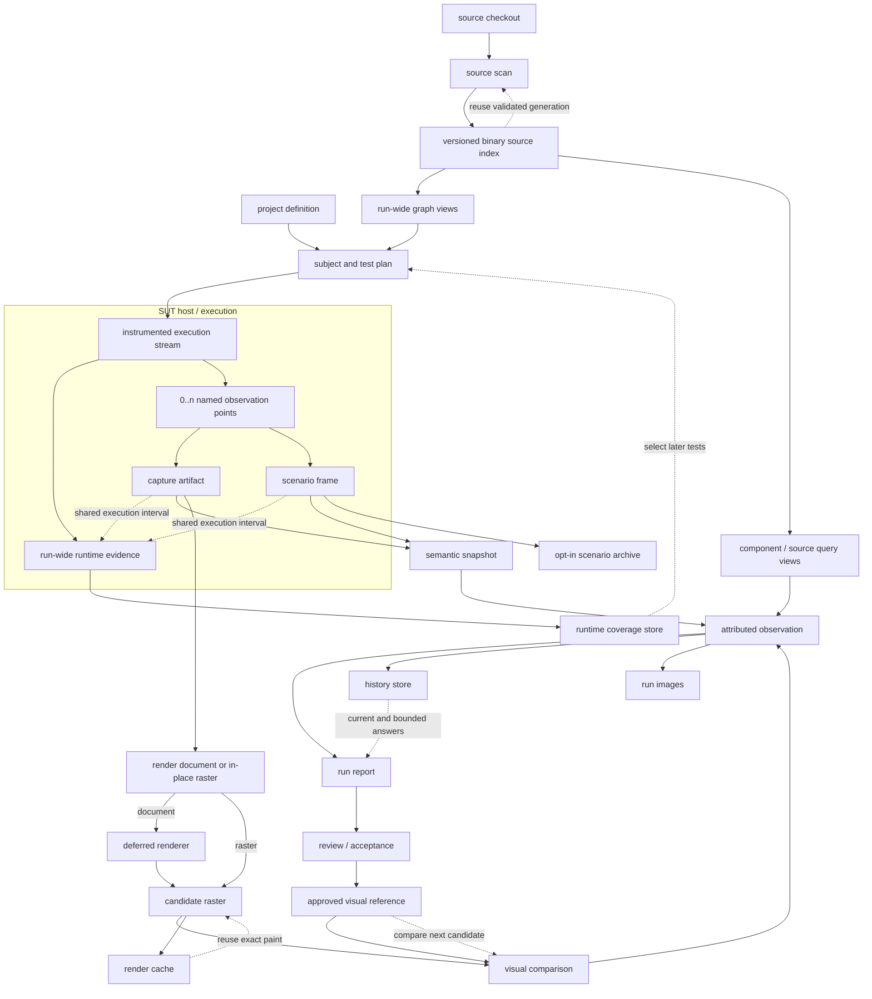

# Information exchange and retention

Work starts with a project definition, a source checkout, a SUT host, and the
evidence retained from earlier runs. It ends with independently persisted
reports, review images, visual references, runtime coverage, scenario paths,
history facts, and disposable caches. Some of those outputs feed the next run;
others exist only to explain or review the run that produced them.

Variance Authority does not serialize one global run object. Each information
domain keeps its own identity, completeness, disclosure, retention, and merge
rules. Records meet only on identities their producers actually emitted.

## Where work starts

A run begins from four inputs:

1. **Project definition:** subject discovery, profiles, viewport, renderer,
   retention, source roots, variation grammar, scenario definitions, policies,
   and output addresses.
2. **Source checkout:** file contents, paths, dependency resolution context,
   component declarations, and the revision or diff being asked about.
3. **SUT host:** the Storybook preview, route, browser test, unit DOM, custom
   host, or existing raster owner that can produce the named subject state.
4. **Retained evidence:** approved visual references, source-index generations,
   runtime coverage, render-cache entries, history facts, and any admitted
   scenario archive.

Configuration and the subject plan define the work. Caches may reduce its cost;
they cannot change which answer is correct. Baselines and history are evidence,
not caches: losing them changes what later runs can know.

## From execution to persisted results

The solid arrows are production or exchange. The dotted arrows are reuse or
attribution. Runtime execution is inside the SUT host and is broader than visual
regression: an execution can produce crossings without a capture, and those
crossings still power later test selection.

The dotted edge from a capture or a frame to runtime does not copy the execution
record into every snapshot. Per-observation attribution requires the capture or
frame and the runtime recorder to share an instrumentation generation and
recorder-issued start and end markers. Without those markers, both records belong to the same SUT
execution but cannot support a frame-level execution claim.

## What exists while the SUT executes

### Runtime execution

Instrumentation produces a block universe from source and increments probes as
the SUT executes. The runner owns temporary per-worker journals and consolidates
them into one run-wide coverage record. The stream includes setup, application
work, tests, and paths that never arrive at a visual assertion.

Runtime evidence is therefore not an attachment created after visual
comparison. Captures and scenario frames are optional points inside the same
execution. Their narrower scope comes from explicit interval markers, not from
discarding everything that happened outside them.

### Capture points

A capture is addressed by subject, observation profile, and attempt. The host
can produce:

- a **render document**, containing the observed HTML and the CSS, inherited
  values, assets, resources, fonts, viewport, and environment needed to paint
  it;
- an **in-place raster**, when the state-owning browser paints directly; or
- a **captured value**, when the subject is not renderable.

Semantic and source evidence travel beside the material when the host can
observe them. Live pages, DOM nodes, framework handles, callbacks, and resource
resolvers remain in the producing process.

### Scenario points

A scenario begins at the named Arrange subject and adds one frame after each
authored Act. Each observed frame references a semantic snapshot; an unobserved
outcome carries diagnostics and terminates the witnessed prefix. Several
executions fold into a partial state machine without inventing unwitnessed
edges.

The scenario path is per SUT. Runtime coverage is run-wide. A shared host
explains why the two arose in one execution; only a shared interval identity
attributes particular source crossings to one frame.

### Presentation readings

A presentation reading is taken from one live page at one locator. The graph,
telemetry, derived structures, findings, and paint geometry are process values
that last as long as the caller holds them. A reading is not addressed by
subject and establishes nothing a later run is measured against.

Two readings of the same locator produce relationship effects and a
presentation-independent content identity. Only that projection reaches a
durable record, as the presentation signal on the observation the caller aligned
it with. An incomparable pair carries its reason and no effects, because
inventing a transition from a single reading would turn absence into evidence.

## What crosses process and service boundaries

### HTML and semantic state

HTML crosses the acquisition boundary as part of a `RenderDocument`, not as a
baseline. Browser and route collection normally hold that document in memory or
send it directly to a local or remote renderer. The unit-test composition writes
one resource-closed `.va-capture.json` file per subject so a later process can
render it.

There is no general HTML cache. A render cache is keyed by the document digest
but stores the resulting raster, not the document. A baseline sidecar retains
the document digest needed for settlement and attribution, not the HTML that
produced it. The run report retains only the semantic and source projections
needed for its sentences.

A full semantic snapshot remains in process unless a capture artifact contains
it or an explicit scenario policy admits it. The scenario archive stores
canonical semantic snapshots by content digest because several frames and
executions can refer to the same state.

### Pixels

Pixel bytes have three distinct homes:

- **Render cache:** a disposable raster keyed by document digest and painter
  identity. The CLI places its local cache under
  `$XDG_CACHE_HOME/variance-authority/renders`, falling back to
  `~/.cache/variance-authority/renders`. A miss or cache failure costs a paint.
- **Run images:** candidate, baseline, and diff PNGs retained for review. They
  default beside `.variance/report.json`, under `.variance/images`, and the
  report references them by relative path. A CI job must upload the report and
  the image directory together.
- **Approved visual reference:** the authoritative PNG plus readable sidecar at
  a baseline key and painter partition. It lives in a configured directory, in
  Git LFS, or in an operator-controlled remote store.

An approved reference and a cache entry may contain the same bytes but have
opposite loss rules. A missing cache entry is reconstructed. A failed baseline
lookup is an operator error. History and scenario archives store no pixels.

A remote baseline service may hold the only durable copy. Its `describe` answer
returns comparison metadata without raster bytes; a full lookup transfers pixels
only when the run needs them. A history service likewise returns bounded text
answers, while its ledger stays remote. The run report retains those answers and
addresses, not local replicas of either store.

### Sense source information

Sense source information is one versioned binary index, not a pair of serialized
object documents. The index stores source identities and names once, then keeps
requests, bindings, exports, declarations, resolved edges, and forward/reverse
relations in aligned typed-array sections. Sparse graph relations use CSR
offsets. Opening it creates graph and component/source query views over those
sections; reach trails and query results remain run-wide in-process values.

The index lives in the configured source-index root. The CLI's local namespace
is `$XDG_CACHE_HOME/variance-authority/scans/<checkout-digest>`, falling back to
`~/.cache/variance-authority/scans/<checkout-digest>`. A generation names its
format, source contents, repository layout, and resolution and toolchain basis.
Readers reject an incompatible, foreign, incomplete, or corrupt generation and
rebuild from the checkout rather than accepting part of it as an empty graph.

The same binary generation can cross a CI cache or artifact boundary. No Sense
service owns it and no process exchanges decoded object trees. Local and remote
consumers transfer the binary artifact, validate its generation, and open only
the sections needed for their query. Sharing remains an optimization: losing the
index costs a source scan and cannot change the selected answer.

### Sense runtime information

The Vitest integration consolidates temporary worker journals into a versioned
`TestCoverage` binary. Its default location is
`$XDG_CACHE_HOME/variance-authority/test-selection/<repository-digest>/coverage.bin`,
falling back to `~/.cache`. `coverageFile` gives it an explicit path when CI must
publish, restore, or share the artifact. Temporary journals are removed after
consolidation.

This record stores the instrumentation recipe, the test files with their
preconditions and completeness, source modules and blocks, and block-to-test
crossings. Compatible partial runs add crossings; an incomplete or focused run
cannot erase earlier evidence by silence. A changed instrumentation generation
replaces the incompatible block universe.

`ExecutionIndex` is the runner-independent query shape used for source-to-test
questions. An MCP integration supplies it to the tool; the MCP server is not its
store. The persisted Vitest coverage file and a supplied execution index are two
carriers for the runtime domain, not copies of the visual run report.

### The three kinds of journey

“Execution journey” names three different values and they live differently:

1. A **source reach trail** explains how a changed file reaches a component. It
   is derived from query views over the binary source index and is not
   independently stored.
2. A **runtime crossing record** says which tests entered which instrumented
   blocks. The coverage binary persists that relation. It is not a chronological
   event log, and the current query shape carries distance rather than a complete
   call path.
3. A **scenario path** records named SUT states and Acts. It remains in the
   session by default or enters the opt-in scenario archive as one manifest plus
   content-addressed semantic snapshots.

Keeping the three separate prevents a source dependency trail, a witnessed test
crossing, and a user-visible golden path from being merged into one graph whose
edges have incompatible meanings.

### MCP observability view

An MCP connection can receive the run report, full presentation readings,
execution index, live Vantage state, Eyes archive, and scenario manifests as
optional fields of one subject. This is a view over separately supplied records,
not a global run object. Tool discovery is shared; evidence identity, completeness, retention, and storage
remain native to each domain.

The inventory distinguishes an unavailable field from a present empty record.
Native tools project into exactly one field and refuse a missing field rather
than substituting an empty value. The testing-surface view is the one intentional
join: it relates an Eyes journal to Sense crossings only when both producers
emit the same test id. Titles and file paths are presentation, not fallback
identity. Within each authored phase it keeps DOM attention, React update
initiators, and executed source distinct. An updater is inside an addressed
target only when their name-and-props structural suffixes overlap; matching a
component name alone is insufficient. Files entered by that test but carrying no
Eyes-attributed target are replay candidates; neither record establishes that
they are safe to replace.

## What can produce a useful report

Report assembly happens after subject observation and before the SUT process is
discarded. At that boundary it can consume:

- the resolved plan, including every planned, excluded, and failed subject;
- per-subject acquisition diagnostics and stabilization declarations;
- semantic snapshots and source provenance for findings and attribution;
- the candidate-to-reference comparison, changed regions, ignores, and
  sensitivity;
- paired presentation readings, when the caller supplied one for each side;
- review-image addresses written beside the report;
- same-run snapshots needed for suite composition and named variations; and
- current and bounded answers returned by history after this run is recorded.

The canonical `RunReport` persists the resulting observations, subject-coverage
ledger, warnings, run/painter identity, image references, variation and
composition readings, presentation signals, and bounded history answers.
`variance report`, its HTML form, and MCP tools over the report read that
artifact; they do not reopen a browser or query the history service again.

Full HTML, semantic trees, masks, baseline bytes, the source graph, runtime
coverage, scenario executions, and whole presentation readings do not enter
`RunReport`. They remain behind their own artifact or store boundary. A
presentation signal is the exception that is not a reference: its effects,
content identity, and information deltas are copied into the observation, while
the graph and paint geometry they were measured from stay with the caller. A
view that shows source-to-test evidence or scenario paths beside the visual
report must be given the separate coverage or scenario artifact and may join it
only through shared identities. Relative image paths are the one exception the
report carries directly, because the page must know where its review pixels
live.

Test results contribute at two levels. Runner completion, preconditions, and
probe hits form runtime coverage even when no visual subject is captured.
Collector results form planned-subject outcomes and capture artifacts. A report
must not infer one from the other: a passing test does not prove its visual
subject was observed, and an observed visual subject does not make the whole
test execution complete.

## Full, partial, and lifecycle rules

Completeness belongs to each retained record. A full capture can sit inside a
partial visual run; complete runtime coverage can sit beside an incomplete
scenario; a report can contain complete observations and have an absent coverage
ledger.

The states remain distinct: **absent** means no producer established a value;
**empty** means the declared measurement completed and found no members;
**partial** names its omitted, failed, capped, or unknown part; **complete**
covers the declared scope; **expired** reached its retention boundary; and
**deleted** was deliberately removed.

There are exactly five lifecycle operations:

- **Create** establishes a new immutable capture, snapshot, raster, report,
  scenario path, review decision, or history fact under its complete identity.
- **Update** changes only explicitly current state, such as configuration, a
  baseline head after approval, a latest-view pointer, or a cache entry. It does
  not rewrite the evidence or decision behind that state.
- **Merge** applies only where a domain declares compatibility and an algebra:
  equal content deduplicates; compatible runtime crossings union; shard reports
  combine non-overlapping subjects under one run basis. Whole-suite relations
  are recomputed after merge or omitted, never guessed from shard-local graphs.
- **Delete** removes one addressed retained copy or evicts a cache entry. Readers
  receive unavailable, expired, or cache miss rather than an empty measurement.
  Append-only history and approval records refuse ordinary deletion.
- **Wipe and redefine** is one compound operation: establish the replacement
  schema, identity basis, painter partition, instrumentation generation, name
  grammar, or retention scope while retiring the values governed by the old
  definition. Old evidence is never reinterpreted under the new basis.

## Where the run ends and the next one begins

The durable outputs are deliberately separate:

| Result | Persisted at | Shared by | Feeds the next run |
|---|---|---|---|
| visual run report | configured path; `.variance/report.json` by default | CI artifact, filesystem, or any transport preserving the file | review and acceptance read it; observation does not |
| run review images | configured directory beside the report; `.variance/images` by default | uploaded with the report | acceptance promotes the exact candidate; otherwise no |
| approved visual references | configured directory, Git LFS, or remote baseline service | checkout/LFS or authenticated service | yes: comparison, digest settlement, and component-based selection |
| render cache | local XDG cache or backend cache | machine or backend cache scope | yes: avoids repainting an identical document under one painter |
| source index | versioned binary generation under the configured root; local XDG scan namespace by default | exact artifact through CI cache, shared volume, or artifact transfer | yes: reuses validated source, name, and graph sections |
| runtime coverage | default `coverage.bin` cache or configured file artifact | restored CI cache, shared volume, or explicit artifact transfer | yes: selects tests for later source changes |
| Eyes attention | test process memory or a runner-owned JSON attachment containing an Eyes archive | whoever can read the test artifact | no: it explains the test execution that produced it |
| scenario execution | process memory or opt-in scenario archive root | whoever can read the admitted semantic text | assessment and presentation; not automatic visual selection |
| presentation reading | caller process memory; only the projected signal persists, inside the run report | whoever holds the reading; the signal travels with the report | no: each run senses its own pages |
| history facts | operator history service | authenticated clients in the configured project scope | yes: current values, recurrence, churn, flakiness, and drift |
| review decision | history approval row and, for repository baselines, changelog evidence | history/repository readers | yes: determines which historical changes count as approved |

The feedback stores answer different questions. Runtime coverage selects tests;
baseline component names select visual subjects; the source index reduces
source-work cost; render caches reduce painting cost; history qualifies the
current result; approved references supply the next comparison. None can
silently stand in for another, and losing a disposable cache must never look
like losing evidence.
