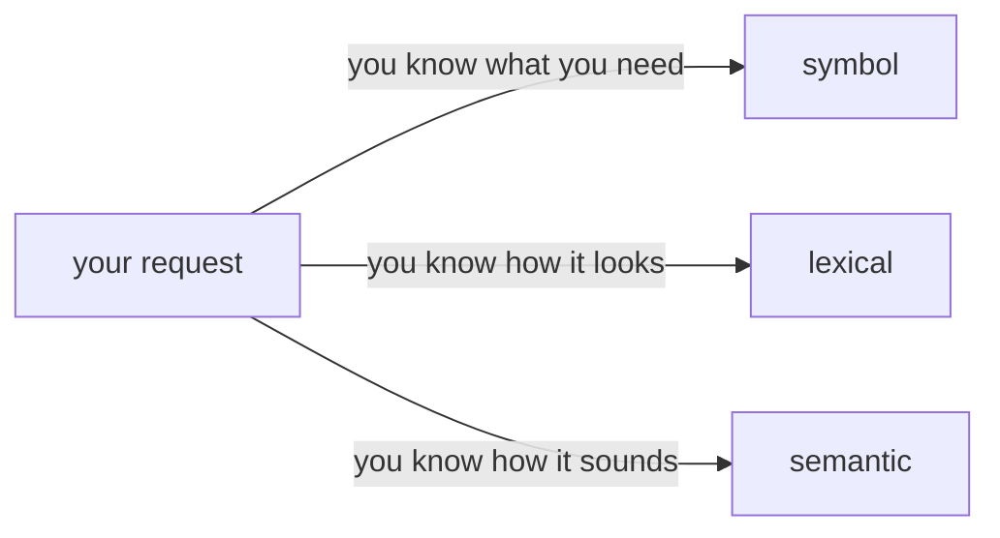

# Orient before you change code

Orientation turns a question about an unfamiliar codebase into an address you
can inspect: a source name, a file, an import neighbourhood, or a captured UI
subject. It comes before diagnosis and editing. Its answer is where to read
next, not a claim that the code is correct.

Variance has two orientation routes:

- **Source orientation** starts from the current checkout. It finds exported
  names and narrows them through resolved module relations.
- **Subject orientation** starts from a completed run. It finds a captured UI
  state from the names, roles, text, components, files and tokens observed on
  that state.

Both routes separate producing an index from asking a question. A producer can
read the repository or run once; an agent, editor or CI step can then ask the
record without repeating that work.

## Three questions share the word search

`rg Button` asks where the bytes `Button` occur. It answers from declarations,
imports, JSX, tests, stories, comments, Markdown, fixtures and snapshots alike.
It hides almost nothing, and it leaves every decision about which hit matters
to you.

Most questions are narrower than that. When you type `Button` you usually want
the component: where it is declared, what it accepts, which package owns it. An
import of `Button`, a `<Button>` in JSX, a test that asserts the string
`"Button"` and a paragraph about buttons are all hits for `rg`, and none of them
is the declaration.

**Symbol search** is still lexical matching over a different corpus. Before the
query starts, everything that is not a declared program entity — a function, a
class, a type, a variable, an export, a module — has already been removed. If
you work in a JetBrains IDE you rely on this every day: Go to Symbol is precise
because it searches a smaller, better-chosen set, not because it analyses your
program on each keystroke. Find in Files over the same repository returns what
`rg` returns.

**Semantic search** makes a different promise: you do not need to know what the
repository calls the thing. Ask where repeated requests stop after a failure,
and the code may say `retry`, `backoff`, `cooldown` or `failureWindow`.
Similarity can cross that vocabulary gap. It also makes two things a matter of
policy at once — which pieces of the repository were embedded, and how
similarity ranks them — so a test that describes retries, or a comment that
explains why something must not retry, can score above the code that retries.

The three are not three generations of one tool. Each one removes a different
unknown:



> **The more you know, the smaller the surface you search.**

Looking for a declaration, search declarations. Holding the name, search names.
Holding a file or a package, scope the search to it. Holding only the concept,
translate it into the words the repository is likely to use. Knowing none of that, use `rg`: it
assumes the least. A narrow search that comes back empty is either a true answer
about that area or a sign that something you assumed is wrong. Widen one step to
find out which, not all the way to `rg`.

## What Variance searches

`variance ask search` is symbol search. Its corpus is exported names and the
documentation written above them, so a question about `createStore` never
returns the files that only import or mention it. It adds one step an IDE does
not take by default: the module graph keeps the candidates connected to a path
you already have.

```bash
variance ask search --query createStore --from src/checkout/ --just-answer
```

`--from` walks the imports of the named path at any depth. `--to` walks the
other direction and finds files that depend on it. Each step shrinks what you
read:

```mermaid
xychart-beta horizontal
  accTitle: Results to read for createStore in a large monorepo
  x-axis ["rg", "git grep", "ask search", "ask search --from"]
  y-axis "files, or exported-name groups" 0 --> 1800
  bar [0, 0, 33, 12]
  bar [1743, 1748, 0, 0]
  bar [0, 0, 0, 0]
  bar [0, 0, 0, 0]
```



The two text searches return every file that contains the string. Symbol search
returns the exported names that match it, and `--from` keeps the ones reachable
from one entry file. The chart is one warm reading of a large frontend monorepo;
[the workspace guide](agent-workspace-api.md#search-finds-the-name-the-graph-finds-the-area)
has what each answer cost in time and what producing the index costs.

Variance does not do semantic search. Nothing is embedded, and the index does
not invent synonyms. When an agent asks, the model on the other end is the
semantic step: it already knows that sign-in may be written `login`, `session`
or `credential`, and it supplies those words. The index matches them the same
way every time and keeps the answer inside the area the graph connects. If the
repository calls sign-in `CredentialGate`, that name comes back when a word you
supplied is part of it, and you can always say why a hit is a hit.

Use `rg` when the text itself is the answer, and `git grep` when the committed
tree is the answer. Both are exact and need no Variance index.

## Choose the entrance from what you have

| What you have | Ask | What you get |
| --- | --- | --- |
| An exact string in the working tree | `rg -n <text> .` | Current files containing that text |
| An exact string in a committed tree | `git grep -n <text> <tree>` | Committed files containing that text |
| Words for an exported source name | `variance ask search --query <words>` | Matching exported names |
| Words plus a file or directory | Add `--from <path>` or `--to <path>` | Matching names inside the related module area |
| An exact exported name | `variance ask symbol --name <name>` | Its declaration, signature, documentation and consumers |
| A name whose examples you need | `variance ask uses --name <name> --from <path>` | Exact import sites, ordered near the path |
| A description of a captured UI state | `variance ask locate --query <words>` | Subject ids and the observed fields that matched |

[Inspect the workspace public API](agent-workspace-api.md) is the source
orientation how-to and contract. [Find the subject you mean](locate.md) is the
subject orientation how-to. [How search finds a subject](lexicon.md) explains
the observed vocabulary behind that answer.

## Ask the record, or produce a new one

An ordinary source question reuses a published workspace generation for one
hour and refreshes it after that. Use `--just-answer` when an editor, watcher or
CI job owns freshness and question latency must contain no Git status, scan or
regeneration:

```bash
variance ask search --query createStore --from src/checkout/ --just-answer
```

Every answer prints when its workspace generation was produced. If no
generation exists, `--just-answer` refuses instead of turning the question into
an index build. `search` always reads this way, with or without the flag: it
is a lookup, and it expects the generation to be published already. [The source index](source-index.md) explains production,
incremental reuse and CI caching.

Subject orientation reads the report a completed run already produced. Its
[lexicon](lexicon.md) records the words observed per subject and builds its
inverted index when first asked. It does not scan the checkout to answer the
question.

## Know where the answer stops

The source graph records module imports, re-exports, literal dynamic imports,
type imports and asset edges. It is not a function-call graph. `uses` reports
where a name is imported, not where code called it at runtime.

No graph database service is required. The workspace generation stores a
compact graph with dependencies and dependents both materialized. The useful
property is the relation and the bounded traversal; the storage engine is an
implementation choice.

Orientation narrows what to open. Read the named files before changing them,
and use runtime, test or review evidence for claims about behaviour.
