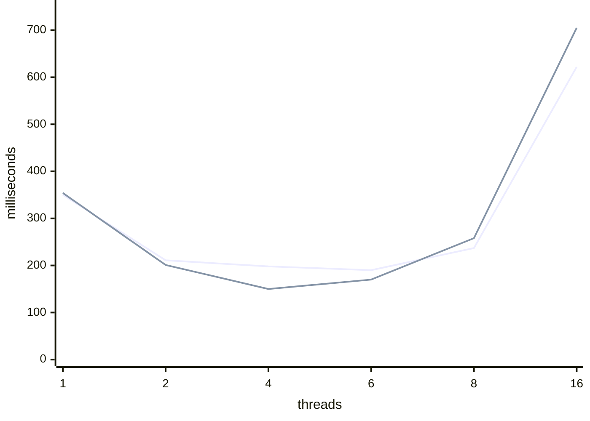
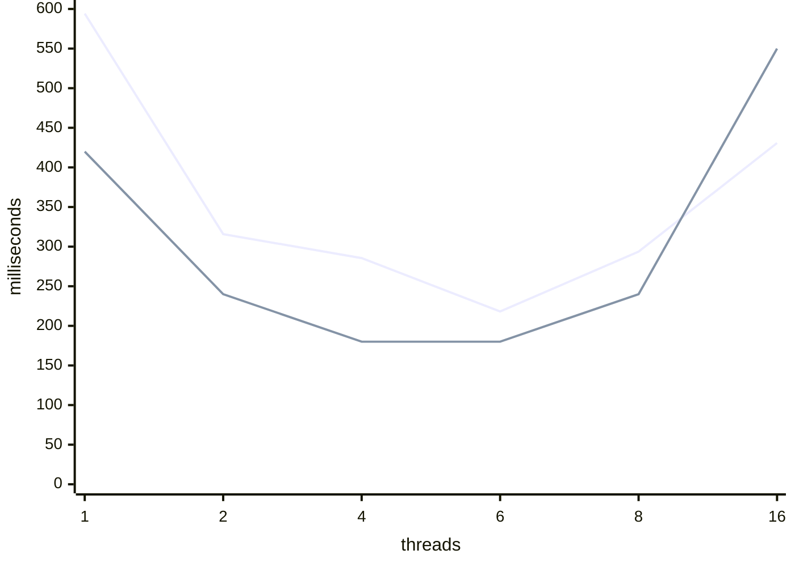

# What it costs to read your repository

Before a [Variance Authority](README.md) run can decide which **subjects** — a
subject is one named UI state you asked for and can ask for again — a change
could have reached, something has to read your repository: every module opened,
parsed, and every specifier in it resolved. It is the part of a run that grows
with your repository rather than with your suite, and a suite of any size pays
it once.

Reading a repository of a few hundred thousand files quickly is not one
problem. It is a sequence of them, and each one is created by the answer to the
last. A fast parser makes reading the bottleneck. Reading a file from
JavaScript costs seven times what reading it from Rust does, so the stage gets
compiled. Getting the reading off the main thread makes the kernel the
bottleneck. Widening the reads makes them slower. Refusing to open files at all
buys a subprocess you then have to earn back. And a scan you only pay once is a scan whose answer you now have to store
and query, which is [its own page](scale.md).

This is that sequence, in the order it was met. Almost every figure in it was
measured on one repository this project did not write — [Material
UI](https://github.com/mui/material-ui) at `8f19b1009b`, public and pinned — on
an M4 Max with twelve performance cores, four efficiency cores and a warm
filesystem cache. The two figures that come from somewhere else say so where
they appear. [The closing section](#what-these-were-measured-on) is the full
stamp, and it is also where the four different counts of that one repository
are reconciled, because the figures below are not all charged per the same one.

## A parser was never the problem

The first suspect on a job that reads 24.9 MB of TypeScript is the thing that
turns text into a tree. It is the wrong suspect, and one thread is enough to
show it:

```mermaid
xychart-beta horizontal
  accTitle: Milliseconds on one thread for Material UI's 24,519 modules
  x-axis ["parse them with oxc", "read them from disk"]
  y-axis "milliseconds" 0 --> 350
  bar [155, 0]
  bar [0, 321]
  bar [0, 0]
  bar [0, 0]
```



[oxc](https://oxc.rs) parses every module in the checkout in 155 ms. Handing it
the files costs more than twice that, on the same thread, off a warm page
cache, with no syntax tree built and nothing resolved. Whatever else a scan
does, it cannot go below this pair, and the larger half of the pair is not
parsing.

That is the first wall, and everything below is what it takes to get under it.

## A tree per file is a tree that has to cross back

Parsing in 155 ms is only useful if nothing between the file and the parse
costs more than the parse. In JavaScript it does, and the same files say by how
much. Doing the whole stage — read every module, parse it, pull every specifier
out of the tree — over 27,748 of them:



Both sides are given the same file list in the
same order and both are made to produce the same 101,655 specifiers, compared
element by element, before either time is printed; a run whose two sides
disagree prints no time at all.

```mermaid
xychart-beta horizontal
  accTitle: Milliseconds to read, parse and extract specifiers from 27,748 modules
  x-axis ["written in Rust", "written in TypeScript"]
  y-axis "milliseconds" 0 --> 2000
  bar [276, 0]
  bar [0, 1997]
  bar [0, 0]
  bar [0, 0]
```

Seven times is not a parser gap, because there is no parser gap: oxc does the
parsing on both sides. What the slow side is paying for is the tree arriving.
Every module's syntax tree is built in the runtime's heap, walked from
JavaScript to find the specifiers, and collected there — 27,748 times, against
155 ms of actual parsing. And it cannot be spread out of the way, because the
walk is the thing allocating: the TypeScript stage holds 1.23 cores of a
sixteen-core machine while the addon holds 7.74.

So the scanner is compiled, and it is the only part of Variance Authority that
had to be. Everything else in it is TypeScript and stays TypeScript, because
everything else is a decision about data — what changed, what it reached, what
to run, what to record — and a decision costs what it costs in any language.
This is not a decision. It is every file you have, and the only way to stop
paying the runtime for them is to stop handing them to it.

[Sense](../packages/sense) ships a Rust addon that opens, parses, resolves and
records a whole cold checkout without handing a syntax tree back to JavaScript
— oxc for the parse and for the resolver, [rayon](https://docs.rs/rayon) for
the pools whose widths the next three sections are spent arguing about, and one
arena per worker rather than one per file, because a tree that never leaves the
worker that built it can be thrown away by resetting a bump pointer instead of
by being allocated and torn down twenty-seven thousand times. It is not a rewrite: the TypeScript
scanner is still the implementation of record, the addon is held to its answers
by differential tests, and a machine with no binary for it builds the same
index and pays more for it. [Where the native code is](native-code.md) says
where that happens.

Plenty of compiled code runs under a scan — oxc's own bindings, libvips under
the screenshots — and all of the rest of it is somebody else's. Installing a
native library is cheap. Writing one is a platform matrix, a release that can arrive without a
binary, and a second implementation to keep honest, which is a bill worth
paying once and only where something forces it.

Those two numbers are where every measurement below starts. What the second one
buys is not a faster loop; it is a scan whose remaining cost is entirely
somebody else's. Once opening a file is the expensive part of reading a file, the
language the loop is written in has stopped being the question — and the
questions that are left all belong to the kernel.

## Opening the files in parallel makes them slower

Twenty-four thousand files is a great many files and almost no bytes, so the
move is to ask for them all at once. Nobody expects that to scale forever. What
everybody expects is the shape it stops in: an SSD serves many outstanding
requests at a time and wants depth to stay busy, so you add readers until the
device is saturated, callers begin queueing behind one another, and the curve
goes flat. The usual pool size — one reader per core — is a guess at where flat
begins.

It does not go flat. Past four readers it goes back up, and keeps going up.

Same files, same work, only the width moving. The width is the size of the
addon's read pool — the parse pool stays at machine width at every point, so the
only thing changing is how many threads are inside the filesystem at once.
`packages/sense/scripts/read-width.mjs` is a driver that calls into it, forty
lines of JavaScript around `readBatch`, so what the sweep prices is the Rust:

```mermaid
xychart-beta
  accTitle: Wall milliseconds to read 27,748 files, by number of readers
  x-axis "readers" ["1", "2", "3", "4", "6", "8", "12", "16"]
  y-axis "milliseconds" 0 --> 500
  line [449.6, 310.9, 301.3, 280.7, 271.4, 281.3, 398.6, 480.8]
```

The wall clock is the symptom. Across the same sweep, system time rises
elevenfold for the same 27,748 `open` calls — not more calls, the same ones —
and what the kernel spends on one file rises with it:

```mermaid
xychart-beta
  accTitle: Kernel microseconds per file, by number of readers
  x-axis "readers" ["1", "2", "3", "4", "6", "8", "12", "16"]
  y-axis "microseconds" 0 --> 200
  line [16.5, 20.0, 26.4, 31.0, 42.8, 59.5, 131.0, 190.8]
```

That per-file cost is the finding, and it is what separates the two explanations.
A saturated device — one serving as fast as it can while callers queue — holds
the per-call cost flat: the wall clock stops improving because each caller
waits longer, not because each call costs more. Here the call itself gets more
expensive, sixteen threads paying eleven times the kernel time of one for
exactly the same 27,748 `open` calls. The readers are not queueing behind the work.
They are making each other's work more expensive, because an `open` walks the
path under locks on directory vnodes and the name cache, and those locks are
shared.

Contention, not saturation. A saturated device is widened by a faster device.
This is not.

Two other readings are available and both are wrong. It is not the efficiency
cores — the machine these were taken on is twelve performance and four
efficiency, so an E-core explanation puts the cliff at twelve, and the
degradation starts at eight, well before it. It is not the scanner either:
ripgrep has no parser, no resolver and no index, and [collapses on the same
curve on the same machine](#the-same-wall-in-somebody-elses-program) — where
its user time, which is its actual searching, holds at 30 to 80 ms while its
system time goes up twentyfold.

**Full-disk encryption is already in these numbers.** They were taken on a
FileVault volume, so every byte read above came back decrypted, and the next
section fails to find the cost of reading all 30.3 MiB of them at all —
decryption included — underneath what the opens cost. Encryption is a
per-byte cost down at the block layer, which is the half of this that is cheap.
BitLocker and LUKS sit in the same place.

**An endpoint security agent does not.** Falcon, Defender, any filter driver or
kernel extension that inspects file access is asked about an `open` before the
filesystem does its own work, and it is asked inside the contended path. That
makes it a multiplier on the thing that already costs everything rather than a
tax on the thing that costs nothing, and **a managed machine or a CI image has
more of it in that path than that one did.** What it comes to is your image, your agent and your
policy, so the numbers above are not transferable and the sweep that produced
them is committed for exactly that reason — run it where the answer matters.
What an agent in the path changes is not mainly which width to pick. It is how
much a descriptor is worth not buying at all, which is where this ends up
anyway.

## The bytes are free; the descriptor is not

If the readers are making each other's work more expensive, the next question is
which part of the work. A read is a path walk, a descriptor and some bytes, and
only one of those three is worth attacking. Two probes over the same 27,748
files, at widths 1 through 16: one opens each file and reads every byte, the
other opens it and closes it again.



`open` and `close`, touching no file data whatsoever, reproduce the entire
collapse. Try to find the bytes between the two lines: adding a full read of
all 30.3 MiB moves the probe by less than the probe moves between runs, and at three of the six widths the version that reads every
byte finishes *ahead* of the version that opens the file and immediately closes
it. Thirty megabytes is not a small cost here. It is a cost that does not
survive the noise of the thing it is sitting on top of, and twenty-seven
thousand `open` calls is that thing.

Three things follow from that, and two of them killed an optimization that
looked obvious:

- **A second pathname resolution is free.** `stat` then `open` then `read`
  costs what `open` then `read` costs, because the second lookup finds the vnode the first one just
  cached.
- **Path depth is free.** `openat` from a directory descriptor opened once per
  directory, resolving one component instead of every component of every path,
  matches plain opens measured beside it in the same run — 303 ms against 308.
- **Locality is worse.** Sorting reads by parent directory, so that threads
  share a vnode instead of colliding over one, lost at every width worth using:
  the checkout's 1,161 directory groups are uneven enough that the sort buys
  stragglers rather than locality.

Two more were tried and are not here. **`mimalloc`**: the probes above spend
nearly all of their time in the kernel, so an allocator was never going to appear
in it, and it did not.
**Per-file `mmap`**: it adds virtual-memory work to a process already bounded
by kernel-wide coordination, which is the same reason ripgrep's authors found
it loses on many small files.

What is left is concurrent `open` itself, and no arrangement of the same calls
avoids it.

## Reads and parses are not one width

Reading is bounded and parsing is not, so they are not run at one width. Reads
go in their own pool at a calibrated constant; parses run on the global pool at
machine width; and each chunk's reads overlap the last chunk's parses, so a
file is being opened while the previous batch is still being parsed.

That is close to the best a schedule can do, and the way to see it is to price
the half that cannot be hidden. Acquiring those files costs 165 ms — the
worktree row of the git table below. The whole stage, acquisition and parsing
and extraction together, costs 218 ms at the same width — the six-thread point
of the sense line in the ripgrep comparison further down. So everything that is not acquisition fits in
53 ms, over files whose parse alone is 155 ms on one thread. Most of the parse
is already happening inside the reads, which is what the overlap is for, and a
schedule that hid the rest of it perfectly could take back 53 ms at the
outside. A channel-based rewrite has nothing to win. Chunk size was swept for
the same reason the widths were: 2,048 files per step wins at 201 ms and 128
loses at 349, because a step short enough to pipeline finely is short enough
that the readers spend it starting and stopping.

**Both widths belong to the machine, and both are constants that should not
be.** The read width is the filesystem's answer, and four to six is what APFS
admitted there — the sweep above bottoms out at six, which is the shipped
constant, but four and eight are within four percent of it and twelve is half
again worse, so the range is the finding and the exact winner is not.
ext4 and XFS admit more; an overlay filesystem in a container, or anything over
a network, usually admits fewer. The parse width is the performance
core count's, and on a large machine it is the larger lever of the two: over a
306,694-file scan on an M4 Pro — ten performance cores, four efficiency — four
parser threads finish in 8.8 s where fourteen take 10.9, and spend a third less
CPU doing it. The arithmetic accounts for it: six readers plus fourteen parsers
is twenty runnable workers asking for ten fast cores, and the overflow lands on
the efficiency ones.

Neither number is a property of the binary, and no package manager can tell
those machines apart: `os`, `cpu` and `libc` are the only keys it has, and none
of them says how many performance cores are behind it. So the width is an
argument on every batch entry point, and `read-width.mjs` is committed, so a
guess made on one machine can be replaced with a measurement in one command on
the machine that has to live with it.

## Then stop opening the file

If a descriptor costs what nobody can widen — and costs more than that on a
machine with an agent in the path — the remaining move is not to buy one.

Git already holds the bytes of every tracked file, addressed by content, in its
object store — packed, for everything that arrived with the clone.

So stop asking the filesystem for them and ask git.

The address is already in hand. A scan takes its digests from `ls-tree` — a
blob's name is the hash of its contents, which is what spares it hashing the
repository itself — and that name is also where the bytes sit in the pack. The
key carried to decide whether a file needs reading is the key that fetches it.
Every `open` in the sections above took the long way round to bytes that a
process one pipe away had indexed under an id the scan was already holding.

`cat-file --batch` opens that pack once per process, and every object after
that is a seek and an inflate: no path walk, no name cache, no vnode lock
shared with five other readers, and nothing for a filter driver to intercept.
Objects written since the last repack are loose rather than packed and cost one
open each, which is the worktree price for the handful of files that have it —
the same command answers for both and the caller never learns which it got.

Repository size decides this, and it decides it in opposite directions.

| reading the same tracked files | from the worktree | from the pack |
| --- | --- | --- |
| the checkout above — 27,748 modules, 30.3 MiB | 165 ms | 204 ms |
| a generated repository — 200,000 blobs | 6.4 s wall, 76 s system | 660 ms wall, 320 ms system |

On a small checkout the pipe costs more than the descriptors it saves, and a
worktree read wins outright. An order of magnitude up, the same comparison is
ten times the wall clock and two hundred times the kernel time, because what
grows between those two rows is exactly what git does not pay. A repository
large enough to make this question worth asking is a repository where the
answer is git.

The second row is a repository nobody wrote, because there was no real one of
that shape to hand, and a generated tree is the kind of thing that flatters a
packfile: two hundred thousand similar files delta-compress beautifully. So it
was run again against a 20,000-file incompressible tree, where they cannot, and
the ratio survived — delta compression is not what produces that row. Of the
660 ms, `--batch-check` — object lookup with no content at all — is 210 ms,
leaving 230 ms of inflate and 370 ms of system time that is almost entirely
67 MB crossing a pipe.

So both paths ship, and what picks between them is the size of the wave — one
wave being however many files a scan has decided it needs at once, which is
every module in the repository on a cold run and a handful on a warm one.
Starting a `cat-file` process costs 7.08 ms there; a blob saves about 53 µs
against an open, which is the per-file gap between the two columns of the first
row above; the two divide to about 134 files, and `FILES_PER_PROCESS = 160`
rounds it up rather than down, because a bucket that only just clears the line
saves nothing worth a process. A wave below it reads from disk, where the
chunked pipeline overlaps the next open with the current parse. Both give the
same answers, and the number is worth remembering for the incremental table
below, where every wave is smaller than it.

Nothing changes for dirty or untracked files. Those are hashed with
`hash-object`, which does not write the object, so `cat-file` answers `missing`
and the read falls back to opening the file — the path every other failure
already used.

The two paths are shaped differently because the thing they are hiding is
different. A worktree read is waiting on a descriptor, so it has a bounded read
pool in front of a wide parse pool with the two overlapped. A pack read is not
waiting on anything worth hiding, so each stream reads its blob and parses it
before asking for the next, and the stream count is the only width there is.

On a mid-sized subtree where both paths are viable, the pack takes a cold scan
from 582 ms to 473 and drops its kernel half by forty percent.

That is the end of the cold path, and it is worth putting next to where it
started. One thread reading and parsing these files, doing nothing else, costs
476 ms. A cold scan of the same checkout — every file read, every tree built,
every specifier resolved, every declaration indexed and the index written —
costs **586 ms**.

The right reading of those two numbers is not that the scan adds 110 ms of work
on top of the read. It is that the scan does not do the read. The 476 ms is
what the obvious route to the bytes costs, and the whole argument above is the
scan getting off that route: it does not pay 321 ms of opens, because it barely
opens anything. Six times the work for 23% more time is not a tight loop. It is
a different road.

## After the first read, you do not read it again

Everything above is the cold path, and you pay it on a fresh clone and on a CI
runner with nothing cached. Every run after it opens an incremental,
content-addressed index instead. What that index holds is one **record** per
file — the file's digest, every specifier found in it, what each one resolved
to, and which directories could have answered them — so an unchanged run reuses
its records whole, an edit rebuilds the records of the files that changed, and a
path appearing invalidates only the records whose specifiers could have named
the directory it appeared in.

Each row below is a working tree put into that shape and then put back. The last
two columns are counted on the run rather than inferred from it: a record is
either reused or rebuilt, and a rebuild either goes back to the file's bytes or
answers from the parse cache, which is keyed by content and by what the file's
name said about reading it.

| The tree is | Total | Records rebuilt | Re-read |
| --- | --- | --- | --- |
| new — no index at all | 586 ms | 24,908 | 78 |
| unchanged since last run | 301 ms | 1 | 0 |
| four files edited | 320 ms | 5 | 4 |
| five hundred files edited | 385 ms | 501 | 500 |
| one file added | 362 ms | 105 | 104 |
| a hundred in, a hundred out, five hundred edited | 556 ms | 1,079 | 1,078 |

The last column is a warm-run measurement and the cold row is not comparable in
it: the native batch reads and parses inside itself, so its 24,908 rebuilds are
invisible to a counter sitting on the scanner's own read path, and the 78 is
whatever that path picked up afterwards. On the warm rows it counts everything.

**Every warm row reads from the worktree, not the pack.** A hundred and four
files re-read is a wave of a hundred and four, which is below the 160 the
section above spends a paragraph deriving, so it takes the disk path — and the
files in these waves are the ones that just changed, which git has no object
for until somebody commits them. The pack is the cold path's answer. The warm
path's answer is that there are four files.

**An edit costs per file, over a fixed toll.** Five hundred files edited cost
about 65 ms more than four did — roughly an eighth of a millisecond each, which
is a file read, parsed and resolved. The 300 ms underneath is charged whether
anything changed or not, and a third of it is git. The rest is the walk —
every path in the repository visited and checked against its digest to decide
not to do anything about it — plus the index decoded so that there is something
to check it against. Both are proportional to the repository rather than to the
diff.

**A path appearing costs the directory it appeared in.** One file added rebuilds
105 records, because a record's edges depend on the bytes of the file, on how
resolution is configured, and on the membership of the directories its own
specifiers could have been answered from — nothing else. A hundred added, a
hundred removed and five hundred edited touch more directories and so rebuild
1,079: the 500 the edit is worth, plus the neighbours of the two hundred paths
that moved. The work tracks the diff rather than the repository.

**That 105 is one directory's answer, and the distribution is the claim.** The
cost of an appearance is the number of records watching the directory it
appeared in, so the whole shape is reported rather than one row of it. Over the
checkout below, 1,493 directories, 506 of them watched by anything, and a record
watches 1.3 directories on average. The table reads the other direction — how
many records watch one directory, which is what an appearance costs — and that
direction is skewed enough that its mean would tell you nothing:

| One path appears in a directory, and it rebuilds | Records |
| --- | --- |
| the median directory | 7 |
| the 90th percentile | 36 |
| the 99th percentile | 242 |
| the worst directory in that checkout | 21,500 |

The worst directory there is `packages/mui-icons-material/lib/utils`, home to
the one module that 21,506 generated icons import. Every one of them genuinely
depends on what that directory contains, so every one of them is rebuilt when
its membership changes — which is to say a regeneration of the icons costs what
a cold run costs, and nothing else in that checkout does. Expect the same
wherever a barrel sits under a generated directory.

One repository shape removes that bound: a `tsconfig` that cannot be read. A
bare specifier is bounded by the `paths` a configuration declares, so a
configuration that cannot be parsed is no bound at all, and there every added
path invalidates every record. The symptom is a warm run that costs what a cold
one does.

### Where the third of a second is

Of a warm run's 301 ms, roughly 116 is decoding the index, 185 is the scan, and
nothing at all is publishing — an unchanged tree has no segment to append. The
scan is two things and neither is a parse: git answering what the working tree
looks like, and about 92 ms of the scanner's own — every record in the index
walked and each checked against its digest. Which of the two is
larger is decided by the accelerators below.

The publish is the smallest of the three because of how little it writes. A run
that changed nothing writes nothing — the index is an append-only chain of
immutable segments, and an unchanged run has no segment to append. A run that
edited four files appends about **14,000 bytes** to a 10.5 MB index. The whole
of it is re-encoded only when the chain has grown past eight segments, which is
one publish in eight and costs about 150 ms more than an append.

### git, and the two accelerators

Everything Variance Authority knows about a working tree comes from git.
`ls-tree` reads the commit and does not grow with the checkout. `status` reads
the working tree and does, so it is the row that matters, and git ships two
accelerators for it that are off by default:

| Asking git for `status` | Costs |
| --- | --- |
| neither accelerator | 93 ms |
| `core.fsmonitor` | 54 ms |
| both | 52 ms |

The monitor answers for tracked files. The untracked cache answers the other
half of the same question — what is on disk that the index has never heard of —
and it does not move this row, because these figures are taken on a clean
checkout and the walk it spares finds nothing. On a working tree with build
output in it, that is the half that costs.

Forty milliseconds off every warm run is worth having, and nothing here takes it
for you: starting a file-system daemon on somebody else's repository is not a
scanner's decision to make. The repository's own configuration decides, and this
is how you make it.

```bash
git config core.fsmonitor true
git config core.untrackedCache true
```

The monitor can be wrong after a crash, on a network filesystem, and across a
container boundary. When it is, git recomputes.

## The same wall, in somebody else’s program

Everything above turns on one claim: that what a scan of this shape costs is
acquisition, and that acquisition degrades with width for reasons that have
nothing to do with the scanner. ripgrep is the way to check that without taking
any of it on trust. It walks a repository's source files, opens
every one, reads all of its bytes and reduces them to something much smaller.
That is the same shape as this scan, minus the part that makes a scan useful:
ripgrep runs a literal search, and this builds a syntax tree and extracts every
specifier out of it. ripgrep is doing far less work per byte, and far more
attention has been paid to it doing that work fast. It is also Rust over the
same kind of work-stealing pool, which is what makes the comparison worth
printing at all: the two sides differ in what they do per byte, not in what
they are written in.

A claim about the kernel should be reproducible in a program that shares none
of the scanner's decisions, and `packages/sense/scripts/scan-cost.mjs` runs both
over the same files at the same widths. The pattern ripgrep is given never
matches, which is its best case — the literal prefilter rejects each buffer
without the regex engine ever starting — so what is left on its side is
acquisition, which is the thing being compared.

ripgrep opens, reads and searches; sense opens, reads, parses and extracts.
Wall clock for each, sense first:



Two curves, one shape. Both bottom out at six, both climb again, and both spend
almost everything they spend in the kernel. That is what the comparison is here for:
a program with no parser, no resolver, no tree and no index collapses at width
on the same machine, which is what makes the collapse the machine's rather than
the scanner's.

User time is the control, and this is the one comparison on the page that can
use it, because here the thread count is set per process before either program
starts and caps everything both of them do. From one thread to sixteen,
ripgrep's user time goes from 30 ms to 80 ms while its system time goes from 380
to 7,740: its searching never changes, and everything that happens to it across
the sweep happens in the kernel. Sense's user time is larger throughout, 241 ms
to 980, which is what building a syntax tree costs over rejecting a buffer on a literal
prefilter, and it is still not what any of these widths are paying for.

Which of the two is faster is the smaller point, and at the minimum the answer
does not flatter this scanner: 180 ms against 218, so the side that parses
TypeScript and extracts every specifier out of it is 21% behind the side that
does not. At sixteen threads it is 22% ahead, and that is not a win either —
both of them are ruined there, which was the point.

## What these were measured on

Every millisecond above was taken on an Apple M4 Max (Mac16,9) — 12 performance
cores, 4 efficiency, 64 GB, macOS 27.0 on arm64, Node v26.7.0, Yarn 4.18.0,
ripgrep 15.2.0 — on a local SSD with a warm filesystem cache. Two things above
are not from that machine and say so where they appear: the 306,694-file scan,
stamped with the M4 Pro it was taken on, and the 200,000-blob row, which is a
generated repository rather than a real one. A warm cache makes the rest of it
the fast end of the range and a floor rather than a budget: size a CI container
above these, not against them.

The repository is one this project did not write: [Material
UI](https://github.com/mui/material-ui) at `8f19b1009b`, 41,171 tracked paths.
It is public and it is pinned, so every figure here that is charged against it
is one you can take yourself.

**Four counts of it appear above and no two of them are the same count**, which
is not sloppiness so much as three scripts having three reasons to disagree
about what a module is.

- **24,519 modules, 24.9 MB** is what `source-index.mjs` scans — `packages` and
  `docs/src`, with declaration files left out — and it is what the floor chart
  and the whole incremental table are charged per.
- **27,748 modules, 30.3 MiB** is every module path in the repository,
  declaration files included, which is what the width sweep, the probes, the
  TypeScript-against-Rust comparison and the ripgrep comparison are all pointed
  at. It is the larger set and the larger number, and the megabytes are binary
  where the line above is decimal.
- **24,908** is the records a cold scan **rebuilt**, which is more than the
  24,519 because the walk also records stylesheets and declaration files that
  the module listing excludes. It is not the number of records the index ends up
  holding, which is counted where the index is
  [sized](source-index.md#how-large-it-gets).
- **78** is not a count of files opened. It is how many of those 24,908
  rebuilds came back through the scanner's own read path, the other 24,830
  having been read and parsed inside the native batch where no counter sees
  them.

Method, because the figures were not all taken the same way. The floor figures, the
git rows and the cold scan are each the **median of five** timings. The width
sweep, the probes, the chunk sweep and the ripgrep comparison are each the
**best of three**, which is the run least disturbed by the rest of the machine.
**Every other row of the incremental table is one timing of one run**: read that
column for its shape and not for a difference of a few tens of milliseconds,
because a single sample is worth about that much either way.

Every figure comes from a committed script, run against a clone of that
checkout, all of them under `packages/sense/scripts`: `source-index.mjs` for the
incremental table, the floor chart and the git table, `read-cost.mjs` for TypeScript against Rust,
`read-width.mjs` for the width sweep, `scan-cost.mjs` for ripgrep.

Material UI is not a large repository, and none of the trees measured above
are. What these rows come to on a checkout of a serious size — and what the
index and the [execution record](execution-record.md) weigh there — is in
[addressing scale](scale.md).