# Addressing scale

You are sizing this for a repository of several hundred thousand files and want
to know whether it fits before you commit to it. Deciding which tests a change
can skip obliges you to keep files on disk; below are what they weigh, what a
question against them costs, and where the answer stops being worth having.

The file that decides whether any of this is feasible is the one that remembers
which tests went through which code. Selection may only skip a test when that
file says the test never covered what you changed, so it has to keep the
relation whole rather than folded, and a whole relation is large. One test file
covering one piece of one module is a **crossing**. A repository of 200,000
modules holds about 1.6 million such pieces, and in a suite of 2,000 test files
the average piece turns out to be reached by about four hundred of them. That
is what importing **barrels** does: a test that wants one name from a package's
`index.ts` loads the file, and the file loads everything it re-exports, so one
import puts the test inside hundreds of modules it never mentions. The relation
has **671 million** entries in it. Coverage tools never meet that number,
because they throw the test axis away: Istanbul and V8 count how many times a
line ran, not who ran it, and a count can never clear a particular test.

Written out as pairs, one per test per piece, 671 million entries is 2,685 MB at
four bytes each and 5,371 MB at eight. Kept whole but not written out, the same
relation is built and held in **132 MB**, and no compressor is involved in
getting there. It falls to **3,408 distinct sets of tests**, one for roughly
every two hundred thousand crossings, because a test that imports a barrel
covers every leaf underneath it: all of those leaves have the same audience, and
the relation stores that audience once instead of once per leaf. The factor of
twenty comes from the way imports are written rather than from an encoder, which
is why it improves on exactly the repositories that prompt the question.

```mermaid
xychart-beta horizontal
  accTitle: Megabytes for 671 million crossings at 200,000 modules
  x-axis ["shared sets, on disk", "shared sets, built", "pairs, 4 bytes each", "pairs, 8 bytes each"]
  y-axis "MB" 0 --> 5500
  bar [77, 132, 0, 0]
  bar [0, 0, 2685, 5371]
  bar [0, 0, 0, 0]
  bar [0, 0, 0, 0]
```



That 132 MB is what the relation costs to build. What it costs to keep is
smaller and is a different number: **77 MB** on disk at 200,000 modules, after
the columns are run-coded on the way out. The rest of the arithmetic follows
from a file that never expands the relation back. It is not read into memory to
be asked about, so a question against that 77 MB touches under 5% of it and
answers cold in under a tenth of a second. It is not rebuilt to be updated, so a
run after an edit pays for the records the edit touched. It does not grow on a
second axis: the case axis is a separate file, priced at the end.

A tool that reads your whole codebase can run out of memory on a large one.
There is a size past which dying is fair, and this page says where it puts that
size rather than leaving you to find it. The largest row in the table below is
two million modules: about a minute of first scan, an index near a gigabyte and
a record near another. That row is extrapolated rather than measured, and past
it the arithmetic still runs but nobody has watched it. A decades-old enterprise
tree an order of magnitude beyond that is a rock, and nothing here pretends to
lift it.

What [test selection](selecting.md) is built for is the shape a large
repository usually has in practice: hundreds of thousands of files, grown
quickly, not all of it written well, with a handful of test files that pull in
half the codebase on their own. That is the case the rest of this page is
worked against, because it is the hard one. If the arithmetic holds there,
your repository is the easy one.

For the mechanical account underneath the arithmetic — what a record shares
between tests, why the relation factorises, and how one question avoids reading
the whole record — read [how the test-to-code map stays
small](how-selection-scales.md) alongside this page.

## Three files have to fit

Selection starts with a [scan of the source](source.md). [Sense](../packages/sense)
reads every file, resolves what it imports, and writes one record per file
into the [source index](source-index.md). That index answers what a change
*could* reach, and a run consults it before it runs anything.

The [execution record](execution-record.md) then narrows that to what each
test *actually* covered: for every test file, the
[regions](execution-record.md#blocks) of every module it went through while it
ran. A **region** is one piece of a module's text the instrument cut — a
function body, a branch arm, the module's top level — and one test covering one
region is a **crossing**. The record is the whole set of crossings your suite
produced, written to one binary file.

The [lexicon](lexicon.md) answers a different question: not whether to run a
subject, but how to *find* one. It is written per subject, which
puts it on its own axis — the index and the record are priced in modules, and
the lexicon is priced in subjects.

This page is the arithmetic on all three, in that order. A fourth file, which
the same run writes, is priced at the end: the per-case
[execution index](execution-record.md) records the same relation per **case** —
one `it` or `test`, rather than the file that holds it — and it is
the only one of the four that grows on two axes at once.

**Each of the three is priced against a different count of your own**, and
nothing on this page converts one of those counts into another, because nothing
in the three files relates them:

| to price | the count you need |
|---|---|
| the [source index](source-index.md) | the modules in your checkout — the source files `git ls-files` lists |
| the [execution record](execution-record.md) | the modules your suite **covers**, which is a fraction of the first that only a recording knows |
| the [lexicon](lexicon.md) | the **subjects** your suite captures — a subject is one named UI state you asked for and can ask for again |

A component library's unit suite covers 3% of the repository's modules and
captures thousands of subjects; an application's suite covers most of what it
ships and captures hundreds. Both ratios are properties of the suite, so go and
count all three.

## The source index

Every `variance run --since <ref>` begins by reading the tree, the way
`git status` does before it prints anything: it asks git which files changed,
parses those, resolves their imports, and updates the index. That reading is
the scan. It is a parse and a resolver, and nothing in it builds or executes
your code.

At a few thousand files nobody asks what that stage costs. At several hundred
thousand it is the one part of a run obliged to touch every file you have, so it
sets the floor under every number below, and three things about it are not what
you would write first. Parsing is the bulk of the work, so it is done by
[oxc](https://oxc.rs) in a Rust addon rather than in JavaScript, which is a
seven-fold difference on the same file list. Reading is not parsing and is not
bounded the same way: opening files is where a scan actually stalls, so the
reads run in a pool held far below the machine's width while the parses run
wide. And past enough files the worktree is the wrong place to get bytes from at
all, so they come out of git's packfile instead. [What it costs to read your
repository](performance.md) is that argument end to end, measured; what it
produces is the rate this page is extrapolated from.

Measured on [Material UI](https://github.com/mui/material-ui), 41,171 tracked
paths of which 24,519 are modules, the first scan is **586 ms** and produces a
10.5 MB index. Every run after it reuses that index, so the figure that matters
is what a run pays before it selects anything, after an edit:

| since the last run, the tree is | a run waits |
|---|---|
| new, no index at all | 586 ms |
| unchanged | 301 ms |
| four files edited | 320 ms |
| five hundred files edited | 385 ms |

```mermaid
xychart-beta horizontal
  accTitle: Milliseconds a run waits on Material UI, by what changed since the last run
  x-axis ["unchanged", "four files edited", "five hundred files edited", "no index at all"]
  y-axis "milliseconds" 0 --> 600
  bar [301, 320, 385, 0]
  bar [0, 0, 0, 0]
  bar [0, 0, 0, 586]
  bar [0, 0, 0, 0]
```



An edit costs the records it touched and a fixed toll on top, which is why the
last three rows sit together. Where those numbers come from, and what a file
appearing or moving costs, is in [what a source scan costs](performance.md).

**The cold scan is about 0.024 ms per module** — 586 ms over 24,519. Scaled up
linearly that is **roughly 5 seconds at 200,000 modules and about 50 seconds at
2,000,000**, once per machine and never again. Read both as linear
extrapolation from the one measured scan, not as measurements: the scan reads,
parses and resolves each module, and resolution is priced per specifier, so a
repository averaging more imports per file costs more than that line predicts.
The 300 ms a warm run pays underneath the diff is charged against the whole
tree as well, and it grows on the same axis: **about 7 µs per tracked path**,
roughly 2 µs of which is git answering what the working tree looks like. A
9,000-path checkout of similar module density is a 65 ms warm run; a
400,000-path one pays the toll ten times over, so budget around three seconds
of walk and index decode on every run. Before anything else, turn on the two
git settings that make the walk cheaper and that ship off: `core.fsmonitor`,
which lets a daemon report what changed instead of git stat-ing every path, and
`core.untrackedCache`, which lets git skip directories whose modification time
has not moved. [The scan page](performance.md#git-and-the-two-accelerators)
measures both.

Size scales with files, and it stays linear. The comparison worth making is
against the cache you would have written first: one JSON object per file, each
one spelling out its own path and the path of everything it imports. A synthetic
200,000-file shape measures 598 MB written that way and **67.3 MB** written the
way the index writes it, through its own encoder and read back through its own
reader. The nine-fold difference is one decision — every name is stored once for
the whole **generation**, which is what a
[written index is called](source-structures.md): the ordered chain of immutable
segments that one scan leaves on disk. A path that appears in forty import lists
is written once and referred to forty times. That is a measurement of the format
at that size, on generated paths rather than on a real tree.

```mermaid
xychart-beta horizontal
  accTitle: Megabytes for a synthetic 200,000-file source index
  x-axis ["the source index", "one JSON object per file"]
  y-axis "MB" 0 --> 600
  bar [67.3, 0]
  bar [0, 598]
  bar [0, 0]
  bar [0, 0]
```



**Three counts of Material UI appear on this page and they are not the same
count.** 41,171 is every path git tracks in the checkout. 24,519 is the module
files among them, and it is what the timings above are charged per. 25,117 is
the records the index wrote, because the walk also records the stylesheets and
declaration files the module listing excludes, and it is what the byte rates
below are charged per.

Real trees give the rate to work from, and it is a range rather than one number:
**318 B per file** over Material UI's 25,117 records, **411 B** over
[Docusaurus](https://github.com/facebook/docusaurus)'s 2,670, and **556 B** over
a 1,236-file TypeScript workspace. Bytes per file track how many edges a file
has, not how large the repository is, which is why the largest of the three is
the cheapest per file. A real 200,000-file tree lands somewhere between about
60 MB and 110 MB.

That is the whole index on disk. A run does not load it either. A generation is
a chain of segments and a scan appends rather than rewrites, so the newest
segment holds what the last run changed and the ones behind it hold everything
older; a reader asks them newest first and stops at the first one that answers,
which means a file nobody has touched is found in the oldest segment and never
decoded past its header. A record is reused when neither its own bytes nor its
surroundings have moved, and the surroundings are named rather than assumed:
each record carries the list of directories its imports could have been answered
from, and each of those directories carries a digest of its entry names. A file
whose text is unchanged still gets re-resolved if a sibling appeared next to
something it imports. Everything else is found and skipped.

## The execution record

You already have something like it: code coverage. Istanbul, c8 and V8's own
coverage record which lines ran while the suite ran. What they hand you is a
count per line, folded across every test, so the report can say *this line was
covered* and never *by which test*. The folding is what keeps a coverage report
small. The unfolded relation is tests multiplied by lines, and a coverage tool
never stores it, because for a large suite it is gigabytes.

Selection needs the unfolded relation. Skipping a test on a changed line is
only safe if the record says that test never covered it, and a count per line
cannot say that about any test. So the execution record saves what coverage
throws away, and its size is the fair question.

You can price the folded version yourself in one command, with nothing to
install: Node writes raw V8 coverage to a directory when you set
`NODE_V8_COVERAGE`.

```bash
NODE_V8_COVERAGE=./coverage-raw yarn test
du -sh ./coverage-raw
```

Run against a 21-file unit suite over 756 modules, that directory is **37 MB of
JSON**, and it is already folded: one file per worker process, not one per
test. Ask for the unfolded relation, one row per
test per region, and the multiplier is the number of test files.

Two fears attach to that once a repository is large: that recording it produces
gigabytes of data, and that reading it needs gigabytes of memory. A third is
about the clock rather than the bytes — that a suite under instrumentation
crawls — and it is answered where the suites are timed, in
[what recording costs while the suite runs](selecting.md#what-recording-costs-while-the-suite-runs):
1.02× on Zod and 1.08× on TanStack Query, against 1.30× for the same suites
under `--coverage`. The figures below come from two recordings:

- **Material UI.** [Material UI](https://github.com/mui/material-ui)'s own
  Vitest suite, recorded with the selection probes installed: 791 modules, 184
  test files and 8,143 regions covered. It is public, large enough to break
  things, and impossible to tune for.
- **A 200,000-module fixture.** That recording scaled 253 times, to 200,000
  modules and 2,000 test files. Its module paths, its region counts per module
  and its region spans are drawn from the real recording: how many regions a
  module has and how many lines each one spans are sampled from Material UI's
  distributions rather than invented, and the fixture's distributions come back
  within half a percent of the ones they were drawn from. One axis is synthesized, and
  it is the one that decides how *well* selection works: which test covered
  which module. So the large fixture answers how long, how many bytes and how
  much memory, and it is never allowed to answer how many tests you skip.
  Every share-of-the-suite figure below comes from Material UI.

### Why it is megabytes and not gigabytes

Multiply modules by regions by test files and the crossing count of a large
repository runs to hundreds of millions. Expanded into pairs, one per test per
region, that is gigabytes before a byte is written to disk.

The record never stores pairs. A region does not own the list of tests that
covered it. It names one entry in a pool of the **distinct** sets of
tests, and the pool keeps one copy of each set, however many regions name it.
That is [hash consing](https://en.wikipedia.org/wiki/Hash_consing) over sets,
and the identifier in the region column is
[dictionary encoding](https://en.wikipedia.org/wiki/Dictionary_coder). Module
paths and test names are kept the same way, as one interned
[string dictionary](https://en.wikipedia.org/wiki/String_interning) per
generation, which is why a name costs bytes once however many rows repeat it.

Sharing on that scale is what imports produce, not a compression trick. A test
file reaches tens of thousands of modules by importing barrels, and every leaf
under a barrel is covered by exactly the tests that touched the barrel. So the
audience belongs to the barrel, and every leaf under it points at one set. The
worst row for a store that keeps pairs is a region the entire suite covered,
because that is 2,000 pairs; here it is an index into the pool, and an index
into a pool of 3,408 is five bytes.

On a barrel-shaped repository of 200,000 modules and 2,000 test files, **671
million crossings collapse to 3,408 distinct sets**, built, stored and queried
inside 132 MB. The same relation written as bare integer pairs has a floor of
2,685 MB, and as pointers 5,371 MB. The factor of twenty, and of forty against
pointers, is not in the encoding. It is in not writing the same fact once per
leaf.

Now assume none of that sharing exists. Give every one of the fixture's 1.6
million regions its own set, sharing nothing with anything, and the pool stops
being a pool: 1.6 million distinct sets, each held while the record is built.
That is 386 MB in the objects holding them, at a 510 MB peak for the process.
Still one process, still no shards, and still under the memory a test runner is
already using. That shape needs every
region in the repository to have been covered by a different combination of
tests from every other region — including the regions of one module, which are
entered by whatever entered the module — so it is not a repository, it is an
upper bound. Which is why it is the one to quote: it does not depend on yours
being shaped nicely.

### Why reading it does not cost a gigabyte

Nothing loads it. The file is
[columnar](execution-record.md#the-coverage-file) —
[column-oriented storage](https://en.wikipedia.org/wiki/Column-oriented_DBMS),
the layout Parquet, [Apache Arrow](https://arrow.apache.org) and ClickHouse all
use, where each field is a contiguous compressed run and a reader decompresses
only the fields the question names. So a question touches the columns it
needs:

| | 200,000 modules, a 77 MB file | Material UI, a 0.5 MB file |
|---|---|---|
| opening it | 43 KB read | 1.8 KB read |
| answering a 100-file diff | 3.7 MB in 498 reads | 0.26 MB in 23 reads |
| as a share of the file | **under 5%** | 53% |

**The share falls as your repository grows.** A small file is mostly header and
dictionary, so a question reads half of it. A large one is mostly rows about
modules your diff did not touch, and those are never decompressed. Cold, in a
new process that opens the file and answers the diff, the whole command is
under a tenth of a second and about 120 MB resident. The second question inside
the same process costs a tenth of the first, because the column runs it
decompressed stay decompressed.

The most expensive question in the format is one no ordinary run asks: every
module against every test, which is how you find out which of your files are
**hubs**, the files most of the repository imports. At 200,000 modules that is
four seconds and 322 MB. It is the ceiling, and one you can afford to hit
deliberately.

### Writing it back costs what changed

A run that records does not only read the record. It lays the modules it just
re-recorded over the ones already there and writes the file back, and that
write is priced by the run rather than by the record. The modules your suite
did not touch this time are never decoded, never grouped and never compared:
the module rows are sorted by path and so is the string dictionary above them,
both by code unit — comparing UTF-16 units rather than asking a locale, so the
order is the same on every machine whatever `LANG` says. One order for both
means a path's place among the strings decides its place among the rows, and
both lookups are a binary search over integers. What carries an untouched module
from the old file into the new one is its row index, and a row index is four
bytes.

At 200,000 modules and 1,600,000 regions, laying ten re-recorded modules over
the record takes 0.6 s and 191 MB of live memory, of which 6.7 MB is objects —
and that 6.7 MB is flat, whatever size the record is. Everything that grows is
the columns themselves, decompressed to be read and compressed to be written;
peak resident is around 470 MB, and that peak is what a larger record moves.

### Which memory figure answers which question

| you want to know | the figure |
|---|---|
| what a run needs in memory while it answers a diff | **about 120 MB resident**, cold, against the 200,000-module record |
| what laying a run's own modules over the record and writing it back costs | 191 MB live and about 470 MB peak resident, at 200,000 modules |
| what the record costs on disk | 77 MB at 200,000 modules; 0.5 MB on Material UI |
| what the most expensive question in the format peaks at | 322 MB, every module against every test |
| what building the crossing relation costs | 132 MB, for 671 million crossings folded to 3,408 distinct sets |
| what it would cost if no sharing existed at all | a 510 MB peak over 386 MB of sets |

**Plan against the first row.** It is the only one an ordinary run pays. The
rest are ceilings: two you pay only by asking for them, and one that no real
import graph can produce.

### Where the observation comes from

Recording is not one process watching everything. Each test file writes its own
small journal as it finishes, and what happens next depends on whether the suite
was split.

**Locally there are workers and nothing else.** One runner process, however many
workers it spawns, one record at the end: the workers write journals into the
run directory and the reporter reads them and writes the file. There is no
fan-in protocol to operate, no shard ids to keep straight, and no server in the
path.

**In CI there are shards, and they are stitched afterwards.** A suite split
across machines produces one record per shard.
[`variance journeys`](../packages/cli#sharding-journeys-takes-more-than-one-file-too)
is the command that reads execution journals — which regions of which modules
each test covered on its way through — and folding shards is one of its modes,
because a fold is several journals read as one. It produces the union the
unsharded run would have written:

```bash
variance journeys shard-1/coverage.bin shard-2/coverage.bin --into coverage.bin
```

The fold refuses rather than guesses. Shards recorded at different commits, or
under different **probe recipes** — the instrumentation configuration a build
applied — are named and rejected. A journal does not spell out which region a
test entered; it writes a number, and the numbers are positions in the region
list that recipe produced. Fold two journals numbered against different recipes
and every row lands on the wrong region, silently, which is why the fold checks
first. Two shards share a recipe when they run the same
instrumented build of the same commit, which is what one checkout and one
configuration give you. A test file two shards both recorded means the split
overlapped, which only you can resolve. And where one shard measured a module
and another's build put no probes into it, **the measured row answers**: a shard
with no probes in a module has no measurement to set against one that does. The
stitched record is the one you share.

**A shared record is supported and never required.** Locally you can record one
and use it, fetch the one CI stitched and layer today's run on top, or work from
nothing at all. A missing or stale record costs a slower answer, never a
different one. The scan caches are content-addressed and behave the same way.

## What the index and the record cost, at four sizes

Both files grow with modules and stay linear. The index column you can price
before recording anything, from a count git already gives you; the record
column is priced per module your suite covers, which only a recording tells
you. Material UI's row is measured on a real repository. The 200,000 row is
measured, at that size, on fixtures rather than on a real tree. The outer two rows are **extrapolation** — those figures
extended linearly to a size no one has measured.

| your repository | modules | modules its suite covers | source index | execution record |
|---|---|---|---|---|
| a medium app, ~200k lines | ~2,000 | ~1,400 | ~0.7 MB | ~1 MB |
| a large library — Material UI | 24,519 | 791 | 10.5 MB | 0.5 MB |
| a large monorepo | 200,000 | 200,000 | 60–110 MB | 77 MB, a floor |
| a very large monorepo | 2,000,000 | 2,000,000 | ~600 MB – 1.1 GB | ~770 MB, a floor |

The index column is a range, not a point, because the rate is: across the three
real projects above it runs 318 B to 556 B per file, and what sets it is edges
per file. Multiplied out to 200,000 files that is 60 MB to 110 MB, and to
2,000,000 it is ten times that. The 67.3 MB the synthetic shape measured sits
inside the range, near its floor.

**The two module columns are different counts, and the gap between them is
yours to measure.** Material UI's Vitest suite is a unit suite over a component
library: it covers 791 of 24,519 modules, about 3%, because most of what the
repository tracks is documentation, examples and packages that suite never
imports. An application's own suite covers most of the application, which is why
the medium-app row assumes roughly 1,400 of 2,000. The 200,000 fixture covers
every module it contains, because it was built that way. What sets the rate is
how much of the tree your test files import, and only a recording tells you.

**The record needs a different constant from the one a per-module figure
gives.** The fixture's 77 MB over 200,000 modules is 0.385 KB per module, and
applying that to Material UI's 791 covered modules predicts 0.32 MB against a
real 0.5 MB — so the per-module figure is the wrong shape for this file. A
record is priced by the regions a suite covered, the test files that covered
them, and one interned string dictionary of paths, region names and digests.
Material UI covers 8,143 regions with 184 test files, which is a far denser
test axis than the fixture's 2,000 files over 200,000 modules, and its names
are real paths rather than generated ones.

Measured on the two real recordings there are, a record costs roughly **0.65 to
0.77 KB per covered module**: 0.5 MB over Material UI's 791, and 0.7 MB over a
429-file suite's 977. Use that range. The 0.385 the fixture gives is a floor,
which is why the last two rows of the table are marked as floors: they are
priced per module of the fixture, on generated names, against a test axis far
sparser than a real suite's. Material UI's record is the small
one in the table for a separate reason: a record is priced by the modules its
suite actually covers, not by the modules the scan found.

**Those are disk figures, and disk is the axis that grows.** Neither file is
loaded. At two million modules a run still reads the index segment by segment
and the record column by column, so the resident figure stays the one measured
above: about 120 MB for a cold answer to a 100-file diff. What a repository
that size changes is how long a first scan takes — priced per module above —
and how much storage you keep, not how much memory a run needs.

## The per-case index

Everything above prices the relation at file granularity: which *test file*
covered which region. That is what a skip list needs, and it is the only thing
a `--since` run reads: a runner skips whole files, so knowing which of a file's
forty cases reached a line buys a skip list nothing. The same run writes a second
file beside the record, with the same relation one level down —
which *case* covered which region — because that is what answers *which tests
walk this branch* and
what [`variance covering`](../packages/cli#covering-which-tests-covered-this-line) and
[`distill`](distill.md) read.

Its test axis is cases rather than test files, and nothing folds them, so it
is larger than the record it sits beside and the gap widens as a suite grows
cases faster than it grows files. Three real recordings:

| cases | crossings | record | per-case index |
|---|---|---|---|
| 4,494 | 906,578 | 0.3 MB | 0.46 MB |
| 2,779 | 751,667 | 0.5 MB | 0.46 MB |
| 659 | 89,277 | 0.7 MB | 0.21 MB |

Half a megabyte for nine hundred thousand crossings is **about half a byte per
crossing**, and it gets there the same way the record does: a crossing is not
an object with field names, it is one position read across three parallel
integer columns — the region it is in, the case that made it, and the distance —
and each column is run-coded, stored as a value and a length rather than
repeated. Sorting the rows by the case that produced them leaves the case column
as long ascending runs. The distance column is how many import hops separated
the test file from the module it entered, which is there for a producer that can
measure it; these probes record entry rather than depth, so every row they write
says zero and the whole column is one run.

Ask for the same index as JSON — name your `executionFile` with a `.json`
suffix and you get it, for a reader that has to have it — and the first row
above is **27.2 MB** instead of 0.46. That is what the three columns cost once
each crossing is an object again: `{"test":0,"distance":0}` is thirty-odd bytes
to say what two run-coded columns say in nothing at all, and it is ninety times
the file it sits next to. Take the JSON only when
something downstream cannot be taught to read the other one.

## Every CI caps what a job may upload

Artifact and cache limits are not a detail to discover on the run that exceeds
them, and the ceiling takes two shapes that fail differently. A per-job artifact
maximum is a hard refusal: the upload fails, the job fails with it, and you find
out immediately. A cache budget is softer and worse. It is granted per
repository, shared with every other thing you cache, and the oldest entry is
evicted when the pool fills — so a record well inside the budget is still a
record that can be gone on a Monday because a dependency cache landed on top of
it, and nothing failed.

Either way the consequence is the same: a record CI cannot hand to the next job
is a run with nothing to narrow against, and a run with nothing to narrow
against is a full run. The failure is silent in the direction that costs money
rather than the direction that breaks, which is why it is worth pricing in
advance instead of discovering.

So price the upload, not the disk. What travels between jobs is the record and,
when a later job reads it, the per-case index; the source index is rebuilt from
the tree and the lexicon travels with whatever consumes it.

| what you upload | 791 covered modules | 200,000 modules |
|---|---|---|
| execution record | 0.5 MB | 77 MB |

The per-case index is not in that table because no module count predicts it.
Its multiplier is your case count, which is a number only your suite has.
Price it from a recording instead: it is roughly half a byte per crossing, and
your crossing count is cases times the regions each one covers. The three
recordings above run 135, 202 and 270 regions a case, so take five hundred and
be wrong in the safe direction: 20,000 cases at five hundred regions each is ten
million crossings, which is about 5 MB. Measured, the three recordings above
run 0.21 MB to 0.46 MB.

Two things to do if your cap is the binding constraint. Compress the upload —
the columns are run-coded but the file as a whole is not, and gzip takes a
0.46 MB per-case index to 0.31 MB. And upload the per-case index only to a job
that asks a question that needs it: the skip list never reads that file, so a
job that does not receive it selects exactly as well.

## What decides the value is what changed, not how much

The instinct is that cost tracks how many files changed. It tracks where they
are, far better. Five changed files in Material UI's recorded suite, counted
twice:

| a diff of five files | tests run |
|---|---|
| adjacent, one feature in one subtree | 31 of 184 |
| scattered across the repository | 155 of 184 |

```mermaid
xychart-beta horizontal
  accTitle: Test files a five-file diff runs in Material UI's suite
  x-axis ["five files in one subtree", "five files across the repository", "the whole suite"]
  y-axis "test files" 0 --> 184
  bar [31, 0, 0]
  bar [0, 155, 0]
  bar [0, 0, 184]
  bar [0, 0, 0]
```



Adjacent files share most of their audience, so the fifth costs little more than
the first. A dependency bump, a codemod or a formatting sweep is the other row,
and there is no honest way to make it cheap: the tests really did cover all of
that.

Adjacency is not a guarantee, and the same recording says so: widen the
clustered diff to ten files and the run jumps to 150 of 184, because the subtree
has grown to include a file most of the library imports. Walk every file in the
suite and ask what it would cost if only that file changed:

- the median file costs **7%** of the suite;
- the ninetieth percentile costs **84%**;
- **a third of the files each cost half the suite or more**, because a utility
  most of the library imports is covered by a test that renders almost
  anything, and a change to it genuinely could break almost anything.

One subtree shows the shape. Eleven adjacent files cost 17% of the suite between
them. The twelfth, a class-names module, costs 78% on its own, and once it is in
the diff the other eleven are free.

```mermaid
xychart-beta horizontal
  accTitle: Share of Material UI's suite a change runs, in one subtree
  x-axis ["eleven adjacent files", "the class-names module"]
  y-axis "% of the suite" 0 --> 100
  bar [17, 0]
  bar [0, 78]
  bar [0, 0]
  bar [0, 0]
```



So the question worth asking before adopting this is not *how big is my
repository*. It is **how often do my pull requests touch a hub**, and your own
recording answers it, and three commands get you there. Run your suite once
with the Vitest or Jest integration installed — that run writes the record —
then check out a recent pull request and ask
[`variance select`](../packages/cli#select-what-your-own-runner-may-skip) what
it would have skipped:

```bash
npx vitest run
git switch <a recent pull-request branch>
npx variance select --format json
```

The counts it reports are the skip list that diff would have had.

### Where this stops paying

Three shapes answer that question in advance, and none of them is repository
size. A repository whose median file is a hub returns a smaller number and not a
smaller bill. A codemod across four hundred directories runs the suite,
correctly, which is not an improvement over running the suite. And a suite whose
wall clock is build, install and container start saves very little by skipping
most of its test files, because the test files were never where the time went.

There is a fourth, and it is about the record rather than the diff: a tree that
never gets recorded over stops paying gradually. Line ranges are coordinates in
the text the suite ran over, so a module whose text has changed since the last
recording is charged whole.

## The lexicon is priced in subjects

Everything above is about deciding what to run. This is about a question you
cannot answer by reading source at all: *which subject is the one I mean?* A
subject's name is `cart/empty`; what a person remembers about it is that it had
a checkbox in it, or the word "Apply", or that it resolved through
`--va-space-2`. None of those need appear in any file you could grep — a role
comes off the accessibility tree at render time, and a token comes off the
cascade. So each run writes down, per subject, the words that subject answered
to: its ids, component names, accessible names, visible text, roles, declaring
files and custom properties. That is the [lexicon](lexicon.md), and
[search](locate.md) runs against it instead of against your files.

Which puts it on a different axis from everything above. Selection is priced in
modules; this is priced in subjects, so what it costs is decided by how many
subjects your suite has and not at all by how large the repository around them
is. Twenty million lines behind two hundred stories is a small lexicon. Two
hundred thousand lines behind twenty thousand stories is a large one, and that
is the case worth pricing.

Two suites, measured. The second is a product application rather than a
library: 572 subjects read from a production Storybook build, in a browser with
layout resolved, its component names minified by that build. It is not public,
so unlike Material UI you cannot check it. It is here because it is
product-shaped where the other is library-shaped, and that is the axis the
table is about.

| | material-ui | a product web app |
|---|---|---|
| subjects | 4,705 | 572 |
| read from | unbundled sources | a production Storybook build |
| values kept | 96,510 | 43,043 |
| values per subject | 20.5 | 75.3 |
| bytes per subject | 243 B | 1,627 B |
| all of the terms, together | 1.14 MB | 0.93 MB |

That last row is the terms and nothing else, and it is the per-subject figure
above it multiplied out. Landmarks are priced further down and are the larger
half on a product suite: 284 B per subject against 243 B of terms on Material
UI, and 2,598 B against 1,627 B on the product app. Budget from the sum rather
than from this table alone.

The per-subject figure is the constant to apply to your own suite, and the two
are further apart than they look. Material UI's run wrote no `files` at all,
while the product app's `files` is 58% of its lexicon on its own, because a
production build names its modules `assets/Component-a1b2c3.js` — a content
hash per module — and every subject lists a couple of dozen of them. Set that
field aside and the figures are 243 B and 689 B per subject: a product suite
costs about three times a library suite, because product language is longer than
component names.

**Subjects are the wrong axis for part of this.** Counted per boundary — every
attributed component instance the same walk passes through — the lexicon runs
**38 B to 51 B** across the suites measured, and what decides where a suite
lands in that range is how large its subjects are. Material UI sits at the
bottom of it, 38 B over 4,705 subjects and 65,132 boundaries, because a library
subject is one control on a blank page. A suite of few, large subjects — where
one subject is a whole page and the page is a tree — sits at the top. So a
per-subject figure transfers only between suites whose subjects are about the
same size, and the per-boundary range is what travels across that difference.

Applied to twenty thousand subjects, which is the size that prompts the
question:

| | the lexicon on disk | the index in memory |
|---|---|---|
| library-shaped, 243 B per subject | ~5 MB | ~42 MB |
| product-shaped, 1,627 B per subject | ~33 MB | ~229 MB |

The memory column is seven to eight times the disk column, and the gap is
structural rather than wasteful. On disk a value is its bytes, once, inside a
run of other bytes. In memory it is a JavaScript string with a header on it,
and it is pointed at twice more: once from the token list that gets
binary-searched for a prefix, and once from the postings list that says which
subjects hold it. Three references and an object header for something that was
twelve bytes of text is where the multiple comes from, and it is why the two
columns scale together rather than one of them bending.

Those two rows are the measured constants applied to a size no one has
measured, the way the rows above are. Both are an upper bound rather than a
forecast, and in a direction you can name: the product-shaped row is the one
whose `files` field is 58% hashed module names, which is a property of reading
a production build rather than of the suite. Read from unbundled sources, it
does not pay that.

### Where things were costs more than what they are called

The [landmarks](lexicon.md) — one entry per node that bears a role, an
accessible name or words of its own, each with what it says, where it sat and
what encloses it, which is how the same walk writes down the arrangement —
are priced per subject too, and on a product suite they are the larger half:
2,598 B per subject against the terms' 1,627 B, which is 1.6 times. On a
library suite the two are close, 284 B against 243 B.

| | material-ui | a product web app |
|---|---|---|
| subjects with landmarks | 3,827 of 4,705 | 543 of 572 |
| landmarks | 11,599 | 15,057 |
| per subject, median | 1 | 9 |
| per subject, 99th | 12 | 231 |
| per subject, largest | 52 | 1,179 |
| bytes per subject that has them | 284 B | 2,598 B |
| all of the landmarks, together | 1.09 MB | 1.41 MB |

A component library's capture is one control on a blank page, so a subject
shows one landmark and the median says so. A product screen is a screen: a
median of nine, a tail of a few hundred, and one page of eleven hundred. That
is the ratio to expect in your own suite — the number of landmarks is the number
of things a person could point at, and a library has few per subject because it
puts few on a page.

So the artifact comes to at least the two totals added: 2.2 MB for Material UI,
2.3 MB for the product app. A third part sits beside them, `declaredIn`, which
joins each component to the files declaring it. It is written once for the
whole run rather than once per subject, so it grows with the number of
components in your repository and not with the number of subjects you capture,
and it is absent entirely from a run that read no source index. Three parts,
three different things they scale with: terms per subject, landmarks per
subject that has them, `declaredIn` per component in the checkout.

The tail is capped at twelve hundred per subject, and the number is a
falsification rather than a guess. Four hundred was the guess. The 572-subject
application broke it: four subjects sat pinned at the cap and lost 1,973 places
between them, off screens of roughly 1,179, 926, 836 and 632 landmarks — and
those four are its biggest screens, which are the ones somebody most needs
orienting on. Twelve hundred clears the largest of them with room and leaves the
other 539 subjects an order of magnitude below it.

A cap on landmarks costs differently from a cap on values: a field that loses a
value loses a word the subject says elsewhere, and a subject that loses a
landmark loses a place, which has no second spelling. Twenty
thousand product-shaped subjects is about 52 MB of landmarks, against 33 MB for
the rest of the lexicon.

### Why a deep tree does not make it unbounded

A subject in a real application can be six hundred boundaries deep, and the
honest question about a number like 243 B is what stops it becoming 24 KB when
every screen sits under an application's worth of higher-order components,
providers and context consumers.

The cap does. A **field** is one bag of values the run writes down per subject,
and there are nine of them: the accessible names on it, its visible text, the
components it mounted, who mounted them, the roles they carried, the regions it
covered, the files those came from, the design tokens it resolved through, and
the component the subject is the narrow example of. Each field keeps at most two
hundred distinct values.

Two hundred is not tight and is not meant to be. The table above measures 20.5
values per subject on Material UI and 75.3 on the product app, across all nine
fields together, so the cap sits several times above what a whole product
subject spends before a single field approaches it. What it buys is a ceiling no
tree depth can pass, and you can multiply it out: nine fields at two hundred
values is 1,800 values, and a value costs 11.8 B on Material UI's vocabulary and
21.6 B on the product app's — 1.14 MB over 96,510 and 0.93 MB over 43,043, both
rows of the table above. So a subject pinned at the ceiling is **21 KB** on the
library vocabulary and **39 KB** on the product one, and twenty thousand of them
would be about **425 MB** and **780 MB**.

That is the number to know and not the number to budget, because no real subject
fills every field. The ceiling is 87 times what a library subject actually
spends and 24 times what a product subject does.

What makes the bounded version still worth keeping is [which two hundred it
keeps](lexicon.md#what-a-deep-tree-does-to-it): the values the fewest other
subjects share, rather than the ones that sort first. A depth-600 tree under
three hundred wrappers would otherwise keep `Anonymous` and `Connect(Account)`
and drop the one component the subject is about.

### The vocabulary saturates; the postings do not

The index a question runs against is a token list and a postings list, and the
two grow differently. Counted over the same suite at increasing numbers of
subjects:

| subjects | distinct tokens | values |
|---|---|---|
| 50 | 149 | 604 |
| 250 | 219 | 5,109 |
| 1,000 | 535 | 27,387 |
| 4,705 | 1,300 | 96,510 |

```mermaid
xychart-beta horizontal
  accTitle: Growth from 50 to 4,705 Material UI subjects
  x-axis ["distinct tokens", "subjects", "values kept"]
  y-axis "times the count at 50 subjects" 0 --> 170
  bar [8.7, 0, 0]
  bar [0, 94, 160]
  bar [0, 0, 0]
  bar [0, 0, 0]
```



Ninety-four times the subjects is a hundred and sixty times the values and
under nine times the vocabulary. Words repeat; that is what a vocabulary is.
The product app is more varied and saturates more slowly — eleven times the
subjects for five times the vocabulary — but both bend the same way.

So the list that gets binary-searched for a prefix grows far slower than the
suite, and the lists that get intersected grow with it. Memory is linear in
values. A question costs what its own words touch.

### What a question touches

A term's cost is the length of its postings, which is a share of the corpus
rather than a scan of it:

| a question against | entries it visits | of the corpus |
|---|---|---|
| `checkbox`, on 4,705 subjects | 521 | 0.5% |
| `autocomplete`, on 4,705 subjects | 3,045 | 3.0% |
| `checkbox`, on 572 subjects | 35 | 0.08% |
| a two-word product question, on 572 | 2,759 | 6.3% |

A rare word stays cheap at any size. A word that appears in a fifth of your
suite costs a fifth of your suite at any size, which is the honest scaling
pressure here: at twenty thousand subjects a saturated word means ranking tens
of thousands of entries, and no amount of index structure makes a word that
fails to distinguish distinguish. That is a ranking problem rather than a
storage one, and
[what a starting point is worth](lexicon.md#what-a-starting-point-is-worth)
is the measurement of what changes it.

## What these numbers are, and are not

**Every millisecond on this page was taken on one machine:** an Apple M4 Max
(Mac16,9), 16 cores — 12 performance and 4 efficiency — 64 GB of memory, macOS
27.0 on arm64, Node v26.7.0, Yarn 4.18.0. Bytes do not depend on that and
transfer directly, and every byte figure here is decimal: 1 KB is 1,000 bytes
and 1 MB is 1,000,000. The times do, and they are single-machine wall clock taken
with a warm filesystem cache, which makes them a floor rather than a budget —
on shared CI vCPUs, which is the other end of the hardware range, expect
worse.

**The diffs measured above are all modules the record has seen.** A real pull
request contains a config, a generated file, a module added since the recording,
and a changed path the record cannot answer for retires the skip list for the
**whole run**, not just for that file. That is the safe behaviour, and it is why
these figures are the cost of an answer rather than a promise of how often you
get one. Which changes widen a run is in [running less of the
suite](selecting.md#where-selection-widens).

**These are the cost of keeping the record and reading it.** What a full suite
costs to record is a separate measurement on a separate path, and this page does
not report it.

**Cost is not safety.** Everything here is bytes, milliseconds and resident
memory. Whether a skip list is *right* is a different measurement with a
different instrument, and the figure that settles it is how often a skipped test
would have failed.
