# Running less of the suite

A change to a few lines should not run every test that imports the file. With
[**execution recording**](execution-record.md), [Variance Authority](README.md)
knows **which parts each test actually covered**. It selects the tests that
reached those lines and shows when no test did —
[what a record knows that no graph can](#what-a-record-knows-that-no-graph-can).

Suppose one changed component reaches **two subjects in a 300-subject suite**.
Selection observes those two when the evidence supports that decision. Any
uncertainty widens the run, and the report explains why.

Selection reads the record across tests. [Distill](distill.md) reads the same
evidence inside one test, looking for work its promise does not need.

[How the test-to-code map stays small](how-selection-scales.md) explains why
that relation can remain practical at monorepo scale without being materialised
as one stored pair per test and region.

For rendered subjects, selection joins possibility to observation. A
[source graph](#the-expensive-row-and-what-retires-it) shows which components
the changed files can reach. A stored baseline records what the subject
**actually rendered**. A subject can be skipped only when both agree that the
change did not reach it.

Other products make different, useful choices. Chromatic's TurboSnap traces a
change through the bundler's dependency graph and tests the stories it reaches.
Percy and Argos leave selection and sharding with the team. The
[product comparison](comparison.md) explains those operating models in context.

A change still has to travel from a file to a component, and for that there is
[an optional file graph](#the-expensive-row-and-what-retires-it) read from the
source itself — a scan, not a build. It answers only that half: a subject is
skipped when its own baseline records none of the components the change reached,
and never because the graph said so.

The graph is a parse of the repository. The component list is written beside the
approved image by the capture that was already reading it, and what that capture
needs is a name on each element: React puts it on the fiber and costs you
nothing, and every other framework needs a build step that stamps it, which is
the same step [attribution](composition.md) needs anyway.

For a route that list is the only link there is. A URL says nothing about what
renders at it, so a change travels from a file to a page by way of the page
having been seen rendering that component — and the answer is exactly as current
as the last render you approved.

```bash
variance run --since origin/main
```

```json
{ "source": { "dirs": ["src"] } }
```

The file list is taken from the **merge base** of `origin/main` and `HEAD` to
the working tree, uncommitted edits included. Against the tip of `origin/main`,
a branch that is behind it would report every file anybody else merged as
changed here, and the selection would widen to the whole suite without a useful
explanation. The hunks the [execution index](execution-record.md) reads are taken from the commit
the index was recorded at, when it names one: its line ranges are in that
commit's coordinates, and a diff from anywhere else lands on lines it never
numbered.

A recording is made by *running* the suite, so the text its line numbers were
cut from is whatever was on disk at that moment, while the position written on
it is `git rev-parse HEAD`. Those agree on a clean tree and nowhere else. Each
changed module is hashed against the text it stands at in the commit the index
names, and one whose two do not agree is charged **whole** — every subject that
ever covered it — and named in the run's notes. Recording once over a clean tree
is what narrows by region again.

## What a change to a module's top level runs

A line at a module's top level sits in no function, so by its lines alone it is
charged to the module: every subject that loaded the file. Most edits up there
run nothing new. A comment, a type or a new function does not change what the
module does as it loads, and a changed constant changes only the code that
reads it.

So each changed file is read from both of its texts, the recorded one and the
one your diff makes of it, and charged by what the edit does:

| The edit | What it selects |
|---|---|
| A comment, a type, formatting | Nothing |
| A function body, or a new function | The subjects that entered the changed regions |
| A top-level value, such as `LIMIT = 10` becoming `20` | Those, and every subject that entered a function reading `LIMIT`, in the file or in a file that imports it |
| Anything that runs as the module loads | Every subject that loaded the file |

A read is followed one file deep, through each file that imports the value, and
further only through a re-export. A file that imports the module as a namespace
and hands it on whole is charged whole, because no name follows the value from
there. The run prints a line per changed file saying how it was read, or why it
could not be — a diff that does not apply to the recorded text, a text that does
not parse — and a file that could not be read is charged by its lines.

## Where selection widens

Selection is deliberately conservative because the two possible mistakes have
very different costs.

A subject observed when it need not have been costs a collection. A subject
*skipped* when it should have been observed produces a green run over an
unwatched surface — and it does so silently, because that subject is not in the
report to be missing from. So every uncertainty resolves toward observing:

| Situation | What happens |
|---|---|
| The subject has no baseline | Observed. It is new; nothing is known about it |
| Its baseline records no component list | Observed. Absent is *unknown*, never *renders nothing* |
| A changed file under `source.dirs` declares no component | **The whole suite runs.** A stylesheet, a token file or a shared helper repaints subjects without naming itself in any of them. This is the row [a file graph retires](#the-expensive-row-and-what-retires-it) |
| The diff reaches components and **no baseline records any of them** | Narrowed, and **named**: the run prints what it reached and could not match. The one row that does not resolve toward observing, and the one [`source.unrendered` controls](#a-change-nothing-has-been-seen-rendering) |
| The diff touched nothing under `source.dirs` | The whole suite runs, and says so |
| The index was recorded over a dirty tree | Each module whose recorded text is not the text at the index's own commit is charged whole, and named. Its line numbers are coordinates in a text that is not this one |
| `git` could not list the diff | The run refuses. An empty diff read as "nothing changed" would narrow to nothing and report success |
| `--since` with no `source.dirs` | The run refuses, for the same reason |

The last three produce an explicit warning or stop. A run that stays whole
without saying so looks exactly like a selector that found nothing affected,
although those facts require different next steps.

These rows read the baselines and the file graph. When the suite also keeps an
[execution record](execution-record.md), the record reads the same diff next
and removes every subject it recorded whole that the diff did not reach, the
subjects the two whole-suite rows kept included. It also keeps every subject it
recorded entering the changed lines, including one whose baseline names none of
the components the change reached, so the run prints the subjects it kept that
way. A changed path it has no row
for is answered by the measured files that import it, and one nothing measured
imports keeps no subject in the run. Two refusals stand over the record, because it
never saw what they are about — a change to a file named in
[`source.before`](changes-before-and-beyond.md#how-a-change-before-reach-is-declared),
and an install that could not be compared.

## What a skipped subject looks like

It is in the report, with the sentence that skipped it:

```
[not observed] story:checkout--summary
not affected by the diff against origin/main: its baseline records 4 component(s)
and this diff touched none of them (Button, Badge, Toggle)
```

That is the same `excluded` state a shard filter produces, and it behaves the
same way: it does not gate, and `variance report` over several shards
[promotes a subject every shard excluded to `failed`](../packages/cli#sharding-report-takes-more-than-one-file)
— because the combined report needs to distinguish a deliberately excluded
subject from one no shard observed.

## Where `source.dirs` starts the answer

`source.dirs` names where component discovery and source traversal begin. With
`source.relations: true`, it is a starting point rather than a graph boundary:
an import from `src/` into `design/button.css` brings that stylesheet and the
files it reaches into the graph, so a later diff can be followed through them.

The directories remain a **declaration about scope** where no graph edge brings
a file in. A changed file inside them that the scan did not read is a gap and
forces a whole run. A changed file outside them is ignored when another in-scope
change gives selection an answer; when the whole diff is outside the graph or
the declared directories, the run is whole because the diff says nothing about
which component changed. That is why `README.md` beside a component edit does
not widen the run, while a diff containing only `README.md` does unless an
execution record is kept.

## A change nothing has been seen rendering

`RootLayout` renders every page in the app and appears in no client fiber tree,
because it is a server component. No baseline records it, and a change to the
global stylesheet reaches exactly that one name:

```
globals.css ← layout.tsx ← RootLayout
```

Every subject records none of it, so every subject is ruled out — and that is two
facts wearing one shape:

- **nothing here watches that surface.** A `Button` no story renders is the
  ordinary reason to run nothing, and running nothing is the whole point of
  `--since`.
- **something here paints it without recording it.** A server component. Then the
  skip is a green run over a stylesheet that repainted every page.

Nothing in the selector separates them: both are components declared in files no
subject imports. An observation surface narrower than the source tree is the
ordinary state of a repository, not a defect to infer around — so the run narrows,
and **says which components it could not match**:

```
`--since HEAD~1` ruled out every subject: it reaches 1 component no baseline
records (RootLayout), so either nothing here watches it or something here renders
it without recording it
```

The rule is the intersection and not the difference. One unrendered component
*beside one that is* rendered is what a real scan looks like — `const Comp =
asChild ? Slot : "button"` is a component to an index and to nothing else — and a
sentence on the difference would print under every run touching a file that
imports a component written that way.

```json
{ "source": { "dirs": ["src"], "relations": true, "unrendered": "whole" } }
```

`whole` is your statement that your subjects paint those components without
recording them, and the run observes everything when it reaches only them. A
server tree is always that, and for now so is anything outside the browser.

## The expensive row, and what retires it

`src/tokens.css` is the file every design system is most afraid of, and so is the
shared helper, the theme provider, the icon nobody thinks about. None of them
declares a component, so each one runs three hundred subjects to report the two
that changed.

The answer is two hops away, and the hops are written down in the source:

```
tokens.css ← button.css ← Button.tsx ← Button
```

```json
{ "source": { "dirs": ["src"], "relations": true } }
```

That reads what imports what — `import`, `export … from`, `import()`,
`require`, `@import`, `@use`, `@forward`, `url()`, CSS Modules' `composes … from`
— and changes the question from *what does this file declare* to **what reaches
this file**. It is off by default because it costs a scan of the source tree, and
because a graph is only worth selecting on if it is honest about its own holes.

Type-only requests stay in that graph, so source-oriented tools can follow them.
Runtime selection does not walk them by default: every compiler erases
`import type`, so a change connected only through a type edge reaches no
importer, test or rendered subject unless another runtime edge also connects it.

The graph trusts the text, and the text is wrong in one known way: a test that
calls `vi.mock('./api')` imports `./api` by the letter and runs none of it. The
scan reads those calls off test, story and setup files as it goes, and the
mocked module is taken out of the graph as seen from that file at every level —
the test is not selected by a change to the module it replaced, nor by one to
anything only that module reaches. A `source.taints` table says the same for
what no reader can see, a framework's own import notation, in the other
direction as well: `+` rows for imports the text does not write.

It is arranged to over-include in exactly the same direction, and has three
refusals of its own:

| Situation | What happens |
|---|---|
| A changed file under `source.dirs` is not in the graph | The whole suite runs. The roots are your statement about where renders come from, so a file inside them the scan never read is a gap in the scan, not a file that affects nothing |
| The diff is entirely outside the graph | The whole suite runs. A CI config, a `tsconfig`, a build config: none of them is a node here, and every one of them can repaint the suite. A lockfile is the exception — it is [read rather than counted](changes-before-and-beyond.md#why-the-lockfile-is-read-and-not-diffed) |
| The files it did reach declare no component | The whole suite runs. That is also exactly what a changed file declaring a component the scan failed to recognise looks like |
| A file's own imports could not all be read — `import('./' + name)`, a `require` this could not read as a literal, a parse that did not finish | The edges it could read are walked. The one it could not is left to the [execution record](execution-record.md), which sees the module load whatever expression named it |
| A relative specifier resolves nowhere | The same: the specifier is recorded with the file's reason, and the edge is the record's to answer |
| A bare specifier resolves nowhere | It becomes an edge to a [package node](changes-before-and-beyond.md#what-a-bumped-package-reaches) under the name it asked for and does not widen the graph. Whether the package is installed here decides nothing about which files import it. If it names repository source through an alias or build plugin, configure that mapping or supply the package boundary through the project graph |

The graph walks what is written. A specifier built at runtime has no written
target, and seeding every such file on every diff would make the run as wide as
the codebase's least legible corner. Recorded coverage has no such blind spot:
a module that loads under a test is in that test's record however it was
named. The file's reason stays on its record, so the scan can say which files
hide an edge.

What the scan reads, and where it stops, is
[`packages/sense`](../packages/sense). The graph itself is data: fold the records
into it, walk it, ask it things. The traversals live in
[`core/relate`](../packages/core/README.md#entrypoints) and open nothing, so a repository
that already computes its own dependency graph can feed this from that instead.

## What `nx` and `turbo` know that a scan cannot

A specifier scan stops at the package boundary. In a workspace,
`@scope/design-system` resolves into that package's **built output**, and built
output is not what anybody edits — so a diff inside one package reaches nothing
in the package that consumes it, and every monorepo has exactly the component
library that boundary hides.

Both tools compute that edge already, from the manifests, and every repository
that has one has already configured it:

```json
{ "source": { "changes": { "tool": "turbo", "task": "build" } } }
```

Their answer is **more changed input, never a second opinion**. Every file under
an affected project is treated as though the diff named it, and selection
proceeds from there as it does from any other change; the two answers union, and
neither overrules the other. Taken as the selection instead, it would give up
most of what selection is for — a project is hundreds of subjects, and
a one-line change to a leaf component marks the whole package affected.

[TanStack Query](selection-tanstack-query.md) shows what that costs. The
repository runs `nx affected` on every pull request, so the graph there is not
hypothetical. A one-line change inside `query-core` marks the 24 packages that
depend on it, which is 168 of the 188 test files. Asked which tests covered
that line, the record answers 10. Across sixty commits, `nx affected` selects
10,207 test file runs and the record selects at most 2,355.

Nx is not wrong about any of it: every one of those 168 files sits in a package
that depends on the edited one. Only 149 of them load the edited module at all,
and a manifest cannot say which of those ever ran the line.

`turbo` needs the `task` because its filter answers *what would run*, not
*what changed*; naming it is how you say which pipeline's inputs match what a
render depends on. `nx` answers about projects without being told.

**A tool that fails stops the run.** An empty project list is a legitimate answer
meaning *this diff crosses no package boundary*, so a missing binary and a quiet
diff must not be able to produce the same value — one of them means every
consumer of the changed package is safe to skip, and the other means nothing at
all.

## Changes before and beyond reach

A run reads from left to right: the harness starts it, the tests it started
run your code, and your code goes out into what the install provides. Selection
lives in the middle stretch, where a file has a name the record knows. A
config file nothing imports and a bumped package you never wrote sit outside it,
and they widen a run for opposite reasons —
[changes before and beyond](changes-before-and-beyond.md) is the page about
handling them.

## What selecting costs

A scan runs before every run that selects, so the number that matters is not the
first one — it is the one after a one-line edit. Three things arrive already
known, and each removes a layer:

- **`git` names every file's content without opening one.** A blob's name *is*
  the hash of its bytes, so `git ls-tree` plus `git status` is the entire walk.
- **A digest names the parse.** The parse cache is keyed by content and by what
  the file's name said about reading it, so it can never go stale: two files
  with one key had one content read one way, on any machine, in any branch, in
  any year.
- **A digest plus resolution configuration and witness directories names the
  whole record, edges and all.** Edges are not a function of bytes alone: they
  also depend on resolver settings and on the directories that could have
  answered that file's specifiers. A configuration change rebuilds every record;
  a path appearing, disappearing or moving rebuilds the records watching its
  directory. An unreadable configuration falls back to the whole path set.

30,500 files and 40,479 edges, one Mac:

| | cost |
|---|---|
| Naming every file's content | 95 ms, and nothing opened |
| A cold scan | 3002 ms |
| Parses remembered | 657 ms |
| Records remembered too | 236 ms |
| The run after a one-file edit | 236 ms — the edit is inside the noise |

```mermaid
xychart-beta horizontal
  accTitle: Milliseconds to scan 30,500 files, by what the caches remember
  x-axis ["nothing, a cold scan", "the parses", "the records too", "the records, after a one-file edit"]
  y-axis "ms" 0 --> 3100
  bar [0, 657, 236, 236]
  bar [3002, 0, 0, 0]
  bar [0, 0, 0, 0]
  bar [0, 0, 0, 0]
```



Both caches live in [your cache](cache.md), keyed by repository root, outside
the work tree unless you name a place inside it — so nothing here is committed. Both halves are content-addressed, which is what makes their
location a cost decision, not a correctness one: a stale entry, a cache
from another branch, or no cache at all costs a slower scan and does not produce
a different graph for the tracked tree. Deleting them costs one cold scan and
nothing else.

There is one bounded exception to that invalidation rule. Git-ignored generated
files are not in the digest map, so one can appear or disappear and shadow a
resolution without changing the recorded directory membership. Track the file
when it participates in source resolution, or set `digests: false` to disable
record reuse for a scan that must observe that generated layout directly.

That is the scan, which reasons about the source. What the *record* costs is a
separate arithmetic — how large the snapshot is at two hundred thousand modules,
how much of it one answer opens, and which repositories this stops paying for —
and it is in [addressing scale](scale.md).

## What recording costs while the suite runs

If you have ever turned coverage on in CI you have a number in your head for
what instrumentation costs, and it is a large one. Check it against this before
you carry it over, because the two instruments are not paid for in the same way.

Every suite below is public and unmodified apart from the configuration that
installs the recorder. Every figure is the median of five runs of the whole
suite, the first discarded as warm-up, with the Vite cache and the record cache
cleared between runs so no run is paid for by the one before it. Pass and fail
counts are identical down all three columns. An Apple M4 Max, 64 GB, Node 26.

| | the suite | recording | `--coverage`, V8 |
|---|---|---|---|
| [Zod](selection-zod.md) — 398 runs, 5,656 tests | 8.87 s | 9.05 s — **1.02×** | 11.56 s — **1.30×** |
| [TanStack Query](selection-tanstack-query.md) — 188 files, 4,523 tests | 11.78 s | 12.77 s — **1.08×** | 15.25 s — **1.29×** |
| [Material UI](https://github.com/mui/material-ui), node scope — 452 files, 7,456 tests | 25.88 s | 26.76 s — **1.03×** | 32.49 s — **1.26×** |

A ratio of two timed runs is only worth reading if you know what the machine
does to an untimed one, so the Material UI rounds carry a second unrecorded
arm. Each round runs the suite plain, recorded, and plain again, and the two
plain arms are the band everything else is read against: their medians are
**25.90 s and 25.88 s**, 0.1% apart over five rounds. A 0.9 s recording cost
stands well outside that. On a suite of nine or twelve seconds it would not —
which is the reason the largest row is here at all.

The same suite pinned to two workers, so that it lasts a minute and a half
rather than half a minute, is the check on whether any of this scales with the
clock. Median of three rounds, two baseline arms 0.02% apart: **91.56 s**
plain, **93.69 s** recorded — **1.02×** — and **110.86 s** under `--coverage`
— **1.21×**. Recording does not grow when the same work is spread over fewer
cores, because what it charges for is what the tests ran rather than how long
they took to run. The gap between the two instruments is the figure to carry:
on that run coverage costs 19.3 s and recording costs 2.1 s.

```mermaid
xychart-beta horizontal
  accTitle: Seconds each instrument adds to Material UI's suite on two workers
  x-axis ["recording", "--coverage, V8"]
  y-axis "seconds added to 91.56" 0 --> 20
  bar [2.1, 0]
  bar [0, 19.3]
  bar [0, 0]
  bar [0, 0]
```



That is the setting `--coverage` gives you, not a pessimistic one.
`Profiler.startPreciseCoverage` takes two independent flags — a counter per
region rather than a bit, and block ranges rather than function entries — and
Vitest's provider asks for both. Node's inspector exposes no cheaper mode;
the best-effort one is d8's.

A probe fires when execution reaches it, so what you pay tracks what your tests
**ran**. The engine's counters are not fired but read, and
`takePreciseCoverage` answers with every script the isolate has loaded, so what
you pay tracks what the worker **had open**. For one report at the end of a
worker that difference never surfaces, which is why native coverage is the right
tool for the job it was built for.

It surfaces for a selector, because a selector cannot use the read at the end of
the worker. That read is one union per file — every region some test covered,
with no record of which test — and a skip list needs the crossing. So the
counters have to be read after every test, and each of those reads is priced by
the environment rather than by the test. On the TanStack Query suite, where
jsdom puts 193 scripts in a worker, the engine hands 144 of them back to every
one of the 4,494 tests, and the run takes **2.1× to 2.7×** the suite — counters
alone, with the result discarded rather than mapped, attributed and written. The
same reading on Zod, which runs in `node` with 52 scripts in a worker, costs
nothing measurable. One engine, one call, two environments.

You do not have to take either figure. Time your own suite five times with the
plugin installed and five times with that one line taken out, and compare the
medians — one configuration with the plugin behind a flag rather than two
configurations, because two that can drift are one and a coincidence.

Wall clock is not the only cost, and on a large suite it is not the one to
watch. The probes add code to every module your tests load, and each worker
runs and keeps that larger code. So a recorded run can finish in the same time
as a plain one and still need more memory in every worker. On a CI machine whose
workers already use most of its memory, that extra memory is what fails the
run, and it rarely looks like a memory error: the operating system swaps or
kills a worker, and you see tests time out at several times their usual
duration. If a recorded run does that and the plain run does not, lower the
worker count before you look at the tests. Under Jest, `workerIdleMemoryLimit`
restarts a worker once it grows past the limit you set, which caps the growth
without lowering concurrency. Measure memory the same way you measure time:
peak memory summed over every worker, with the recorder and without.

Under Jest 30 on Node 24 or newer, most of that growth does not come from the
probes. Jest 30 calls hooks and event handlers inside an `AsyncLocalStorage`,
and with the implementation Node uses by default, the memory of every test file
that has finished stays in the worker until the heap is close to its limit. Each
worker grows to that limit whether the suite is recorded or not; the probes make
each file larger, so a recorded run gets there sooner. One `beforeAll` per file
is enough to start it. Run the tests with
`NODE_OPTIONS=--no-async-context-frame`, which selects Node's older
implementation, and that memory is released as usual: on a 60-file suite the
heap after the last file drops from 344 MB to 79 MB without the recorder, and
from 422 MB to 95 MB with it. Try the flag before you lower the worker count.

The second worry is size rather than time — one row per test per region sounds
like gigabytes before it is written. What the record does instead, what it
measures at two hundred thousand modules, and how much of it one answer opens
is in [addressing scale](scale.md).

## What a record knows that no graph can

Everything above reasons about **reach**: which components a change touches, and
which subjects have been seen rendering them. Reach is a property of the source,
and a scan is the right instrument for it. Which *lines* a subject went through
while it painted is not a property of the source at all — three stories mounting
one component, with one import graph and one set of files, take three different
paths through it — so nothing above can be asked the question, however good the
graph gets.

A build instrumented with `testSelectionProbes()` from
`@variance-authority/sense/journal` records those paths: for every observed
subject, the regions of each module it crossed while it was painted. That is
what [`packages/playwright-test`](../packages/playwright-test) narrows specs
with, and it answers one question about a suite that a diff never asks:

```bash
variance journeys
```

```
app/src/components/CartCard.tsx  3 observers
  parted     function CartCard/onClick  51-58
    entered  story:cart-card--removing
    missed   story:cart-card--item, story:cart-card--verbose
  unentered  branch CartCard/empty  62-64

pool: 3 observations the journal recorded whole, out of 3 subjects the report names
```

**`parted`** is one module two subjects went through differently — where a flake
that only appears once a handler has run is written, which is why the reading is
[in `flakiness.md`](flakiness.md#which-part-of-the-module-they-took-differently)
as well. **`unentered`** is a region with source of its own that nobody in the
pool covered at all, and that is the row below.

Two things bound it, and both are printed, not assumed. The journal
**accumulates across runs**, so the pool is the subjects this run's report names;
`--all` asks for the record on purpose, and a checkout with no report to read
gets the record *with the sentence saying so*. And an observation the journal
recorded as truncated is **dropped from the pool** rather than counted as having
missed anything — a recording that stopped early proves no absence — with a count
of what was dropped, because a pool of two that should have been three reads as
agreement.

## Where the taints and the record disagree

A taint says what a file's run reaches. The record says what it did. A checkout
that has both — taints from the mock reader or a table, a journal from an
instrumented run — can check one against the other, and every disagreement is a
fact about one of them.

```ts
import { auditTaints } from '@variance-authority/sense/taint';

for (const { test, module, kind, taints } of auditTaints(coverage, relations, tainted)) {
  console.log(kind, test, module, taints?.join(', ') ?? '');
}
```

| kind | what it found |
|---|---|
| `shadowed-but-entered` | a module the test shadows, which the record says the test covered: the mock did not take, or the taint is wrong about it |
| `reachable-but-not-entered` | a module the test reaches on the graph with none of its shadows in the way, which nobody covered for that test: an import the run never loads, or a mock no taint names yet |
| `added-but-not-entered` | a module a `+` row said the test imports beyond its text, which the record never saw the test in: the addition names the wrong file |

None of them is a verdict. Each is the coordinate to look at, and where a taint
said the thing the record disagrees with, the row names **which taints** said
it — a table somebody wrote by hand and a reader over the source are corrected in
different places. The middle row has none: that trail is one the scan drew
and no taint touched.

Two things bound what a row may claim, and both are structural. Only an
**instrumented** module testifies — one with no probes was covered by nobody the
record can see, which is silence rather than absence. And only a **complete**
observation testifies to absence, so the middle question is not asked of a test
whose recording stopped early: a run that ended mid-flight proves nothing about
where it never got to.

It wants both sides to exist, which is what makes it the last thing to set up
rather than the first: a record comes from a [journey](journeys.md), and taints come from a
reader or a table. With one side alone there is nothing to disagree with.

## What this does not reach

**A fork that has never gone the other way.** Rendering is a series of choices —
this branch, that child, or none — and a baseline records the ones that were
made. The graph answers *which components a change reaches*; the subject side of
the question is still what the last run painted. So a subject that would
**newly** render `Button` after this change — a branch no run has taken — is not
selected by a change to `Button`, because a component that has never appeared is
in no baseline to be matched against. `relations` does not change it: the graph
widens what a change reaches, and never what a subject is known to have rendered.
No observation closes that, however closely a run is watched — a record shows
what happened, and this render did not. A bundler graph over stories selects it,
because on the subject side it too reads imports rather than a record, and this
does not. What covers this gap is the row above it: a change the selection
cannot attribute runs everything, and a new branch usually arrives with an edit
to the file that decides it.

[`unentered`](#what-a-record-knows-that-no-graph-can) names where those forks
are, in the modules something did load: a region with source of its own that no
subject in the pool went into. It closes nothing: a region no run has covered is
exactly the one no record can rule out, and the list is only as wide as what was
instrumented and observed. But *nothing here has ever been in this branch* is a
sentence somebody can act on, and the alternative is inferring it from a report
that cannot mention it.

**A first run.** Nothing has baselines, so nothing can be ruled out, and the
whole suite runs. That is correct and worth expecting: `--since` pays from the
second run onward.

---

**Further:** [`distance.md`](distance.md) for the API that measures how far the
change travelled to selected test files, and the inventory and runner work an
integration still owns ·
[`flows.md`](flows.md) for where baselines live ·
[`source.md`](source.md) for how the scan reads a file, resolves a specifier and
remembers both ·
[`execution-record.md`](execution-record.md) for the keys, lookups, traces
and costs of the coverage file ·
[`distill.md`](distill.md) for using that record to make one test smaller ·
[`packages/sense`](../packages/sense/README.md#correct-what-a-files-text-claims-to-import) for the taint
tables themselves ·
[`packages/sense`](../packages/sense) for what the scan reads and where it stops ·
[`packages/cli`](../packages/cli) for the rest of the command line ·
[`comparison.md §2`](comparison.md#chromatic) for what TurboSnap does that this
does not.
