# TanStack Query: 78% fewer test file runs than Nx

[TanStack Query](https://github.com/TanStack/query) is 27 packages, so a
package-grain selector already has something useful to say: change
`query-core` and it runs the 24 packages that depend on it. That is the correct
answer to the question a graph asks, and it is 168 of the 188 test files. Run
the suite once through [Variance Authority](README.md) and the record answers
the question you wanted asked — which tests covered the lines you changed —
with 10.

> **TLDR**
>
> - Over the sixty commits before it landed, each checked against a record made
>   at its parent commit, `nx affected` selects 3,464 test file runs of 11,280.
>   The record selects **775, 78% fewer than Nx**.
> - The walk from what the edit changed selects **441**, and the file graph
>   1,470. The record selects more than the walk on commits that change a
>   manifest the Vite configuration reads, and one file more on every commit.
> - Change one line in `query-core` and the record selects **10 files, 4.4s
>   instead of 12.7s**, a **65%** shorter run.
> - One commit of setup, and recording costs **1.08×** a suite run.

Nothing in the repository was written with this in mind and no test was changed
to accommodate it. One commit adds the instrumentation; the
[fork](https://github.com/Variance-Authority/tanstack-query-example) carries
it, along with the write-up and the scripts every figure below came from.

## The whole suite, once

| | |
| --- | --- |
| Test files | 188 |
| Tests | 4,523 |
| Wall clock | 12.7s |
| Modules recorded | 259 |
| Regions recorded | 5,409 |
| Record on disk | 332 KB |

The record is one file for the whole workspace. It has to be: a `react-query`
test covering `query-core` is the observation the whole thing rests on, and two
separate runs cannot see it.

## What the recording run cost

| | median of five |
|---|---|
| the suite as it ships | 11.78 s |
| recording | 12.77 s — **1.08×** |
| `vitest --coverage`, V8 provider | 15.25 s — **1.29×** |

Same pass and fail counts in all three — the 22 that fail in the upstream
repository fail in each — with the Vite cache and the record cache cleared
between runs. This suite runs in jsdom, so a worker holds 193 scripts against
Zod's 52. A probe is paid for by the test that reaches it and does not notice;
the engine's counters are read rather than fired, and a read answers with the whole isolate. Asked the question
a selector asks — after every test, not once per worker — the same counters cost
2.1× to 2.7× the suite, and that is with the result thrown away.

## One line, asked of the record

Inside `Query.fetch` in `packages/query-core/src/query.ts`:

```diff
-      if (observer) {
+      if (observer !== undefined) {
```

Ten test files across five packages, 780 tests, 2.8s against the suite's
11.4s — 4.4s of wall clock against 12.7s. The graph runs 168, because every
test in an affected project counts as affected; the repository's own `test:pr`
is `nx affected`, so that is not a hypothetical selector. Both answers are
defensible; one of them is 16.8 times the other.

```mermaid
xychart-beta horizontal
  accTitle: Test files selected for a one-line change in query-core
  x-axis ["the record", "nx affected", "every test file"]
  y-axis "test files" 0 --> 190
  bar [10, 0, 0]
  bar [0, 168, 0]
  bar [0, 0, 188]
  bar [0, 0, 0]
```



## Why the grain is the whole argument

A module's regions are not covered uniformly, and the spread is what a graph
cannot see. `query.ts` is 150 regions, loaded by 149 of the 188 test files —
and the median region among them is covered by 29, the cheapest by 1. The top
level of a hub module is reached by nearly everything. Its interior is reached
by a handful, and which handful is different for every branch.

Two orders of magnitude separate the two, and only something present while the
tests ran can tell them apart.

## Sixty commits, each against its own parent

The fork keeps a replay script for the sixty commits before the instrumentation
landed. For each one it checks out the commit's parent, records the suite
there, then checks out the commit and asks which test files its change needs.
Every count is in one unit: the test files in the parent's record, 188 on
every commit. A file selected on five commits counts five times.

Four selectors answer the same sixty questions. `nx affected` is what the
repository runs on every pull request. The replay script names its inputs:
prose, examples, CI and type tests are not inputs to the unit suite. The other
three are Variance Authority: the file graph (`variance reach
--whole-files`), the walk from what the edit changed (`variance reach`), and the
record (`variance select`).

```mermaid
xychart-beta horizontal
  accTitle: Test file runs selected over sixty TanStack Query commits
  x-axis ["reach", "the record", "file graph", "nx affected", "run everything"]
  y-axis "test file runs" 0 --> 11500
  bar [441, 0, 0, 0, 0]
  bar [0, 775, 0, 0, 0]
  bar [0, 0, 1470, 0, 0]
  bar [0, 0, 0, 3464, 0]
  bar [0, 0, 0, 0, 11280]
```



| | total | median | p90 | selects nothing on |
| --- | --- | --- | --- | --- |
| run everything | 11,280 | 188 | 188 | 0 |
| `nx affected` | 3,464 | 0 | 188 | 36 |
| the file graph | 1,470 | 0 | 143 | 42 |
| the walk from what changed | **441** | 0 | 0 | 55 |
| the record | **775** | 1 | 23 | 0 |

The file graph and Nx both widen on a hub. Five commits edit comments in
`query-core`'s `types.ts`, which nearly every test imports, and the file graph
selects 143 or 144 on each of them, and Nx 168. The walk reads both texts of each changed file,
finds that nothing that runs has changed, and selects none.

Where a commit changes code, the record selects fewer than the walk, because it knows
which of the files that import a module ran the lines that changed. Three
`fix(query-core)` commits select 143 from the walk; the record selects 67, 47
and 23.

Where a commit changes a package manifest, the record selects more than both
walks, and that is correct. Nx selects 188 on those commits. Each project's Vite
configuration imports its own `package.json`, so a manifest is part of the
configuration its tests ran under. Neither walk treats a manifest as a changed
file. The record reruns the tests of the projects whose configuration changed,
and no others: a commit that changes the devtools manifests reruns 14 files, and
the three that change nearly every package's manifest rerun 179 to 181. Those
four commits are 553 of the record's 775.

The record selects at least one file on every commit, because one file here
fails in the upstream repository on every commit, and a file that did not pass
is a file the record does not speak for. It runs every time.

Type tests are files no run reads. The compiler checks them and nothing
executes them, so no recording has a row for one, and a change to one selects
nothing from the record. This repository runs them as a separate target, and
that target owns them.

## What it took to fit

One commit, and three things in it:

- One run over every package, not one run per package.
- Every project wrapped, and the root wrapped too. A Vitest project inherits
  neither plugins nor setup files from the configuration around it, so the
  projects carry the instrumentation and the root carries the reporter that
  folds one run into one record.
- A dispatcher that decides nothing. It asks `variance select` for a skip list,
  subtracts, and hands the rest to Vitest. Everything that makes the answer
  safe lives in the answer, not in the script.

```bash
git clone https://github.com/Variance-Authority/tanstack-query-example
cd tanstack-query-example && pnpm install
pnpm vitest run                        # records
node .variance-scratch/replay.mjs 60 c2231461
```

Measured on an M4 Max with 64 GB under Node 26. A wall-clock figure is a
property of a machine as much as of a tool; the counts — files selected, runs
avoided — are the part that transfers.

See [Zod](selection-zod.md) for the same exercise on a repository where a
package graph has nothing to offer, [running less of the suite](selecting.md)
for what the selector does, and the [execution record](execution-record.md) for
what a region is.
