# TanStack Query: 77% fewer test file runs than Nx

[TanStack Query](https://github.com/TanStack/query) is 27 packages, so a
package-grain selector already has something useful to say: change
`query-core` and it runs the 24 packages that depend on it. That is the correct
answer to the question a graph asks, and it is 168 of the 188 test files. Run
the suite once through [Variance Authority](README.md) and the record answers
the question you wanted asked — which tests covered the lines you changed —
with 10.

> **TLDR**
>
> - Over the sixty commits before it landed, the record skips **at least 79% of
>   all test file runs** — at most 2,355 instead of 11,280.
> - TanStack Query already runs `nx affected` on every pull request, and it
>   still selects **168 of the 188 files**, because every test in an affected
>   project is affected. Put the record behind Nx and it skips at least **77%
>   more than Nx does alone**.
> - Change one line in `query-core` and the record selects **10 files, 4.4s
>   instead of 12.7s** — a **65%** shorter run.
> - One commit of setup, and recording costs **1.08×** a suite run.

Nothing in the repository was written with this in mind and no test was changed
to accommodate it. One commit adds the instrumentation; the
[fork](https://github.com/Variance-Authority/tanstack-query-example) carries
it, along with the write-up and the scripts every figure below came from.

## The whole suite, once

| | |
| --- | --- |
| Test files | 188 |
| Tests | 4,523 |
| Wall clock | 12.7s |
| Modules recorded | 259 |
| Regions recorded | 5,409 |
| Record on disk | 332 KB |

The record is one file for the whole workspace. It has to be: a `react-query`
test covering `query-core` is the observation the whole thing rests on, and two
separate runs cannot see it.

## What the recording run cost

| | median of five |
|---|---|
| the suite as it ships | 11.78 s |
| recording | 12.77 s — **1.08×** |
| `vitest --coverage`, V8 provider | 15.25 s — **1.29×** |

Same pass and fail counts in all three — the 22 that fail upstream fail in each
— with the Vite cache and the record cache cleared between runs. This suite runs
in jsdom, so a worker holds 193 scripts against Zod's 52. A probe is paid for by
the test that reaches it and does not notice; the engine's counters are read
rather than fired, and a read answers with the whole isolate. Asked the question
a selector asks — after every test, not once per worker — the same counters cost
2.1× to 2.7× the suite, and that is with the result thrown away.

## One line, asked of the record

Inside `Query.fetch` in `packages/query-core/src/query.ts`:

```diff
-      if (observer) {
+      if (observer !== undefined) {
```

Ten test files across five packages, 780 tests, 2.8s against the suite's
11.4s — 4.4s of wall clock against 12.7s. The graph runs 168, because every
test in an affected project counts as affected; the repository's own `test:pr`
is `nx affected`, so that is not a hypothetical selector. Both answers are
defensible; one of them is 16.8 times the other.

```mermaid
xychart-beta horizontal
  accTitle: Test files selected for a one-line change in query-core
  x-axis ["the record", "nx affected", "every test file"]
  y-axis "test files" 0 --> 190
  bar [10, 0, 0]
  bar [0, 168, 0]
  bar [0, 0, 188]
  bar [0, 0, 0]
```



## Why the grain is the whole argument

A module's regions are not covered uniformly, and the spread is what a graph
cannot see. `query.ts` is 150 regions, loaded by 149 of the 188 test files —
and the median region among them is covered by 29, the cheapest by 1. The top
level of a hub module is reached by nearly everything. Its interior is reached
by a handful, and which handful is different for every branch.

Two orders of magnitude separate the two, and only something present while the
tests ran can tell them apart.

## Sixty commits, priced rather than run

The fork keeps a replay script that walks the sixty commits before the
instrumentation landed, asks the selector the same question at the same
coordinates, and counts what would have run. It checks no old code out. It
reports separately on the commits whose files have not moved since the
recording, because a commit is priceable against a record only while its line
numbers still mean what they meant.

Test file runs over the sixty commits:

```mermaid
xychart-beta horizontal
  accTitle: Test file runs selected over sixty TanStack Query commits
  x-axis ["the record, at most", "project graph", "run everything"]
  y-axis "test file runs" 0 --> 11500
  bar [2355, 0, 0]
  bar [0, 10207, 0]
  bar [0, 0, 11280]
  bar [0, 0, 0]
```



Per commit, against 188 files if you always run everything:

| | total | median | p90 |
| --- | --- | --- | --- |
| project graph | 10,207 | 168 (89%) | 188 (100%) |
| the record, at most | **2,355** | **0 (0%)** | 187 (99%) |

Thirty-six of the sixty run nothing at all. On the thirty commits whose
coordinates are still exact the graph owes 4,917 runs and the record owes 315,
with a 90th percentile of 15 files — 8% of the suite — and twenty-five of the
thirty running nothing.

Every figure for the record in this section is a ceiling. The replay counts
the whole suite for any commit that changes a path no run read and that its own
list does not set aside — eight of the sixty, over 38 distinct paths, 27 of
them a `package.json`. The record selects nothing for such a path by itself, so
on those eight commits it runs no more files than the replay counts.

Type tests are another file no run reads. The compiler checks them and
nothing executes them, so no recording has a row for one and a change to one
selects nothing from the record. This repository runs them as a separate target, and
that target owns them.

## What it took to fit

One commit, and three things in it:

- One run over every package, not one run per package.
- Every project wrapped, and the root wrapped too. A Vitest project inherits
  neither plugins nor setup files from the configuration around it, so the
  projects carry the instrumentation and the root carries the reporter that
  folds one run into one record.
- A dispatcher that decides nothing. It asks `variance select` for a skip list,
  subtracts, and hands the rest to Vitest. Everything that makes the answer
  safe lives in the answer, not in the script.

```bash
git clone https://github.com/Variance-Authority/tanstack-query-example
cd tanstack-query-example && pnpm install
pnpm vitest run                        # records
node .variance-scratch/replay.mjs 60 c2231461^
```

Measured on an M4 Max with 64 GB under Node 26. A wall-clock figure is a
property of a machine as much as of a tool; the counts — files selected, runs
avoided — are the part that transfers.

See [Zod](selection-zod.md) for the same exercise on a repository where a
package graph has nothing to offer, [running less of the suite](selecting.md)
for what the selector does, and the [execution record](execution-record.md) for
what a region is.
