# Zod: 54% fewer test file runs

[Zod](https://github.com/colinhacks/zod) is one package, and 196 of its 202 test
files reach the code they exercise through a single barrel. A selector that
decides at the grain of a package therefore has nothing to say about it, and a
selector that decides at the grain of a file has little more: change one line
in the core and either one selects most of the suite. Run the suite once
through [Variance Authority](README.md) and a one-line edit selects 8 runs,
because the record knows which of the files that *reach* a module covered the
*lines* you changed.

> **TLDR**
>
> - Over the sixty commits before it landed, each checked against a record made
>   at its parent commit, the record selects **5,592 test file runs of 12,120,
>   54% fewer** than running everything, which is what Zod does. A package graph
>   selects 8,047.
> - The walk from what the edit changed selects **4,142**, and the file graph
>   4,531. The record selects fewer than the walk where a commit changes the
>   inside of a function, and more where it changes code that runs as the core
>   loads, which Zod's compile-mode setup runs for every test. Manifest,
>   lockfile and build commits are 2,214 of the record's 5,592.
> - Change one line in `locales/ru.ts` and the record selects **8 runs, 1.5s
>   instead of 8.2s**, an **82%** shorter run. A package graph would still run
>   201 of the 202 files.
> - One commit of setup, and recording costs **1.02×** a suite run.

Nothing in the repository was written with this in mind and no test was changed
to accommodate it. One commit adds the instrumentation; the
[fork](https://github.com/Variance-Authority/zod-example) carries it, along
with the write-up and the scripts every figure below came from.

## The whole suite, once

| | |
| --- | --- |
| Test files | 202 |
| Test file runs | 398 |
| Tests | 5,656 |
| Wall clock | 8.2s |
| Modules recorded | 123 |
| Regions recorded | 9,067 |
| Record on disk | 539 KB |

There are more runs than files because two of Zod's Vitest projects collect the
same paths — `packages/zod/src/**/*.test.ts` runs once as itself and once under
a compile-mode project. A test file path is not unique within a run, and the
record stores the union rather than letting the second run overwrite the first.

## What the recording run cost

| | median of five |
|---|---|
| the suite as it ships | 8.87 s |
| recording | 9.05 s — **1.02×** |
| `vitest --coverage`, V8 provider | 11.56 s — **1.30×** |

Same pass and fail counts in all three, Vite cache and record cache cleared
between runs. Zod runs in `node`, which is why the third row is the interesting
one: the engine's counters are read per worker and answer with every script the
isolate has loaded, and a worker here holds 52. What it buys for that is one
union per file — every region some test covered, with no record of which test —
and its overhead is about fifteen times the recorder's.

## One line, asked of the record

Inside `getRussianPlural` in `packages/zod/src/v4/locales/ru.ts`:

```diff
-  if (lastDigit >= 2 && lastDigit <= 4) {
+  if (lastDigit >= 2 && lastDigit < 5) {
```

Eight runs over six distinct paths, 95 tests, 1.5s of wall clock against 8.2s.
Two of those six are the files the record selected; the other four are files it
does not speak for, which run every time. The package graph offers 201 of
202 — on a single-package library that is the whole suite with a rounding
error. 197 of the 202 test files load the edited module while they run, so a
selector that reruns every file that loaded the module selects 197.

## Why the grain is the whole argument

A module's regions are not covered uniformly, and the spread is what a graph
cannot see. `ru.ts` is 50 regions:

```
  197 files    3-188   · module
    2 files    5-23    getRussianPlural
    1 files   14-16    getRussianPlural · branch
    2 files   18-20    getRussianPlural · branch
```

Median 1, 90th percentile 2, maximum 197, and 21 of the 50 covered by nobody.
The hub modules behave the same way at a larger size: `core/schemas.ts` is
1,206 regions loaded by 197 test files with a median region covered by 7;
`core/compile.ts` is 686 regions, median 13.

Two orders of magnitude separate a module's top level from its interior, and
only something present while the tests ran can tell them apart.

## What the record will not speak for

It calls 198 of the 202 files whole, and a file that did not finish is not a
file it may skip. The four are worth naming, because neither reason is a bug:

- `packages/resolution/attw.test.ts` fails on this tree. It shells out to the
  repository's own build tool, and a file that ends in an error recorded
  nothing about the rest of itself.
- The three files in `packages/treeshake` are never instrumented. The root
  configuration lists `packages/*` as projects, and a directory with no Vitest
  configuration of its own gets a bare project that inherits neither plugins
  nor setup files.

Wrapping `packages/treeshake` is one file and it is the wrong answer. It raises
the record to 201 whole, but the regions it adds are the *built bundle*, not
the source — so an edit to `src/ru.ts` would let the
selector skip tests that genuinely depend on that source, because what they
covered is an artifact no diff names. Leaving those three to run every time
costs 3 files out of 202 and is correct.

## Sixty commits, each against its own parent

The fork keeps a replay script for the sixty commits before the instrumentation
landed. For each one it checks out the commit's parent, builds the library,
records the suite there, then checks out the commit and asks which test files
its change needs. Every count is in one unit: the test files in the parent's
record. A file selected on five commits counts five times.

Two baselines and three Variance Authority selectors answer the same sixty
questions. Zod itself runs everything, so the first baseline is `vitest run`.
The second is a package graph read from the workspace manifests, because it is
the usual alternative to running everything. The three selectors are the file
graph (`variance reach --whole-files`), the walk from what the edit changed
(`variance reach`), and the record (`variance select`).

```mermaid
xychart-beta horizontal
  accTitle: Test file runs selected over sixty Zod commits
  x-axis ["reach", "file graph", "the record", "package graph", "run everything"]
  y-axis "test file runs" 0 --> 12500
  bar [4142, 0, 0, 0, 0]
  bar [0, 4531, 0, 0, 0]
  bar [0, 0, 5592, 0, 0]
  bar [0, 0, 0, 8047, 0]
  bar [0, 0, 0, 0, 12120]
```



| | total | median | p90 | selects nothing on |
| --- | --- | --- | --- | --- |
| run everything | 12,120 | 202 | 202 | 0 |
| package graph | 8,047 | 201 | 202 | 20 |
| the file graph | 4,531 | 130 | 134 | 22 |
| the walk from what changed | **4,142** | 127 | 134 | 26 |
| the record | **5,592** | 79 | 202 | 0 |

The two walks sit close together because most of Zod's tests import the library
through one namespace, `import * as z`, and the walk is whole wherever an import
names no export.

Where a commit changes the inside of a function, the record selects fewer
than the walk, because it knows which of the files that load `core/schemas.ts`
ran the lines that changed. It selects fewer on twelve commits, 798 fewer in all. A fix
to discriminated unions selects 130 from the walk and 19 from the record; a fix
to format checks, 130 and 28.

Where a commit changes code that runs as the v4 core loads, such as a regular
expression constant or the locale index, the record selects more than both
walks, and that is correct. The compile-mode project runs every `packages/zod`
test with a setup file that imports the core, so that code runs in every one of
those runs, including the 59 v3 test files that import none of it. Neither walk reads configuration, so neither sees the setup
file; the record saw it run. Ten commits select 200 to 202 from the record
where the walks select 128 to 135.

Eleven commits change a manifest, the lockfile or the build, and neither walk
treats those as changed files. The record reruns the tests whose install or
configuration changed, which here is nearly all of them: each of the six release
commits selects 201, and the eleven together are 2,214 of the record's 5,592.

The record selects at least four files on every commit, because four files
run every time. On the commits that change only prose or a benchmark it selects
4 to 8.

One test reads `packages/docs/content/api.mdx` through the filesystem, which is
a real dependency and one no import names. The docs project lists it in its
`preconditions`, so a change to it reruns every test that project records and
no other project's. Left unlisted, it selects nothing.

## What it took to fit

One commit, and three things in it:

- One run over every project, not one run per project. A record cannot be made
  package by package.
- Every project wrapped, and the root wrapped too. A Vitest project inherits
  neither plugins nor setup files from the configuration around it, so the
  projects carry the instrumentation and the root carries the reporter that
  folds one run into one record. Here that meant splitting the shared base into
  an unwrapped `vitest.root.mjs`, so the projects that merge it do not wrap
  twice.
- A dispatcher that decides nothing. It asks `variance select` for a skip list,
  subtracts, and hands the rest to Vitest. Everything that makes the answer
  safe lives in the answer, not in the script.

```bash
git clone https://github.com/Variance-Authority/zod-example
cd zod-example && pnpm install
vitest run                             # records
node .variance-scratch/replay.mjs 60 796e1360
```

Measured on an M4 Max with 64 GB under Node 26. A wall-clock figure is a
property of a machine as much as of a tool; the counts — files selected, runs
avoided — are the part that transfers.

See [TanStack Query](selection-tanstack-query.md) for the same exercise on a
27-package monorepo, [running less of the suite](selecting.md) for what the
selector does, and the [execution record](execution-record.md) for what a
region is.
