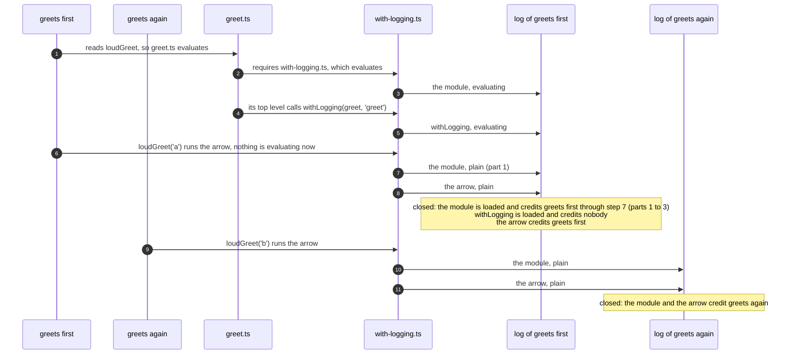

# Spec 0059 — a change runs the cases that ran it

**Missing:** a selection whose unit is the case. Every seam records which case
entered which region (`<coverage file>.cases.bin`), and `narrowByJourneys`
already reads that record. But it answers with test files, and so does
`yarn test:since`. A branch that five of two hundred cases walked runs all two
hundred. Nothing hands a runner the five.
**Built on:** `cases.ts` (the per-case record, scoped by async context),
`execution-select.ts` `narrowByJourneys` (the region-to-case join),
[ADR-0072](../context/adr/0072-a-change-is-read-before-it-is-charged.md) (the
regions a change is charged to).

## Purpose

Running only the affected tests is the reason to record coverage at all. A test
file is the unit CI shards on. It is not the unit a person or an agent waits
on in a local loop. The record already has the finer answer, and a file-grain
selection throws it away at the last step.

## What would discharge it

**1. The join answers cases.** A region charged by 0030 or by a reading selects the
cases whose crossings entered it. `ExecutionNarrowing` carries the cases for each
selected file, each with its `SelectionReason`. A file keeps the file-grain
answer when any of the following is true: the file itself changed, the file has
no case record, the file was charged whole (a `load` verdict, an import path),
or a charged region ran for the file rather than for a case: at collection time,
in a `beforeAll`, or while a module evaluated, whether or not a case was open
(see [A module evaluated inside a case](#a-module-evaluated-inside-a-case)).

**2. Code outside every case is credited to every case.** A region that ran at
collection time, in a `beforeAll`, or while a module evaluated ran for the file,
not for one case. So every case in the file depends on it. The record already
says so, two ways. One that ran at collection time or in a `beforeAll` sits in
the file's own frame, which credits it to every case of the file. One that ran
while a module evaluated is marked `loaded`, and the evaluation is credited to
no case: covering names every case of each file that loaded the module, through
the file graph. A case that enters the same region later, by a call, is
credited with that call as usual.
Charging either selects the whole file, never the first case that happened to
load it.

**3. Each runner's own public filter, and nothing of ours.** The selected cases
are passed through the filter the runner already documents:

| Runner | Filter |
|---|---|
| Vitest | `--testNamePattern` over the full name, anchored and escaped, one alternative per case |
| Playwright | `--test-list`, a file of `path › title` lines |
| Rstest | `--testNamePattern`, as for Vitest |

No runner is patched and no reporter skips cases by itself. A person can paste
the same command, and it runs the same cases.

**4. A name is not an identity, and a collision widens.** `ExecutionTest.name`
is not unique within a file. When two cases share a full name and only one of
them was selected, the filter runs both, and `--dry-run` says so. When a
runner's pattern cannot express the set, the whole file runs and the run says
why.

**5. `test:since` chooses the grain.** File grain stays the default for the
gate. `--cases` asks for cases. `yarn verify` never narrows below the file.

**Acceptance, as scenarios:**

- A change inside a branch that one case of a 200-case file enters runs that
  one case under each of the three runners.
- A change to a function that only a `beforeAll` calls runs the whole file.
- Two cases named `renders` in one file, one of them selected: both run, and
  the dry run names the collision.
- A test file changed in the diff runs whole.

## A module evaluated inside a case

Inline requires belong to the transform (React Native's Babel preset, SWC's
`lazy`), not to Jest. The transform turns each import into a `require` that runs
where the binding is first read. So a module evaluates inside the first case
that reads it: its top level runs inside that case, and so does whatever the top
level calls, such as a higher-order function wrapping a component or a factory
building a selector. The cases after it read the cached exports.

The case index has to record such a run as it records the same file loaded
eagerly. Below, one fixture shows what the index gets wrong when it does not, and
the five parts that keep it right. `inline-requires.integration.test.ts` runs
the fixture both ways and asserts that the two record the same regions with the
same cases.

### The fixture

```ts
// src/with-logging.ts
export function withLogging(fn: (name: string) => string, label: string): (name: string) => string {
  const prefix = `[${label}]`;                // line 2: runs once, while greet.ts evaluates
  return (name) => `${prefix} ${fn(name)}`;   // line 3: runs on every greeting
}
```

```ts
// src/greet.ts
import { withLogging } from './with-logging';

function greet(name: string): string {
  return `hi ${name}`;
}

export const loudGreet = withLogging(greet, 'greet');
// The case this module evaluated in. The first case asserts it, so a run whose
// transform did not defer the import fails instead of passing vacuously.
export const evaluatedIn: string | undefined = expect.getState().currentTestName;
```

```ts
// test/greet.case.ts
import { evaluatedIn, loudGreet } from '../src/greet';

it('greets first', () => {
  expect(loudGreet('a')).toBe('[greet] hi a');
  expect(evaluatedIn).toBe('greets first');   // the inline run; the eager run expects undefined
});
it('greets again', () => {
  expect(loudGreet('b')).toBe('[greet] hi b');
});
it('greets nobody', () => {
  expect(true).toBe(true);
});
```

The comment above each block names the file and is not part of it, so line 1
is the first line of code. The instrument numbers a region for each function
and one for each module as a whole, and puts a **probe** at each: a call that
writes an entry into the current log. A case that enters any region of a module is also logged as entering the
module's region, because an edit to the top level is an edit that case ran. In
`with-logging.ts`:

| Region | Lines | Entered by |
|---|---|---|
| the module | 1–4 | evaluating the module, and every case that calls into it |
| `withLogging` | 1–4 | `greet.ts`'s top level, once, while `greet.ts` evaluates |
| the arrow | 3 | every `loudGreet` call |

Line 2 lies in two regions here, `withLogging` and the module, both spanning
lines 1–4, so a change to line 2 charges both and selects the cases credited in
either one.

The collector gives each case its own log, and switches to it after the case's
`beforeEach`. Each module's prologue raises an evaluating depth and its last
statement lowers it, so while any module's top level runs, every entry is
written with an **evaluating** bit. When the case closes, the collector reads
its log out into a **frame**, one row per module, and the index folds the
frames. An entry with the bit marks its region `loaded` and credits no case. An
entry without it credits the case. A `loaded` region can still credit cases
through their plain entries.

### What the index records

The cases each region credits. The middle column is the inline run without
parts 1 and 2 below. The file graph is the import graph between files, which
names the cases of every file that loaded a module.

| `with-logging.ts` region | eager | inline, without parts 1–2 | inline |
|---|---|---|---|
| the module, `loaded` | `greets first`, `greets again` | `greets again` | `greets first`, `greets again` |
| `withLogging`, `loaded` | none | none | none |
| the arrow | `greets first`, `greets again` | `greets first`, `greets again` | `greets first`, `greets again` |
| **a change to line 2, without the file graph** | `greets first`, `greets again` | **`greets again`** | `greets first`, `greets again` |

`greet.ts` has the same shape: without parts 1–2, its module region loses
`greets first` too.

So a change to `const prefix`, read without the file graph, names `greets
again` alone. Yet `greets first` made the same call, and evaluated the module as
well. Its entries in the module's region were all written while the module
evaluated, so they credit no case.

### What happens inside `greets first`



`greets again` gets step 10 for free: its log is new, so its first entry into
`with-logging.ts` is a first entry into the module too. `greets first` does
not. Its log already holds the module from step 3, and steps 7 and 8 land in the
same log.

Under an eager load, both modules evaluate in the file's own log before any case
opens. The first entry `greets first`'s log gets for `with-logging.ts` is the
plain one made when the case calls the arrow, and the index is the same.

### The five parts

**1. A probe logs its module's region once each way after every switch.**
Before logging its own region, a probe logs the module's region if it has not
logged it that way since the collector last switched logs. One way is with the
evaluating bit and the other without. That gives step 7. Without part 1, the
module's region is logged again only after a switch, which gives step 10 but not
step 7.

**2. The log keeps both entries for a region.** Sort and compaction keep a
region once each way. The read-out, `lists()`, reports a region entered both
ways in `again`. Without part 2, steps 3 and 7 merge into one entry with the
evaluating bit or-ed in, so the region reads as `loaded` only, and step 7 is
lost: the evaluation erases the call.

**3. The frame carries those regions as a second row of the module.** A frame
has a row per module, listing the regions entered in `hits` and those entered
while evaluating in `shared`; a third list, `loaded`, is empty in a case's
frame. The readers, `case-fold.ts` and the
Rust `FoldVisitor`, fold any number of rows per module: `shared` sets `loaded`,
and the rest credits the case. A second row listing the `again` regions, with
nothing shared, credits the case for step 7. No reader changed, the frame format
keeps its version, and older recordings still open.

**4. The story tap does not count step 7 as a visit.** The story tap is a
debugging recorder, not part of the coverage record: it tapes every probe hit in
order, as the visits a case made, and step 7 reaches it like any hit. Nothing visited the top level at step
7. The tap counts a module entry as a visit only when it comes straight after
the module's prologue raised the evaluating depth. The tap is also why part 1
keeps a flag of its own per way: the other regions' probes skip a region already
logged by testing a per-region bit the tap zeroes to see every hit, and with
that bit the module would be logged on every hit. `story-tap.test.ts` asserts
that the coverage record is the same with the tap or without it.

**5. A case that entered nothing writes a frame.** This one does not depend on
inline requires. `greets nobody` enters no region. Without its own frame it is
missing from the index, in both modes. The file graph names only cases the
index holds, so a change to line 2 would never name it, even with the graph.
Its frame now lists no modules but names the case and how it settled.

### What a change to line 2 selects

`coveringTests` answers with one list. First come the cases credited in the
line's regions: here the module's region, so `greets first` and `greets again`.
Then, through the file graph, come the cases of every file that loaded the
module, marked `loaded`, which adds `greets nobody`. Without a graph the second
part is missing, and `ranWhileLoading` says the list may be short.
`coveringChange` splits the same answer per region into `tests` and
`passengers`. For a region that ran while loading, `passengers` is absent
without a graph.

Point 1 of [What would discharge it](#what-would-discharge-it) is where the
selector this spec asks for widens to the whole file. Under
inline requires a case was open when a `loaded` region ran, so that widening
keys on `loaded`, not on "no case was open".

### What does not read `again`

The file-grain union, which selects whole test files, reads the log directly
and or-s both ways per region. It loses nothing, because the whole file is
selected either way. The journey reader (`journey.ts`) and the page drain
(`probes.ts`) receive `again` but read only `hits` and `shared`. Whether a
request that is the first to evaluate a module loses its later entries there,
the way `greets first` did, is unmeasured.

## Out of scope

**Parameterized cases.** `it.each` cases have their names formatted before
they run. Each formatted name is recorded as its own case and is selected by
that name. Nothing reconstructs the table.

**Cases that overlap in time.** Concurrent cases are attributed through async
context. A continuation that outlives its case is the case the record refuses to
guess about, and interleaving tests stay unsupported.
