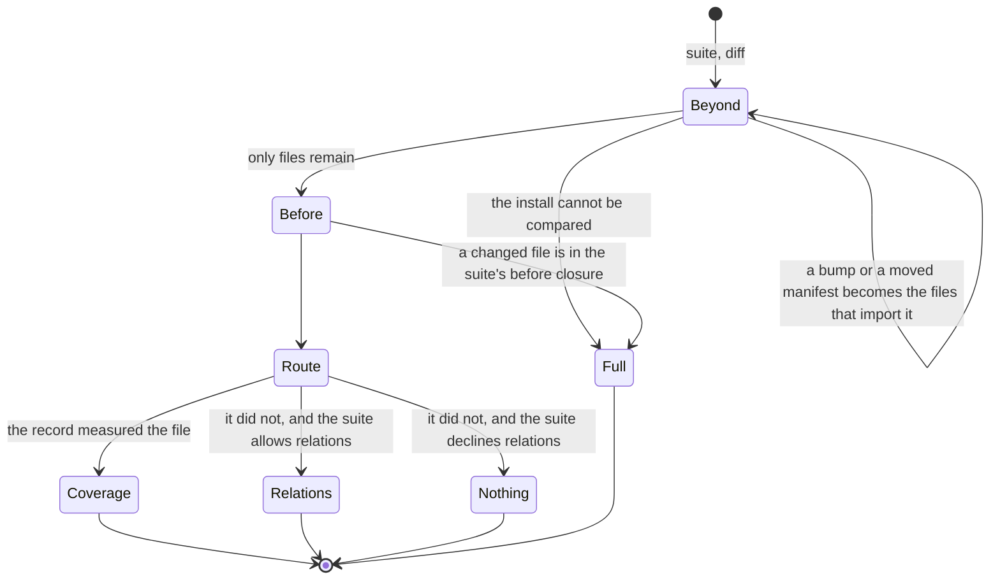

# Spec 0091 — a suite is selected by a machine

**Missing:** the composition. Selection is four questions asked of one suite in
a fixed order, and today they are one function's branches. Coverage selection
takes the file graph and the install and answers from them as well as from the
record. The before check sits beside it in `select-command.ts` rather than in
front of it. A bumped package becomes changed files by splicing them into the
patch. Whether a changed file is answered by the record or by the graph is
decided inside the selector that answers it. No stage can be tested, replaced
or reported on alone.
**Built on:** `beforeReach` and `changedBefore`
(`packages/core/src/relate/before.ts`), the install comparison
(`packages/cli/src/commands/installed.ts`, `moved-packages.ts`),
`narrowByExecution` and `answerByImporters`
(`packages/sense/src/test-selection/`), `reach`
(`packages/cli/src/commands/reach.ts`), and the suites in
`variance.config.json`.

## Purpose

Each question has one owner, and an owner that also answers its neighbour's
question answers both worse. Coverage selection walking the graph is why a file
the record never measured is reported as `unread` in one command and widened in
another ([0046](0046-the-safety-rule-lives-in-one-place.md)). Install handling
inside the selector is why a bump that reaches the harness narrowed instead of
running the suite. A graph fallback written inside coverage selection would be
one more branch in the same function.

## The machine

One machine runs per suite, over one diff.

- **Beyond reach.** A package bump is traced against the arrows to the
  repository files that import it, transitively through the install. A moved
  manifest (`exports`, `main`, `type`) becomes the files of its package. Each
  traced file is marked changed whole, and the machine continues with files
  alone. It runs once: what leaves it has no package left to trace. An install
  that cannot be compared exits to a full run. A checkout with no lockfile has
  no install to compare and contributes nothing.
- **Before reach.** The suite's `before` closure: the top-level list, the
  suite's own list, and what their files load. A changed file inside it exits to
  a full run of the suite and names itself. A bump reaches this stage as the
  config or setup file that imports the package, so the closure holds files
  only.
- **Route.** Per changed file. A file the record measured at its commit goes
  to coverage, even when no test entered it. A file it did not measure — added
  after the record, outside every instrumented root — goes to relations when the
  suite allows them, and to nothing otherwise.
- **Coverage.** The record and the diff, nothing else. Its answer is
  [0046](0046-the-safety-rule-lives-in-one-place.md)'s safe skip list.
- **Relations.** The first tests for the file: the walk against the arrows stops
  at the first test file, or at the first file the record measured, whose
  tests coverage then answers. Absence selects nothing.
- **Nothing.** Reported with the file and the reason.

The suite's answer is the union of its files' answers, or the full suite if
any stage exited to it.

## What would discharge it

**1. The stages are functions with one input and one output each.** Beyond
takes the diff and the install and returns files. Before takes the suite's
lists and files and returns an exit or the files. Route takes a file and the
record and returns a selector. Each is tested alone, and `select` and `run
--since` compose them in the same order.

**2. Coverage selection takes no graph and no install.** `relations` and
`packages` leave `narrowByExecution`, `answerByImporters`, the journey reader
and the native select in the sense addon. What the importer walk did today moves
to the relation stage, which hands coverage the first measured file it reaches.

**3. A suite declares whether it reaches by relations.**
`suites.<name>.relations`, on by default. An e2e suite turns it off and names
what it rests on in its own `before`: the app's directory and the services it
drives. A directory entry claims every path under it, so any change to the app
runs the suite. A Playwright component suite keeps relations, because a mounted
component is imported by its test.

**4. `before` holds files.** The package arm of `beforeReach` and
`changedBefore` is deleted once Beyond hands bumps over as files.

**5. Absence widens nothing.** The relation stage does not turn an unreached
file into a full run, and the `unread` set of
[ADR-0062](../context/adr/0062-a-skip-list-is-bounded-by-what-the-record-witnessed.md)
is superseded by the Route stage's `nothing` with its reason.

**6. The report names the stage.** Every selected test says which stage chose
it, and every full run says which file put it there.

**Acceptance:** for one diff and one suite, `variance select` and `variance run
--since` print the same stages and the same answer. A bump of a package only
the setup imports runs the whole suite, through Beyond and then Before, with
no package arm in Before. A file added after the record selects the first tests
that import it, and selects nothing in a suite that declines relations.

## What it forecloses

**No stage answers its neighbour's question.** A selector that reads the graph
to decide whether it applies has taken Route's job, and a fallback inside a
selector is a second router.

**No name heuristics.** Which suite rests on what, and which suite reaches by
relations, is declared. Nothing is inferred from a file name, a runner or a
kind.
