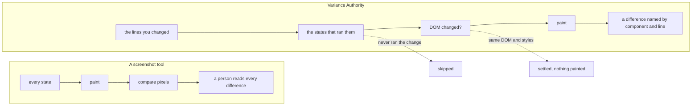
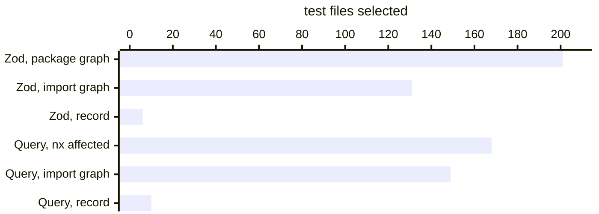
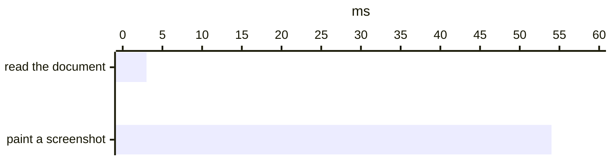
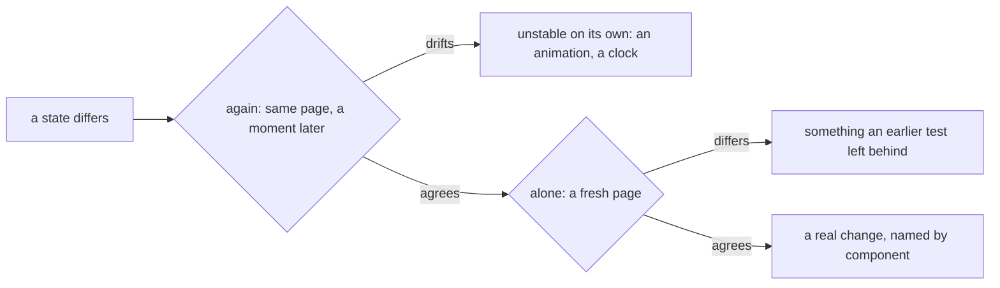

# What visual review costs, and where Variance Authority cuts it

A visual regression suite costs you twice: machine time for every picture it
takes, and an engineer's time for every difference it shows. Both grow with one
number — how many comparisons the suite makes, and how many of those it puts in
front of a person. A screenshot tool takes every picture first and compares
afterwards, so that number is fixed before anything clever runs.
[Variance Authority](README.md) runs beside the tool and the tests you already
have, and decides earlier. It runs only the specs and stories that executed the
code you changed, settles a state whose DOM and styles are unchanged without
painting a pixel, and when it does show you a difference, it names the
component and the `file:line` that drew it.

## Two bills, one count

The machine bill is a multiplication, and it is worth writing out because every
factor in it is a decision somebody made once and forgot:

```text
UI states × viewports × browsers × themes × builds
```

Forty stories at two viewports in two browsers under light and dark is 320
pictures per build. Every push pays for all 320, in CI minutes on your runners
or in the unit a hosted service meters. Most of those pictures are of states the
push did not touch, and the suite takes them anyway, because a screenshot tool
learns that nothing changed by taking the picture and comparing it.

The review bill is the same count after the comparison. Every difference that
survives to a person is a decision: open the image, find what changed, work out
whether anyone meant it. A design-token edit that repaints every surface turns
into hundreds of those decisions at once, each one correct and none of them
useful. A flaky state turns into the same decision every week. A team that
lives with this for a quarter starts approving in bulk, and a suite approved in
bulk has stopped testing anything.

Perceptual matching, pixel thresholds and a hosted review queue all read a
comparison that has already been captured, painted and billed, so they lower the
review bill and leave the machine bill where it was. A dependency graph prunes
earlier, but by what a story imports, and a component half your stories import
reruns half your stories. Cutting both bills means knowing what each state
actually ran, and spending at each step only on what is still in question:



## Cheaper to run: only what ran the change

### A recorded run knows which states touch which lines

One run of your suite, with your application built with a probe, records which
blocks of your source each spec and each story executed while it was painted. The
record lives in the tool's cache, never in your tracked files. From then on, a branch runs the
specs that executed the lines it changed:

```bash
variance run --since origin/main
```

Every other spec the record saw run to completion is skipped, and the report
names each one with the reason. This is coverage-based test selection, and it
answers a narrower question than an import graph can. Three stories that mount
one component share one import graph and take three different paths through it.
[`variance journeys`](journeys.md) prints what the record saw: the component's
`onClick` handler is where the three stories parted, one of them entered it and
two never did, and one branch was entered by none of them:

```text
app/src/components/CartCard.tsx  3 observers
  parted     function CartCard/onClick  51-58
    entered  story:cart-card--removing
    missed   story:cart-card--item, story:cart-card--verbose
  unentered  branch CartCard/empty  62-64
```

An edit inside `onClick` reruns the one story that clicked. A dependency graph
reruns all three, and every page that renders a cart. The last line is the half
of the answer a graph never gives: the empty-cart branch is code no story
entered, and the record shows you that no test covers a change there, where a
graph would rerun the three stories and let them pass.

The record is not a second thing to maintain. The probe is a plugin in the
build your tests already run against. Recorded runs on your main branch keep the
record current, and CI carries it between jobs in
[one cache step](cache.md#in-ci). Record the whole suite on every commit to main
and the record is never more than one commit behind the branch it answers for.

The same record narrows unit suites too, and that is where it has been measured
on public projects. A one-line edit, on unmodified forks of
[two open-source libraries](coverage-test-selection.md#what-it-saves-on-real-suites):



Recording cost those suites at most 8% of their run time, where V8 coverage on
the same suites costs 26% to 30%. Over sixty real commits, at least half of Zod's
test file runs and nearly four in five of TanStack Query's were skipped. A unit
test is the cheap case: a visual state costs a navigation and a paint, so each
one skipped saves more, and your first run with `--since` counts its own skips.

Wherever the record cannot answer, the run widens and says why. It has two
documented blind spots: a branch no run has taken yet, which
`variance journeys` lists as `unentered`, and a result a memoizer handed back
from an earlier call. A stylesheet or a token file executes
nothing, so for those, with the file graph switched on, the run finds the
components whose imports reach the file and runs the states whose baselines
show them rendering one. [Running less of the suite](selecting.md) is the exact
contract, blind spots included.

### The DOM decides before a picture does

A state that does run is read first as a document: its DOM, the styles that
apply to it, a hash of each image and font it loaded. Reading that is much
cheaper than painting it. On [the todomvc example](instruments.md), in Chromium:



When the document matches the one the baseline was painted from, painting it
again would reproduce the baseline, so nothing is painted. Only states whose
DOM, styles or resources changed pay for a raster, and those are painted into
[one browser kept open](better-tests.md#faster-dont-surrender-to-workarounds)
for the whole run rather than one started per capture.
Canvas, WebGL and video draw outside the document; a state built on one is
captured as a screenshot and pays for its picture every run.

## Easier to keep: each difference arrives answered

The review bill is paid in decisions, and a decision is expensive when you
cannot tell what you are looking at. A pixel diff says how many pixels changed;
a person then opens the image to find out what that means. Variance Authority
traces each changed region to the element that painted it, the component that
rendered it, and the line that wrote it:

> **this region, inside `Toggle`, in `main → region "Todos" → item 2 of 3`,
> written at `examples/todomvc/src/ds/components.tsx:107`.**

A reviewer reads that in seconds and knows who to ask.
[From a pixel to a line](attribution.md) says what each step needs from your
build.

### A rebrand is read once, not once per screen

Every difference has a kind: accessibility, geometry, style values (`token`),
text, or sub-pixel noise. You declare which kinds a group of states is under
test for, instead of how many pixels it may lose. A component story asserts on
everything. A route — a whole page at a URL — can assert that the page
assembles:

| A change | Component story | Route declared `layout` |
|---|---|---|
| The sidebar collapsed | reported | reported |
| A button lost its accessible name | reported | reported |
| The brand colour changed everywhere | reported | let through, and counted |
| Sub-pixel noise from the renderer | reported | let through, and counted |

A threshold absorbs anything small enough, including the collapsed sidebar; a
kind absorbs one sort of change however large it is, and the report counts
what each rule let through on every run. [Sensitivity](sensitivity.md) owns the
levels. On the component side, [Tribunal](../packages/tribunal/README.md), the
self-hosted review service, lists a build by cause: a
token edit that changed forty stories through `Button` is
one entry, `Button`, and the reflow it pushed
onto everything around it is counted once for the build.

### An unstable state gets a cause, not a retry

A retry hides an unstable state until next time, and a tolerance big enough to
absorb rendering noise is big enough to absorb a small real change. When a state
differs, Variance Authority reads it again, and each reading is evidence rather
than a second chance:



Each answer reaches you as what it is, and [flakiness](flakiness.md) counts
them by component across runs. Nothing is ignored automatically at any count.

### The harness you have stays

Your Playwright specs, Storybook, served routes, jsdom unit tests and Vitest
browser mode already put the app into the states you care about. Variance
Authority takes the state from whichever of them set it up, and your
`toHaveScreenshot` assertions can keep running while you try it. There is no
second suite to keep in step with the first. [Add it to what you already
use](replacing.md) takes one harness at a time.

## Where to start

Pick one UI state that a harness you trust already sets up, and take it through
[your first run](start.md): a baseline you approve, then a second run that
reports it unchanged. Then build your application with the probe, record one run
of the suite, and the next pull request runs with `--since origin/main`: it
shows which states it skipped and why. [Gate a build on what
changed](gates.md) puts that run in CI beside the job you have now.
